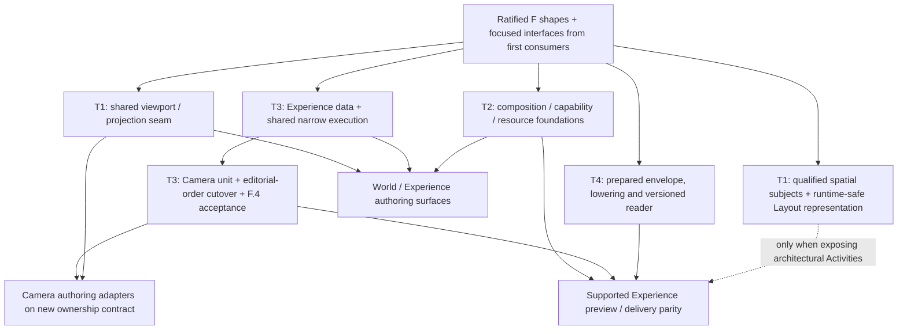

# World / Experience — architecture synthesis

**Status: reconciliation provenance, not a live architecture contract or implementation plan.** Accepted conclusions are folded into the [North Star](./reference/north-star.md), [architecture](./reference/architecture.md), [F](./reference/composition-execution.md), [Camera contract](./reference/components/camera-tour.md), [shell contract](./reference/design-system/editor-shell-and-visual-system.md) and [T3 manifest](./roadmap/p25-experience/README.md). Read those owners for the current answer.
**Date:** 2026-09-29.  
**Product input:** [Experience Authoring — Product and Behavior Synthesis](./World-Experience-Model.md), read in full.  
**Production baseline:** `origin/main` at `a6ee6dc28f209f23bb36e609d6f28b31f341796d`; after rebase, branch `fd171ff67817d89564eed7b8235ff3c9057155df` differs from main only in this synthesis and the product-input Markdown before the reconciliation edits. The bounded implementation claims below were rechecked against that branch; they remain current for this reconciliation.

The original synthesis used source and targeted test inspection, without a browser run or production acceptance. Its initial pass changed no production code, contracts, roadmap status or prototypes; the subsequent reconciliation promoted accepted conclusions into the linked owners. **CURRENT** means verified implementation; **PROPOSED DESTINATION** labels the recommendation at the synthesis stage, now subordinate to live contracts; **MIGRATION / CUTOVER** identifies replacement obligations; **DEFERRED** identifies mechanisms or depth not required for the first foundation.

Authority was reconciled against the [ratified decision record](./reference/decisions/northstar-ratification-2026-09-27.md), [North Star](./reference/north-star.md), [architecture](./reference/architecture.md), [F.1–F.5](./reference/composition-execution.md), [roadmap](./roadmap/README.md), and the [F](./roadmap/f-foundation-contracts/README.md), [T1/P26](./roadmap/p26-spatial-depth/README.md), [T2/P24](./roadmap/p24-scene-staging/README.md), and [T3/P25](./roadmap/p25-experience/README.md) manifests. Prototype behavior supplies evidence; its types and runtime do not supply authority.

## A. Executive conclusion

**Recommend an Experience-owned Presentation, directly referenced by Guide Stops, over independent Layout, Scene, Camera, and typed-resource authorities. Replace Destination as a separate authored concept.** Presentation takes over its useful semantic job: reusable visitor-facing meaning with an entry policy. A navigation destination remains an address or target role, not another entity between a Stop and a Presentation.

World and Experience become product-authoring lenses. World is neither a document nor a domain that absorbs Layout and Scene. Camera remains an independent authority, progressively authored through Experience controls and also used for transient World inspection. The current requirement to switch to a separate Camera surface is a shell restriction to amend, not an architectural guarantee to preserve.

```text
                         PROJECT COORDINATION
               accepted revision · dependency lock · F.4
                                  │
       ┌──────────────────────────┼───────────────────────────┐
       │                          │                           │
     LAYOUT                     SCENE                       CAMERA
 architecture, spaces,     objects/components,          Views, connectivity,
 levels, structures,       placement, lights,           routes, framing,
 valid representation      environment, capabilities    projection, evaluation
       │                          │                           │
       └──────── domain-qualified subjects and capabilities ─┘
                                  ↑ references
                              EXPERIENCE
          Presentations · explanation · Activity invocations
          Interactions · optional Guides → Stops → Presentations
          editorial continuation · Gates · session declarations
                                  │
             typed resources shared across these authorities
          states · performances · content/media · Camera resources
                                  │
                  common semantic lowering and execution
               isolated session → domain evaluators → render
                       editor preview / visitor delivery

World lens: authors Layout/Scene truth; inspects through Camera.
Experience lens: authors Experience truth; delegates Camera/resource edits.
Neither lens owns another copy of the world or an execution engine.
```

The smallest coherent change is **not** a new generic World model or a complete orchestration kernel. It is a collection-capable Experience unit, an independently bounded Camera unit, stable references and occurrence identities, narrow shared execution, and project-level compound acceptance. These must arrive together at the editorial-order cutover. Canonical geometry, useful Camera algorithms, domain planners, rendering components, and isolation infrastructure should survive behind appropriate adapters.

Three cautions change the destination materially:

- **Reusable meaning, authored occurrence, and running visit are different identities.** Presentation, Stop, and session invocation must not collapse into one key.
- **“Last accepted command wins” needs a declared replacement policy.** It cannot override F.3's default rejection of competing exclusive control globally.
- **Shared Camera math is not yet shared execution.** The current editor timeline and public visitor controller orchestrate that math differently. Preview/public parity requires a common semantic execution path, not another Experience renderer.

## B. Current infrastructure map

The source links below are evidence anchors, not a proposed physical package layout.

| Subsystem | CURRENT implementation and owner | Reusable support | Limitation / cutover obligation |
|---|---|---|---|
| Project envelope | [`ProjectDocument`](../packages/project-model/src/project-types.ts) has `id`, `name`, `layout`, `scene`; [`validateProject`](../packages/project-model/src/project-codec.ts) accepts only those root keys. Project-model coordinates nested validation. | Strict validation, canonical serialization, whole-project import/export boundary. | No accepted-revision field, dependency lock, Camera unit, Experience unit, or general resource unit. The public Layout type remains legacy-shaped while wall-first values cross it through explicit casts; [`CompatibleRuntimeProject`](../packages/project-model/src/compat-runtime.ts) has the real union. Do not perpetuate that typing shortcut in F.2. |
| Layout truth | [`LayoutDocumentWallFirst`](../packages/layout-core/src/layout-wall-first-types.ts) is format 5: one floor datum, Junctions, Walls, reconciled Rooms, hosted Openings, Layout objects, optional identity ledger. Layout-core owns it. | Wall-first architecture and world-local geometry are sound foundations. | No full Site/Building/Level/Space model, placed architectural definitions, or general representation channels. One-floor storage is current behavior, not a destination constraint. |
| Architectural compilation | [`compileLayoutGeometry` / `compileWallFirstLayoutGeometry`](../packages/layout-core/src/layout-geometry.ts) and [`prepareCompatibleRuntime`](../packages/project-model/src/compat-runtime.ts) supply renderer-neutral compiled geometry. | Keep the canonical compiler and its validity/identity guarantees. | T1 representation must consume this output. Prototype clipping/unfolding must not reconstruct architectural truth independently. |
| Scene truth | [`SceneDocument`](../packages/project-model/src/scene.ts) format 1 stores textures, materials, model/primitive/light entities, optional clusters, and Camera records. Physical transforms are world-local when `roomId` is absent. | Current entity/light/material semantics and world-local placement. | Models are catalogue `assetId` placements, not the destination definition/component/capability system. Clusters are editor hierarchy metadata, not semantic assemblies. Environment styling is also partly supplied by rendering defaults rather than a complete authored environment unit. |
| Camera persistence | [`SceneNavigationNode`, `SceneConnection`](../packages/project-model/src/scene.ts) and the [Scene codec](../packages/project-model/src/scene-codec/parse-document.ts) own the landed encoding. Nodes combine pose/FOV, connectivity, next/previous, detour, hold, and lock fields. | Fixed views, interior anchors, directional tracks and connection timing contain useful authored intent. | F.2 already requires Camera's own codec unit in the same cutover that moves editorial fields to Experience. A View today has no general semantic subject binding or adaptive-framing reference. |
| Runtime Camera graph | [`resolveSceneDocument`](../packages/project-model/src/scene.ts) resolves world poses, inserts fresh node endpoints, and builds a graph with `createNavigationGraph`. | Interior-only authored anchors and generated endpoints remain correct. | Graph assembly must consume the Camera unit. Runtime lookup/projection is not an additional authored graph. |
| Camera routes | [`getCameraRoute`, `getCameraConnectionRoute`, `walkFlowChain`](../packages/camera-core/src/camera-route.ts) resolve explicit connections, oriented tracks, BFS traversal, and legacy node-linked order. | Spatial connectivity and route evaluation. | `walkFlowChain` rejects a repeated node before returning to the start. That is unsuitable for repeated editorial occurrences. Retire the order walker as the new Experience navigation authority; retain spatial route semantics. |
| Camera motion | [`createCameraMotion`, `sampleCameraMotion`](../packages/camera-core/src/camera-motion.ts) compile/sample curves, FOV, framing envelopes and guards. Creation accepts an optional live start pose and timing options. | Mature canonical sampling, directional framing, endpoint and guard behavior. | The prepared object contains Three curves/vectors, not a serializable release descriptor. Guards depend on duration/easing. External retiming cannot simply change a clock while bypassing preparation. Live-start support is partial, not a complete free-exploration/rejoin API. |
| Editorial timeline | [`editor-camera-timeline`](../apps/editor/src/lib/editor/camera/editor-camera-timeline.ts) derives node order, per-edge movement and destination-node holds. [`editor-directed-edge-motion`](../apps/editor/src/lib/editor/camera/editor-directed-edge-motion.ts) applies directional timing options. | Pure directed-edge preparation and Camera inspection/seek calculations. | Node-order schedules, node-keyed boundaries, and edge lookup by connection ID cannot represent repeated occurrences independently. Extract reusable preparation; replace editorial scheduling with occurrence-based execution. |
| Camera mutation | [`EditorNavigationGraphMutator`](../apps/editor/src/lib/editor/store/navigation-graph-mutator.svelte.ts) and [pure graph planners](../apps/editor/src/lib/editor/editor-navigation-graph.ts) support add/connect/delete, order, detours, timing and holds. | Validation/planning ideas and canonical path editing. | Creation/connect operations can also write node order. Those coupled writers must be split or retired, not retained beside Guide editing. Camera placement still has a Room-floor-oriented entry path. |
| Scene mutation | [`EditorPlacementClusterMutator`](../apps/editor/src/lib/editor/store/placement-cluster-mutator.svelte.ts) edits entities, lights, transforms and clusters; material mutation is another editor controller. | Existing validation and field semantics; gesture begin/commit/cancel behavior. | These mutate a Scene store inside Scene history, with session dependencies. They are neither serializable F.4 intents nor visitor capability implementations. Calling `updateLightFields` from playback would edit source. |
| Layout mutation | [`planWallChain` / `planWallSegment`](../packages/layout-core/src/layout-wall-chain.ts) return candidates and operation lineage; [`runLayoutMutation`](../apps/editor/src/lib/editor/layout/layout-mutation-runner.ts) wraps editor transactions. | Domain-owned pure planning, rejection and identity continuity. | The runner accepts an editor callback and commits only Layout. Adapt planners into project acceptance; do not mistake this wrapper for a general command protocol. |
| Selection | [`EditorSelectionStore`](../apps/editor/src/lib/editor/store/selection-store.svelte.ts) has workspace/navigation slots; Layout has its own interaction selection. [`EditorActiveSelectionStore`](../apps/editor/src/lib/editor/app/active-editor-selection.svelte.ts) resolves one active domain. | Canonical per-domain identity, selection reconciliation, one exposed active selection, remembered context. | The facade hardcodes Scene/Camera domain gates. It needs Presentation/Stop/View-use context and F.1 identity adapters. A second Experience selection store with independent picking would break coherence. |
| History | [`EditorHistoryController`](../apps/editor/src/lib/editor/store/history-controller.svelte.ts) is one chronological, 100-entry stack of separate Scene or Layout snapshots. Scene replacement rebuilds runtime and notifies dependents through [`EditorDocumentStore`](../apps/editor/src/lib/editor/store/document-store.svelte.ts). | No-op suppression, validation before acceptance, cancellation and chronological undo. | It has no compound entry, expected revision, or atomic multi-domain installation. Two adjacent history entries do not become one transaction. |
| Workspace and view state | [`EditorViewState`](../apps/editor/src/lib/editor/app/editor-view-state.svelte.ts) stores Scene/Camera and shared Plan/3D; [`EditorSessionState`](../apps/editor/src/lib/editor/store/session-state.svelte.ts) stores tools, helpers, visibility and chrome. [`EditorApp`](../apps/editor/src/lib/editor/app/EditorApp.svelte) maps these onto older workspace state and separate Plan/3D components. | Session-only lifetimes and guarded transitions. | Domain/view enums and Inspector gates encode the current shell. They do not constitute T1's future continuous viewport/projection seam or constrain World/Experience lenses. |
| Preview takeover | [`preview-coordinator`](../apps/editor/src/lib/editor/preview/preview-coordinator.ts) prepares a detached, validated snapshot and retained texture bytes; [`EditorApp`](../apps/editor/src/lib/editor/app/EditorApp.svelte) captures return context before teardown and restores it on exit. | Snapshot isolation, failure-before-session-mutation, disposal and return behavior. | Preparation still consumes authored codecs. Extend the host to select Experience/entry and start an isolated production execution session. Preserve source isolation without cloning authored semantic authority. |
| Product visitor runtime | [`VisitorPreviewSurface`](../apps/editor/src/lib/visitor/VisitorPreviewSurface.svelte) serves preview and the [public route](../apps/editor/src/routes/p/[publicationId]/+page.svelte), mounting visitor geometry/entities and a Camera director. | Shared generic visitor surface, rendering components, resource lifetimes and zero-node viewing. | [`VisitorRuntimeState`](../apps/editor/src/lib/visitor/visitor-runtime-state.svelte.ts) navigates node next/previous and blocks requests while transitioning. It has no Presentation/Stop/run model. The director's free look is node-anchored; zero-node orbit is not the desired general explore/rejoin behavior. |
| Execution parity | [`VisitorCameraDirector`](../apps/editor/src/lib/visitor/VisitorCameraDirector.svelte) calls `getCameraRoute` then `createCameraMotion(route, livePose)`; the editor's directed-edge resolver passes authored timing options, and its timeline adds holds. | Same route/motion primitives. | The visitor does not consume the editor schedule or pass its directional options on that call path. Sharing a package is not evidence of complete timing/order parity. This is a cutover obligation, not a reason to copy the editor timeline into Experience UI. |
| Identity and repair | Plain string IDs and same-project validation; [Layout identity ledger](../packages/layout-core/src/layout-identity.ts) plus [display facade](../apps/editor/src/lib/editor/identity/layout-identity-view.ts). Layout planners report created/split/retired lineage. | Preserve existing identities and proven lineage. Compact labels are useful presentation. | No general domain-qualified revision-aware reference/resolution protocol. Display tokens are explicitly not selection/topology identity. Names, array positions and compact references cannot become F.1 addresses. |
| Actions/events/session | [Editor interaction FSM](../apps/editor/src/lib/editor/store/interaction-fsm.ts), Camera preview controllers and visitor navigation state are specialized. [Gizmo policy/adapters](../apps/editor/src/lib/editor/gizmo/editor-gizmo-contract.ts) expose manipulation affordances. | Reducer/effect separation and host/domain adapter patterns. | No production intrinsic-capability registry, performance executor, typed Experience session declarations, or general channel arbiter was found in these seams. Gizmo capabilities describe editing tools, not visitor behavior. Editor FSM code must stay out of visitors. |
| Cloud saves | [`saveProject`](../apps/api/src/project-persistence.ts) locks a project row and appends the next full-document version. | Ownership, version storage and transaction infrastructure. | No expected-base-revision argument. A row lock serializes writes but does not reject stale intent. F.4 requires a separate project acceptance precondition. |
| Publication | [`publication-persistence`](../apps/api/src/publication-persistence.ts) already checks publication revisions and pins asset metadata; public read joins a saved project version and revalidates it. [`visitor-cold-runtime`](../apps/editor/src/lib/visitor/visitor-cold-runtime.ts) runs `prepareCompatibleRuntime` at boot. | Publication pointer concurrency, asset verification, immutable release membership, cold bootstrap and disposal. | Publication revision is not project revision. Current delivery is authored source plus a manifest, not F.5 prepared data. Destination pointers select published Experiences, and readers must stop depending on current authoring validators/compilers. |
| Visitor isolation | [`preview-surface-boundary`](../apps/editor/src/lib/visitor/preview-surface-boundary.ts) checks the transformed import graph. Frozen Museum code has its own lane. | Retain structural isolation tests and generic visitor rendering. | Do not reuse the Chopin-specific director/activation system as the new Experience runtime. Runtime-safe domain math belongs in the visitor closure; editor stores and tools do not. |

Two implementation details particularly limit blanket reuse. Canonical wall-first preparation returns an **empty legacy Room registry**, while several placement entry paths still require tagged Room floors; the [Camera contract](./reference/components/camera-tour.md) explicitly records the Camera placement problem. Also, the public visitor's transition lock is observable in code and characterized by its [navigation tests](../apps/editor/tests/lib/visitor/visitor-runtime-state.test.ts). Neither should be elevated into a product restriction.

The [Camera dense-sweep tests](../apps/editor/tests/lib/museum/navigation/camera-motion-dense-sweeps.test.ts), [route tests](../apps/editor/tests/lib/museum/navigation/camera-route.test.ts), [preview coordinator tests](../apps/editor/tests/lib/editor/preview/preview-coordinator.test.ts), and [selection tests](../apps/editor/tests/lib/editor/app/active-editor-selection.test.ts) are valuable existing evidence to carry forward. They do not establish new Experience semantics.

## C. Product concept → architecture mapping

| Product concept | Recommended semantic owner | Existing support | Destination role | Notes |
|---|---|---|---|---|
| World | Product-authoring lens over Layout, Scene and resources | Shared project, world-local placement | Author what exists and its intrinsic capabilities | No `WorldDocument`, World compiler or World resource store. |
| Subject | Its domain or typed resource | Layout IDs, Scene entity IDs, Camera IDs | Addressable meaning plus declared capability interface | A reference/protocol, not a universal mutable object record. World subjects are a useful subset of all subjects. |
| Space / Room | Layout | Persistent enclosed Rooms | Semantic spatial subjects; Room is an enclosed Space kind | Site, Building, Level and open Space semantics come from T1. Neither containment nor a Zone implies transform ownership. |
| Capability | Owning Layout/Scene/Camera/content domain, potentially defined by a resource | Specific fields and editor operations | Typed supported operations/properties, constraints, signals and channel effects | Experience discovers and invokes; it does not fabricate missing capabilities. |
| Experience | Experience unit | No persisted production implementation | Visitor composition, entry, Presentations, Interactions, optional Guides, session declarations | Multiple Experiences over one world; no Guide or Presentation required for exploration. |
| Presentation | Experience | Product prototype's Encounter; North Star's Destination role | Reusable visitor meaning and contextual composition with explicit entry behavior | Replaces Destination as an authored entity. Not intrinsically a sequence or a performance definition. |
| View | Camera semantics, using common resource identity when reusable | Fixed node framing, directional framing tracks | Authored spatial attention: fixed or explicitly adaptive framing/projection | Experience owns a use/binding, not copied pose/path/FOV. |
| Explanation / content | Experience for visitor meaning; common resources for reusable content/media | No general Experience content model; prototype simulates narration | Localized text, associated media and semantic cues | Inline text is sufficient initially. Audio, transcript alignment and reuse do not require every text block to become a separate definition. |
| Activity | Experience invocation; definition/capability remains with its owner | Prototype only for general Activity semantics | A particular use of a capability or performance | Running state belongs to the execution session. Organizational membership is not lifecycle. |
| Interaction | Experience binding; trigger subject remains domain-owned | Specialized pointer/navigation handlers | Visitor event/context → supported action with availability and conditions | Experience-wide and Presentation-local forms use the same semantics. |
| Guide | Experience | Legacy Camera sequence approximates one | Optional editorial traversal with stable Stop identities | Not a Camera path and not a second spatial graph. |
| Stop | Experience, within a Guide | Prototype Position | One occurrence referencing a Presentation and contextual invocation settings | Repetition reuses Presentation identity while preserving independent Stop identity. |
| Gate | Experience progression policy | Node locks are only partial legacy evidence | Explicit condition on a specified continuation/action | Not a duration, Camera lock, or mandatory standalone resource. |
| Preview / session state | Execution session; editor return context separately | Detached preview plus specialized playback state | Isolated runs, choices, clocks, channel ownership and Camera control | Never source mutation or document undo. |

## D. Proposed destination architecture

### Presentation replaces Destination, while entry remains explicit

The North Star gives Destination “reusable visitor-facing meaning and an entry policy.” The product synthesis assigns that meaning to Presentation and adds the things through which it is expressed. There is no evidenced second lifetime, identity, or ownership boundary that justifies retaining both authored entities.

Therefore a Stop references a Presentation directly. An Interaction can open a Presentation directly. A public semantic address can identify a Presentation or a particular Stop. “Destination” remains ordinary navigation vocabulary for a typed target, just as “subject” is broader than one persisted record type. It does not become a mandatory wrapper.

Presentation must retain an entry contract: present normally, enter at a supported named point, or deliberately keep the current viewpoint. Absence of a View is valid; failure to resolve a referenced View is a repair condition. Those states must not collapse into `null`.

The ratified record also uses lowercase “reusable presentation” for portable choreography. Preserve that capability as a **performance resource**. An Experience Presentation binds such resources to visitor meaning, subjects and content; it need not itself be a portable performance definition. This terminology amendment prevents a rename from accidentally moving all performances into Experience.

### What a Presentation owns and references

**Owns:** its stable Experience-local identity, title/purpose, focus associations, visitor-facing explanation and localization, contextual interaction bindings, Activity and Camera-use declarations, and supported entry/default pacing policy. It may define a partial presentation-state contribution or reference a reusable state resource. It does not own the resolved world state.

**References:** domain-qualified subjects, Camera Views/routes, supported capabilities, and independently identified resources. Focus says what the Presentation is about. Camera targeting says what a particular View follows. Creating a View from focus may establish an explicit adaptive binding, but later changing focus must not silently retarget every View.

A Presentation can have zero, one or several focus subjects. “Present this viewpoint” captures a Camera View; it does not require inventing a fake World object. A framing region can be Camera-owned intent. A durable named architectural region belongs to Layout's Space model; a spatial activation volume belongs to Scene's trigger-subject semantics. Experience does not acquire a second region geometry system.

Reuse first means several Stops invoking one Presentation in an Experience. Content, Views, states and performances can be shared independently. Do not add a global Presentation-definition/use hierarchy simply to make all records look alike. Cross-Experience or library reuse of a complete bound Presentation can later use an explicitly portable resource/template with declared dependencies; it is not an additional T3 prerequisite.

For local edits, distinguish **shared definition**, **authored use**, **Stop context**, and **running visit**. A Stop may override declared content bindings, a supported entry point, pacing, continuation, or invocation parameters. An override is not a second mutable copy of the Presentation. Structural divergence should create an explicit independent Presentation identity. Editing a shared View only here creates a private Camera specialization/fork and retargets the relevant use atomically; it does not bury an independent pose in the Stop.

### Guide, Stop and running-visit identity

A Guide owns ordered Stop membership and continuation rules. Each Stop references a Presentation. Order provides default Next; explicit next-target, branch or terminate policies override that default through one resolver. Do not also persist reciprocal previous/next links merely as an alternate representation of the same editable order. A simple previous neighbor can be derived; after branching, Back normally consumes the session's visited-occurrence trail.

A Stop owns its stable occurrence identity, occurrence label/context, Presentation binding/entry choice, local invocation parameters, pacing, Gate and continuation choices. Shared View or Presentation identity never implies shared Guide connections, Gates or lifecycle.

The running visit gets a further session identity. Visiting Stop A twice creates two visits. Two Stops using the same Presentation are distinct visits even when adjacent. Entry actions and completion events are scoped to the relevant visit/run; yesterday's or the previous Stop's completion cannot accidentally satisfy a new Gate. An explicitly resumed detour parent retains its original invocation rather than firing entry again.

Adding an interior View as a Guide checkpoint is an explicit authoring operation: create a Stop referencing the Presentation with a selected entry policy. It does not turn every View into a Stop or make View-use order the Guide. Whether a checkpoint also enters an explanation cue is a product policy called out in section M.

### Camera authoring through Experience

```text
Experience control or World inspection capture
  → typed authoring intent / transient viewing request
  → Camera-owned validation, preparation and evaluation
  → one resolved Camera output for the viewport
```

A reusable View owns stable Camera identity and framing/projection intent: fixed framing or an explicit subject/role relationship, relevant frame, framing hints and precision parameters. It may be project-local initially. Reuse across projects requires a compatible role/frame interface or packaged dependencies, not raw foreign subject IDs.

Movement is related but not identical to a View. Camera owns spatial connections, routes and intrinsic motion profiles. An Experience use selects the View, compatible route/movement policy, bindings, activation relationship and any supported invocation time mapping. A View need not acquire a route from every possible predecessor. The current node can initially represent a fixed View at a Camera graph location; no speculative replacement of all graph primitives is necessary.

Only Camera-declared invocation inputs may vary locally. A duration mapping or compatible target-role binding is evaluated by Camera. Editing path anchors, fixed pose, projection, lens or framing definition is a Camera edit, potentially to a private specialization. Never authorize a generic Experience property patch to interpolate `XYZ/FOV` independently.

World navigation, orbit position, inspection trail, temporary section/lift and helper visibility are editor-session state. Capture is an explicit operation that extracts eligible Camera intent and domain-owned state contributions. It must not serialize the trail, renderer pose cache, helper visibility or a preview session as authored truth. A Camera target that follows a transformed architectural representation must explicitly use canonical or displayed coordinates supplied by Layout; Experience cannot guess the display transform.

Travel must resolve a supported Camera route or return a gap. Cut is a declared transition that does not require or invent a spatial edge. Interrupt/rejoin captures the actual current evaluated pose as a session input, then asks Camera to prepare the supported continuation. The optional start pose in current `createCameraMotion` is useful, but does not by itself solve arbitrary off-graph origins, same-View rejoin or route feasibility. Those are Camera adapter obligations.

### Capabilities, performances and Activities

Use three layers, not three copies of behavior:

1. **Intrinsic interface:** the domain/definition declares supported properties/actions, types, constraints, affected channels and signals. “Open casing” must be a real supported component capability, not an arbitrary mutation that Experience invents.
2. **Reusable definition:** a state/clip/performance resource composes capabilities through roles and parameters. Object-only behavior remains usable outside an Experience. Scene may bind ambient behavior; resource import alone does not start it.
3. **Activity invocation:** Experience binds subjects/resources and supplies contextual activation, parameters and lifetime. The execution session creates runs with private clocks and channel ownership.

Not every direct light change needs a reusable performance resource. A typed invocation of a Scene light capability is sufficient. Introduce reusable definitions when there is behavior worth reusing. Conversely, a reusable rotor/opening performance must not be embedded in Experience merely because its first authoring control appears there.

Presentation membership organizes work. Activation and termination are explicit semantic relationships with simple defaults. Moving an Activity between organizational groups does not silently rebind its lifetime. Cancel, Finish and Continue have real differences: cancel terminates work and releases only still-owned contributions; finish lets finite work complete with a declared result lifetime; continue transfers or retains an explicit session owner until a supported boundary. None survives session disposal accidentally, and none writes the authored baseline.

### Interactions and Gates

An Interaction is a contextual offer to invoke existing meaning: **trigger/event source + availability/condition + typed target action**. The trigger subject may differ from the action target. Activating a switch can address a light; activating an exhibit can open a Presentation. Navigation actions address Experience, viewing actions address Camera, and intrinsic actions address their owning subject/resource interface.

Experience-wide and Presentation-local interactions share the same binding model. Local availability resolves against the active Presentation invocation, including repeated visits. A supported session condition reads typed declarations through bounded pure expressions. The host converts pointer, keyboard or accessible activation into semantic input events; a persisted DOM selector, UI callback or script is not the interaction model.

Subject-first authoring uses capability discovery over the selected F.1 subject reference. “Let visitors activate this” captures a validated invocation/offer; it does not record mouse events or promote an editor mutator to runtime code. A Presentation or Guide is unnecessary for an Experience-wide offer.

A Gate belongs to the continuation/action it constrains. Stop progression is the first consumer. A completion signal must identify its invocation/cue/epoch; a session-state condition must declare its scope. Missing required input cannot silently make a Gate pass. Gate scope is explicit: a Gate on Next does not automatically forbid exploration, closing a Presentation or every other navigation action. There is no implicit Gate for Camera travel, pending narration or Auto pacing.

### Session execution and channel control

Keep accepted authored data immutable to execution. A session holds the active Experience, current visit/Stop, navigation trail, optional suspended invocations, typed state values, event ordering, clocks, media position and resolved channel control. It composes a baseline plus contributions and sends evaluated values/effect intents to domain adapters. The renderer consumes the result; it does not decide lifecycle.

The prototype's latest-command behavior should become a **declared replacement/handoff operator for supported channel families**, not a global exception to F.3. Once such a command is accepted, it supersedes the previous owner's contribution. Subsequent sampling or cancellation from the old run cannot regain control or remove a newer value. Conflicting exclusive controllers remain rejected when replacement is not declared. Camera still has one resolved controller per output; no generic last-write map may bypass Camera or Layout validity.

Execution events and evaluation are separate. Reading a sampled value cannot dispatch an Activity again. A Camera transition cannot reissue old subject commands. Transition origins are captured at command acceptance; subsequent sampling uses that captured origin and explicit time, not whichever pose the renderer happened to show last. Ordinary visit restart and detour resume are different events.

Free exploration releases guided Camera control and pauses autoplay. It does not globally stop unrelated Activities. Rejoin uses the actual pose and leaves autoplay off. Supported work follows its own lifetime; unsupported continuation policies must fail clearly rather than pretending all work is cancel-on-leave.

### Revisions, missing references and valid authoring state

Use F.1 references with domain, stable subject/instance path, capability/component where relevant, and revision context. Stop identity remains stable through reorder. Invocation identity is session-local and never substitutes for Stop identity. Resource revisions are pinned directly or through the project lock; no hidden “latest.”

World edits produce relationship-specific impact: **unchanged, recomputed, needs review, unresolved**, with causes. Adaptive Views recompute only the relationship they explicitly declare. Fixed Views retain their authored framing and receive review/infeasibility diagnostics. A subject moving does not prove its explanation is still correct. An unrelated world edit should not require reviewing every fixed View forever; coarse invalidation may be an initial implementation, explicitly identified as conservative.

Deleting a subject/capability preserves Presentation, Guide and unaffected uses. Keep the affected reference and binding inspectable for explicit rebind/replace/remove. Never retarget by name, nearest object or coincident Room containment. Only proved source correspondence may carry a reference through a replacement.

**Important F.1/F.4 refinement:** distinguish a structurally valid authoring document containing an explicit unresolved binding from an executable, closed program. Domain validation must specify which unresolved states are representable; F.4 atomically accepts the coherent result and its diagnostics. It must not install a half-updated pair of documents or silently erase the binding. Preview can diagnose and disable an affected optional use; required navigation/Gate dependencies block the affected execution. Publication rejects unresolved required dependencies in the selected Experience closure. This is a focused interface amendment to make repair and atomic validity compatible, not permission to accept arbitrary malformed source.

### World spatial implications

The current Layout/Scene separation is sufficient **as an ownership architecture**, but its landed schema is not sufficient for every listed World subject. World-local Scene placement already permits objects/lights without a Room frame. Layout already permits physical Walls outside a completed Room. Neither supplies a semantic outdoor Space, Site/Building hierarchy, multiple levels or reusable placed structures merely by existing.

T1 must own the semantic spatial subjects, level/structure-qualified references and runtime-safe representation contract. Room remains one enclosed-space case. Garden/open area must not be encoded as a giant enclosing Room, and a Zone must not become a transform parent. Scene owns placed content and environmental presentation; physical architectural membership remains Layout-owned.

T3 can target existing Rooms, Walls, Scene entities and Camera Views through the shared reference contract before richer spatial types arrive. It must not hardcode `roomId` as mandatory focus or visitor location. Full site/building authoring, multi-level UI, slab/ceiling ownership, topology-changing alternatives and geometric algorithms remain T1 or later spatial work. Experience can invoke only the representation capabilities actually implemented by that domain. A visually lifted ceiling does not change canonical navigation topology.

## E. Reuse / extend / migrate / retire matrix

| Classification | Infrastructure | Architectural disposition |
|---|---|---|
| **REUSE AS-IS** | Canonical Layout compilation and existing validity/lineage algorithms | Preserve domain mathematics and explicit connectivity. Add representation consumers without a second compiler. |
| **REUSE AS-IS** | Visitor/editor import-boundary checking; texture disposal and release-scoped cache principles | These already protect the desired lifetime boundary. Extend their coverage as new shared runtime modules arrive. |
| **REUSE WITH ADAPTER** | Camera route and motion primitives | Supply inputs from the Camera unit and occurrence-based invocation; preserve supported numerical behavior. New movement/projection semantics belong inside Camera. |
| **REUSE WITH ADAPTER** | Directed-edge preparation, path/framing tools, gizmo host | Move reusable preparation out of editor-only orchestration; adapt tools to Camera-owned operations and T1 projection. Keep gizmo machinery editor-only. |
| **REUSE WITH ADAPTER** | Layout planners, Scene field validation, selection actions | Wrap the useful domain work in shared intent/acceptance boundaries; expose F.1 subject identity without copying editor state into runtime. |
| **EXTEND** | Selection facade and Inspector target resolution | Add Experience semantic targets and explicit editing scope while keeping one active-selection interpretation and domain memories. No commitment to panel arrangement. |
| **EXTEND** | Chronological history | Add one coherent project result/undo covering all affected units and locks. Snapshot history can remain initially; CRDTs and an operation log are not prerequisites. |
| **EXTEND** | Detached preview host and generic visitor surface | Select Experience/entry; execute shared program against a snapshot; restore authoring context and dispose all runtime effects. |
| **EXTEND** | Resource infrastructure | Evolve beyond texture/catalogue IDs to typed identity, revisions and locks. Do not duplicate storage for Views, Activities or each lens. |
| **MIGRATE** | Camera records in Scene | Move to the Camera unit at the editorial-order cutover; update codecs, import/export, save, graph preparation, authoring and delivery together. |
| **MIGRATE** | Camera node order, detours, node holds and locks | Translate into Experience Presentation/Stop/continuation semantics with an explicit conversion report. Keep spatial connectivity in Camera. |
| **MIGRATE** | Current project envelope and cloud Save | Adopt F.2 unit boundaries and F.4 expected project revision; publication's existing revision check is a useful pattern, not the same precondition. |
| **MIGRATE** | P22 authored-snapshot release path | F.5 prepared payloads and independently versioned readers; retain transport, asset verification and pointer guarantees where sound. |
| **RETIRE** | Legacy node-flow walker and Camera Sequence writers as editorial authority | No new production path may edit those links after Experience order becomes writable. Legacy readers may survive only behind a bounded compatibility boundary. |
| **RETIRE** | Node-based visitor navigation and transition-as-permission lock | Replace with occurrence/session navigation; valid Next can interrupt motion. Preserve useful input/accessibility adapters. |
| **RETIRE** | Current Scene/Camera mode gating as a destination requirement | Replace exposure policy through design reconciliation. A Camera operation remains Camera-owned when invoked from Experience. |
| **NEW** | Experience unit, Presentation/Guide/Stop semantics | There is no production persisted foundation to rename or extend. Introduce only the useful concepts, not a universal definition/use dictionary. |
| **NEW** | Shared narrow session reducer, invocation identity, declared channel arbitration, capability discovery | Needed by actual Experience consumers. Grow by supported actions and conformance, not by implementing the entire future kernel. |
| **REJECTED PROTOTYPE SHORTCUT** | Prototype World document, definition dictionaries, interpolation and runtime | Retain behavioral examples and useful tests; do not port their ownership or engine into production. |

Specific prototype evidence explains the last row. [`model.ts`](../prototypes/experience-authoring/src/model.ts) stores View poses inside Experience definitions; [`camera.ts`](../prototypes/experience-authoring/src/camera.ts) supplies independent linear pose interpolation and preset rates. [`runtime.ts`](../prototypes/experience-authoring/src/runtime.ts) keys Activities by authored use ID, and `enterEncounter` returns early for the same Encounter. These cannot represent general independent runs of repeated Presentation uses. `removeUse` also converts affected positions to “hold” automatically; production repair must preserve the distinction between intentional keep-viewpoint and missing framing. [`presentation.ts`](../prototypes/experience-authoring/src/presentation.ts) uses a fixed entry pose, estimated narration and a two-second allowance: useful pacing experiments, not production duration truth.

The [Spatial prototype's implementer reference](../prototypes/spatial-authoring/IMPLEMENTER-REFERENCE.md) supplies the important experience constraints: rendered projection governs picking, representations retain source correspondence, and view trail differs from document Undo. Its [stage](../prototypes/spatial-authoring/app/stage.js) interpolates its own Camera model and approximates flat projection with a tiny perspective FOV; its analytic caps and per-frame geometry regeneration are explicitly prototype shortcuts. Preserve the experience requirements through canonical Camera/Layout evaluation, not those mechanisms.

## F. F.1–F.5 mapping

F already settles shapes. This synthesis proposes semantic refinements and identifies first consumers; it deliberately does not freeze TypeScript interfaces, numeric versions, storage files or a mega-kernel.

| Concept / concern | Governing foundations | Exact interface eventually required | First consumer that should draft it |
|---|---|---|---|
| World subject, Space, component and generated fragment | **F.1**, F.3 | Qualified subject reference and typed resolution; canonical/displayed frame and generation correspondence where used | Earliest T1 spatial or T2 composition consumer, with T3 reference requirements included; shared F amendment before either persists its own variant. |
| Camera View and movement resource | **F.1–F.3**, F.5 | Camera unit boundary; reference/binding; supported invocation preparation/result including timing, projection, route failure and serializable lowering | T3 Camera/order cutover with Camera ownership; coordinate T1 projection needs. Reuse the common resource header supplied by its first consumer. |
| Experience, Presentation, Guide and Stop | **F.1–F.2**, F.4–F.5 | Collection-capable unit, stable occurrence/reference model, entry/continuation semantics and lowered program nodes | T3's first persisted Experience consumer. |
| Explanation/content/media | **F.1–F.2**, F.3 where evaluable, F.5 | Content/media identity and revision; semantic cue identity; optional inline content validation | T3 for explanation/entry content; first actual media consumer for synchronized cue/duration interfaces. No advance transcript-alignment schema. |
| Intrinsic capability | **F.1, F.3**, F.5 | Capability discovery/validation, typed action inputs, affected channel addresses, emitted signals and required runtime support | T2's first runtime-capable Scene subject; T1 for Layout representation. T3 can consume a narrow real adapter before rich assemblies exist. |
| State/performance definition and Activity use | **F.1–F.3**, F.5 | Resource revision/interface; role binding and invocation identity; supported lifetime/conflict policy | T2 for resource identity/locks; T3 for first bounded invocation; later coordinated direction for nesting and richer time mappings. |
| Interaction, Gate and availability | **F.1, F.3**, F.5/session contract | Semantic input/action, bounded guard/state declarations, event provenance, availability and progression result | T3's first real visitor activation and Gate. |
| Latest accepted command / runtime ownership | **F.3**, F.5/session contract | Declared replacement/handoff operator, arbitration result and run ownership/epoch semantics | First T2/T3 channel that permits both Activity and visitor control; amend shared F semantics before shipping the conflict. |
| Cross-domain creation, fork, repair | **F.1, F.2, F.4** | Expected project revision, captured inputs/allocated IDs, typed intent, prepared candidates, diagnostics, atomic result and undo | T3's “capture/create View and use in Presentation/Stop” operation, as already required by F.4. |
| Revision impact and unresolved bindings | **F.1, F.4**, F.5 | Typed missing/incompatible/repair result; representable unresolved authored state versus executable closure; impact diagnostics | T3 subject/View deletion and rebind, coordinated with T2 revision replacement. |
| Preview session and visitor program | **F.3**, F.5/session contract | Isolated session reducer inputs, supported run/time/event semantics and evaluated domain outputs | T3's narrow preview/visitor execution consumer. It shares semantics with T4 lowering. |
| Publication and semantic addresses | **F.1, F.5** | Prepared manifest/profile, selected Experience/entry, closed locks/hashes, release-qualified semantic address and reader negotiation | T4's first prepared visitor profile; integrate T3's selected Experience program as it lands. |

**Interface ownership remains the ratified F rule:** the first consumer drafts the interface, it is ratified as a focused amendment to [composition-execution](./reference/composition-execution.md), and implementation lands in shared code. Parallel tracks reuse it. T3 cannot mint a private `SubjectRef`, session format or acceptance protocol and promise convergence later.

F.5's program slots are required architecture coverage, not an instruction to implement every later node kind immediately. A narrow profile declares exactly which semantics it supports. Unknown required semantics fail; optionality is explicit. Persisting richer behavior while silently ignoring it is not a valid minimal implementation.

## G. Camera + Experience cutover

### Required end state

Camera owns reusable Views, possible spatial traversal, routes, framing/projection, intrinsic movement and evaluation. Experience owns Presentation uses, Stop occurrences, order, holds/pacing, continuation, Gates and contextual interaction. The new format has one writable owner for each. Camera's codec is independent of Scene; Experience is collection-capable; the project accepts compound changes atomically.

**A read adapter is acceptable; two writable order models are not.** Do not generate editable legacy node links from Guides, synchronize both directions, or leave an old Camera Sequence editor behind as another authoring route. An immutable legacy release or the frozen Museum lane can remain isolated from new authoring; it cannot become a bridge that writes the old model back into a converted project.

### Migration responsibilities

| Landed fact | Cutover treatment |
|---|---|
| Camera node identity, fixed pose/target/FOV | Preserve identity through a conversion map into Camera View/location identity. A node's label can seed a Presentation title but is not identity or proof of editorial meaning. |
| Connections, interior anchors, directional tracks and timing | Move to Camera-owned persistence. Keep generated node endpoints runtime-derived; preserve explicit connectivity and directional semantics. Do not create travel edges just because two Stops are adjacent. |
| `nextNodeId` / `previousNodeId` | Convert the supported legacy flow into Guide order/continuation, with new stable Stop identities referencing corresponding Presentations. Remove current-format writers and fields. |
| `detourOfNodeId` and legacy detour chains | Convert to explicit Experience detour/continuation relationships. Covered data needs equivalent supported behavior or a blocking conversion diagnostic; deferring rich detour authoring is not permission to drop existing meaning. |
| Node `holdSeconds` | Move to occurrence pacing/hold semantics. Do not convert a hold into a permission Gate. |
| Node `lockInteraction` | Translate its actual entry/interaction restriction explicitly into Experience policy. Current code checks the destination node, so copying the flag into “wait for this Stop's completion” would change meaning. Unsupported special cases need diagnostics, not guessed Gates. |
| View-keyframe `holdSeconds`, framing envelopes and connection duration | Classify by semantic job, not field spelling. Intrinsic Camera framing/motion timing remains Camera-owned; editorial dwell leaves node records. Preserve effective behavior and define supported invocation mapping through Camera. |
| Unsequenced Camera nodes | Preserve as Camera Views. Do not automatically turn every free View into a visible Presentation or Guide Stop. Convert an actual legacy visitor entry affordance explicitly if covered data uses it. |
| Empty project / no guided flow | Remain valid. A new Experience can be purely exploratory, with no dummy node, Presentation or Guide. |
| Serialized project, local exports, saved projects, public releases | Cover each through explicit format conversion or isolated legacy delivery policy. Version negotiations and migration coverage are named; do not accumulate perpetual development-format readers implicitly. |

Identity allocation and conversion inputs must be captured before evaluation. The conversion is deterministic for the same source/mapping, preserves world-local coordinates, reports ambiguity, and installs the complete accepted project only after validation. Covered pre-baseline data needs a documented recovery/retirement policy; the current presence of a development format on main alone is not a permanent compatibility promise.

The cutover spans source codecs, project envelope, Camera graph preparation, mutation APIs, selection reconciliation, history, save/import/export, preview, visitor navigation and event identity. It cannot be considered complete when only the new document or UI exists. Legacy editorial writers must be unreachable for the converted format, and readers must not silently infer order from Camera array position.

### Evaluation and acceptance obligations

Retain Camera algorithms that remain valid behind a new occurrence-aware adapter. Repeated connections need independent invocation/time contexts even when compiled geometry is reusable. Retiming must prepare duration-dependent guards correctly; nonlinear mappings may be rejected until supported. Seeking, endpoint framing, reduced-motion alternatives and prepared release sampling must agree with the same Camera semantics. A serialized descriptor is data for canonical evaluation, never a dump of Three objects.

The first compound authoring intent should be **“Present this / capture a View and use it here”**: allocate a Camera View and a Presentation binding, optionally create a Stop, validate all references against one expected project revision, then accept once and undo once. Other early compounds are **“edit this View only here”** and **“replace/rebind a subject or View and repair the affected uses.”** Editing an existing Guide order alone is a single-domain case of the same acceptance boundary.

Existing snapshot history can implement the first compound result. What changes is acceptance and installation, not necessarily the storage technology of the undo stack. Undo restores all affected authored units/locks coherently and creates a new accepted head for stale-writer purposes; it must not revive an old revision token as though no intervening work happened. Runtime visitor events never enter that stack.

## H. Experience minimum foundation versus later depth

The first foundation must close ownership and identity holes. It does not have to reproduce the prototype's entire demonstration.

| Concern | Architectural guarantee required now | **T3 FOUNDATION** | **LATER EXPERIENCE / COORDINATED-DIRECTION DEPTH** |
|---|---|---|---|
| Persisted composition | Independent units; several Experiences over one world | Collection-capable Experience unit; minimal Presentation with focus/content/View uses; empty/exploratory Experience valid | Rich organization, cross-project Presentation templates and advanced localization workflows |
| Guide | Occurrence identity independent of Presentation/View | Optional Guide, repeated Stops, default Next, explicit target/end, deterministic Back context; preserve covered legacy continuation meaning | Rich branching authoring, nested detours and resumable subpresentations |
| Camera | One authority and truthful route/transition result | Capture/fixed View; supported simple framing assistance; cut or supported travel; early redirect and minimal explore/rejoin from actual pose | Rich adaptive framing, orbit/track vocabulary, nonlinear retiming and sophisticated precision direction |
| Content | Visitor meaning owned by Experience | Text explanation and semantic accessible content; media only for supported adapters | Production narration generation, phrase alignment, captions tooling and multilingual synchronized media |
| Activity | Invocation distinct from definition/run; no source mutation | At least one real bounded capability adapter, such as Scene light intensity or a supported state contribution, with explicit lifetime and source/preview separation | Mechanical component behaviors, independent looping performances, nested orchestration and complex persistence across visits |
| Interaction | Trigger and target differ; availability is explicit | Experience-wide and Presentation-local activation; open Presentation, invoke supported capability, navigate; keyboard/semantic activation | Rich input families, spatial conditions and multiple simultaneous contextual offers |
| Session logic | Typed declarations, bounded pure conditions, explicit writers/reset | Small typed subset sufficient for a real condition, e.g. a boolean set by visitor activation and read by a Gate | Broad expression vocabulary, richer state scopes, live shared sessions, analytics |
| Timing and pacing | Timing, readiness and permission remain distinct | Manual Next never waits on motion. If Auto/estimates are exposed, derive only supported work and label unknown/assumed durations honestly. No general autoplay UI is required to establish the foundation. | Multi-View semantic cues, dependency scheduling, media critical paths, richer Auto pacing and precise direction |
| Interruption | No stale work reclaiming channels; departure disarms local pending work | Defined behavior for every supported operation, Camera replacement and session teardown; reject unsupported lifetime policies | Full Cancel/Finish/Continue authoring across nested, concurrent and independently clocked work |
| Contention | F.3 default plus declared operators | Narrow exclusive/replacement policy for the channels actually exposed; ownership-aware cleanup and event scoping | Blending, additive transforms, coordinated handoffs and broad diagnostic graphs |
| Repair | Stable identity and explicit unresolved results | Preserve affected bindings; rebind/remove; distinguish missing View from intentional keep-viewpoint; publication readiness checks | Rich correspondence, revision impact visualization and library-update workflows |
| Authoring consistency | One expected revision and coherent snapshot | Camera split/order cutover plus first F.4 compound result and undo; local/cloud stale-writer handling | Collaboration merge, selective actor undo or CRDTs if later justified |
| Preview / release | Same semantic lowering/evaluation; isolated sessions | Production execution for supported Experience behavior; selected entry; source-safe exit; T4 integration for that supported profile | Rich release profiles, film, presenter/shared-session modes and advanced debugging |
| Layout representation | Domain-owned runtime-safe evaluation | Reference existing Layout subjects; invoke only supported T1 channels when available | Authored section/peel/lift performances and topology-valid alternatives as their domain capabilities land |

Do not fake a rotor or unfolding Wall in T3 to demonstrate Activities before those domains expose real capabilities. Conversely, a minimal real Scene channel need not wait for T2's entire assembly/library program. Define the capability and runtime adapter with the responsible domain, then let T3 consume it.

Derived planning should eventually compute readiness from a declared finite dependency graph and canonical Camera duration, not sum overlapping durations. Persistent work contributes a relevant start/readiness event, not an infinite completion. In T3 a smaller supported calculation is sufficient. The prototype's fixed reading rate, fixed overview pose, two-second allowance and queue policy are experimental defaults, not required algorithms.

Session determinism is required for the supported behavior from the first implementation: explicit input events, captured origins, run-scoped completion and no repeated side effects from sampling. Full arbitrary seeking/replay, checkpoints, nonlinear time and nested orchestration can wait. A seek cannot invent visitor history that was never recorded.

## I. Cross-track dependencies

These are ownership/interface gates, not a sequence of whole phases.



- **T1 viewport is an authoring integration dependency, not a prerequisite for all T2/T3 data work.** It must expose the evaluated Camera/projection, canonical subject picking, displayed/source correspondence where applicable, temporary inspection and validated edit entry points. T3 does not build an Experience-specific viewport while waiting.
- **Level/structure-qualified identity precedes new spatial persistence.** Full site/building/level UI does not precede text Presentations, repeated Stops or captured Views. T3 must use the qualified reference shape even while targeting today's one-floor entities.
- **T2 and T3 meet at the first actual capability and resource use.** Agree on discovery, typed invocation, revision locks and runtime channel meaning. Rich imported assemblies and library browsing are not gates for a simple Presentation; truthful import/placement remains necessary for the real creator-to-audience loop.
- **Camera unit split, editorial cutover and first F.4 acceptance form one correctness gate.** T1 may establish projection/inspection support earlier. Migration of Camera authoring adapters to the new ownership contract follows that T3 gate; it cannot create new order writers in advance.
- **T4 can lower existing data in parallel.** It then integrates the supported T3 program through the same lowering/evaluation used by authoring preview. A durable external release requires the prepared reader and explicit supported profile, not completion of later coordinated direction.
- **Representation behavior depends on its specific T1 capability.** A Wall-unfold Activity waits for runtime-safe unfolding and channel semantics, not merely a convincing prototype. Other Experience work continues independently.

The roadmap's existing cross-track constraints remain sound. This reconciliation makes the shared Camera invocation and minimal capability adapters explicit; it does not reinstate “finish P26, then P24, then P25.”

## J. Architecture constraints for design

- **MUST** preserve one Camera authority, even when Camera controls appear inside Experience authoring.
- **MUST** distinguish World source edits, Experience invocation/state edits, temporary inspection, and preview/visitor state.
- **MUST** support an Experience without a Guide and without a Presentation; exploratory Interactions are sufficient.
- **MUST** allow Presentations without Guide membership and several Presentations about the same subject.
- **MUST** allow repeated Stops referencing one Presentation, with independent occurrence settings and clear local/shared editing scope.
- **MUST NOT** turn a Presentation's list of Views into implicit navigation order.
- **MUST** route all control surfaces to the same semantic selection and operation authorities. Remembered context and the exposed editing target are distinct.
- **MUST** make intentional keep-viewpoint, unresolved framing and an uncaptured transient view distinguishable.
- **MUST** keep manual progression available when a valid continuation exists, unless its explicit Gate blocks it. Motion/readiness are not permission.
- **MUST** allow exploration and rejoin without restoring stale Camera pose or silently resuming autoplay.
- **MUST** show supported subject capabilities and repair results truthfully; selection cannot confer a capability the domain lacks.
- **MUST** preserve one logical acceptance/undo for a cross-domain creation or local fork.
- **MUST** use the projection and representation actually rendered for picking, framing and editing; source identity survives display transformations.
- **MUST** preserve semantic content and reduced-motion meaning through the same execution model.
- **MUST** keep preview execution out of authored source and restore authoring context on exit.

These constrain behavior and ownership. They prescribe no Navigator, Inspector, Guide dock, ruler, icon, panel width, Camera exposure level or Plan/3D control arrangement. The [PLATE contract](./reference/design-system/editor-shell-and-visual-system.md) remains the existing design authority until an explicit amendment; its current Scene/Camera exposure restrictions need reconciliation, not silent inheritance or silent dismissal.

## K. Decision register

| Issue | Classification | Recommendation / rationale |
|---|---|---|
| Layout, Scene, Camera, Experience remain separate | **ALREADY RATIFIED** | Preserve independent semantic and codec boundaries; F.2's destination replaces the current two-document encoding. |
| World is a lens, not a new document | **REFINEMENT WITHIN EXISTING CONTRACT** | Gives a product name to joint authoring over existing owners; does not add a semantic authority. |
| World / Experience replace the old creator-facing domain hierarchy | **PROPOSED AMENDMENT** | Adopt the two product lenses. Reconcile North Star and PLATE exposure/axis clauses explicitly; visual composition remains open. |
| Presentation versus Destination | **PROPOSED AMENDMENT** | Presentation absorbs reusable visitor meaning and entry policy. Retire Destination as a separate entity; retain typed navigation addresses. |
| Presentation versus reusable performance | **REFINEMENT WITHIN EXISTING CONTRACT** | Presentation is Experience-owned visitor composition; portable choreography remains an independently reusable resource. |
| Camera UI demotion versus semantic authority | **PROPOSED AMENDMENT** | Remove the requirement to switch to a separate Camera surface. Experience controls delegate Camera edits; no Camera authority is removed. |
| Guide/Stop order and repeated occurrences | **ALREADY RATIFIED** | Experience owns editorial order; Stop references Presentation, with stable occurrence identity. No writable node-order coexistence. |
| Separate Stop, invocation and run identity | **REFINEMENT WITHIN EXISTING CONTRACT** | Necessary to distinguish repeated visits, persistent work and detour resume. Runtime state cannot key solely by Presentation/View-use ID. |
| View reuse and only-here editing | **REFINEMENT WITHIN EXISTING CONTRACT** | Common resource identity, declared invocation parameters, explicit private Camera specialization/fork when spatial intent differs. |
| Prototype View/use dictionaries | **REJECTED PROTOTYPE SHORTCUT** | Do not store Camera definitions under Experience or require one universal contribution dictionary. Preserve behavioral scope distinctions. |
| Activity/capability/performance layering | **ALREADY RATIFIED** | Intrinsic interface belongs to the subject domain; reusable behavior belongs to typed resources; Experience owns contextual invocation. |
| Experience-wide Interactions without Guide/Presentation | **REFINEMENT WITHIN EXISTING CONTRACT** | Same typed interaction semantics at different availability scopes; no fabricated Presentation container. |
| Latest accepted command behavior | **PROPOSED AMENDMENT** | Ratify declared replacement/handoff semantics for supported channels, ownership-aware cleanup and stale-command suppression. Preserve F.3 rejection elsewhere. |
| Timing, Auto readiness and Gate permission | **REFINEMENT WITHIN EXISTING CONTRACT** | Separate policies. A duration is not a lock, and persistent work need not delay readiness indefinitely. |
| Prototype runtime | **REJECTED PROTOTYPE SHORTCUT** | Useful behavior evidence; its use-ID state, Camera interpolation, broad map writes and simulated media are not production execution. |
| Preview/public semantic parity | **ALREADY RATIFIED** | One lowering/evaluation path and isolated execution. Current generic visitor rendering is reusable; source-codec cold preparation is transitional. |
| Missing reference repair versus acceptance | **REFINEMENT WITHIN EXISTING CONTRACT** | Specify explicit unresolved authored states and stricter executable closure in the first F.1/F.4 interface amendment. No silent retarget/removal. |
| Room versus Space | **ALREADY RATIFIED** | Room is one enclosed-space case. T1 owns richer spatial semantics; Experience must not demand a Room frame. |
| Runtime-safe Layout representation | **ALREADY RATIFIED** | Inspection recipes capture Camera intent plus typed domain state; representation math is not editor-only. |
| Prototype tiny-FOV projection and analytic geometry | **REJECTED PROTOTYPE SHORTCUT** | Preserve continuous inspection and projection-correct interaction, not its Camera/geometry implementation. |
| Exact shell composition and controls | **DESIGN QUESTION** | Decide in the subsequent design phase within section J and explicitly amended shell authority. |
| Interior-View checkpoint and detour explanation defaults | **DESIGN QUESTION** | These are product-behavior decisions, not merely placement choices; recommendations and owner calls are in section M. |
| Full nested execution, advanced cue alignment, replay and film | **DEFERRED MECHANISM** | Keep compatible slots and invariants now; implement through actual later consumers. |
| Exact F interfaces, byte encodings, history technology | **DEFERRED MECHANISM** | First real consumer drafts focused F amendments. This synthesis does not select schemas, CRDTs, ECS or an execution substrate. |

## L. Required North Star / architecture amendments

**Provenance of amendments now promoted into the owning contracts.** This table records the synthesis recommendation; the linked live contracts own the accepted wording and preserve current behavior until cutover. The two prototype questions in §M remain hypotheses.

| Owning document / concern | Exact conceptual amendment required |
|---|---|
| [North Star](./reference/north-star.md), composition concept table, Experience section, ownership table and final hierarchy | Replace Destination as an authored entity with Presentation. State that Presentation includes reusable visitor meaning plus entry policy, can exist without a Guide, can involve several/no concrete objects, and is directly referenced by Stops and navigation actions. Define “destination” only as an address/target role where useful. |
| North Star, reusable presentation/performance language | Disambiguate Experience Presentation from independently reusable performance resources. No ownership change for intrinsic behavior, ambient Scene bindings or portable choreography is required. |
| North Star, same-world lenses and sacred shell contracts 2/11 | Adopt World/Experience as product lenses; remove the assumption that Camera truth must be edited only through a separate top-level Camera surface. Replace it with delegation to canonical Camera operations/evaluation. Preserve distinct semantic ownership and world-local placement. |
| [Architecture](./reference/architecture.md), authority and execution tables | Describe Experience as owning Presentations, Guides, Stops, contextual Activity/Interaction uses and progression policy. Make authored use versus session run explicit. Preserve Camera, resource and project-coordination ownership. |
| [Camera contract](./reference/components/camera-tour.md), destination section | Specify View intent versus invocation context, transient inspection versus explicit capture, current-pose interruption/rejoin, and removal of node-order authority. Preserve the landed section until cutover. No amendment to one Camera authority or interior-only authored anchors is required. |
| [F contract](./reference/composition-execution.md), F.1/F.2/F.4 | Existing unit/identity/atomicity decisions remain. First consumer amendments must define shared references/results, unit/envelope interfaces, compound acceptance and representable unresolved bindings versus execution readiness. Presentation/Guide vocabulary replaces Destination references without creating another domain. |
| F.3 and session semantics | Add the declared replacement/handoff behavior for the supported channel families, including accepted command ordering, run ownership and stale cleanup. Do not replace default exclusive-conflict rejection with blanket last-write-wins. Scope completion signals to invocation/epoch. |
| F.5 / preview and publication | No change to the prepared-release destination, selected Experiences, version negotiation or reader isolation. Add concrete Presentation/Stop entries and supported program/capability interfaces only with T3/T4 consumers. |
| North Star / Experience behavior | State that execution duration, Auto readiness and progression permission are separate; Gates are explicit; exploration releases guided Camera control and rejoin leaves autoplay paused. Organizational membership does not define Activity lifetime. |
| [PLATE](./reference/design-system/editor-shell-and-visual-system.md), core contracts and exposure ownership | Reconcile the Scene/Camera domain axis, Camera-only timeline/exposure assumptions, Scene-Plan local-mode assumptions and prohibition on Camera editing outside that workspace. Preserve canonical identity, one exposed target, one writable control owner per fact, state/lifetime clarity and visitor isolation. Do not choose replacement panels or metrics here. The old “not separate documents” phrasing must not contradict F.2's independent codec units. |
| [P25/T3](./roadmap/p25-experience/README.md) and [roadmap](./roadmap/README.md) | Replace destination/occurrence vocabulary with Presentation/Guide/Stop; record the narrow foundation boundary and shared execution/capability seam. Preserve Camera-order cutover plus first compound acceptance and the existing parallel-track gates. No child implementation plan is produced here. |
| [P26/T1](./roadmap/p26-spatial-depth/README.md) and [P24/T2](./roadmap/p24-scene-staging/README.md) | Clarify their specific contributions: viewport/projection and qualified spatial/representation semantics; composition/capability/resource interfaces and ordinary placement. Do not make completion of their full depth a T3 prerequisite. |
| World spatial ownership | **No invariant amendment required.** Room-not-universal, world-local placement, levels/structures and runtime-safe Layout representation are already ratified. Exact Space/level formats remain T1 work. |
| Deterministic selection/history and source isolation | **No invariant amendment required.** Extend concrete adapters and acceptance boundaries; retain one coherent authoring transaction and independent execution sessions. |
| [Persistence](./reference/components/persistence.md) and [Scene codec](./reference/components/scene-codec.md) | **No claim of shipped cutover now.** When implementation lands, replace current Camera-in-Scene, per-domain-history and authored-snapshot-release descriptions with verified new behavior and the explicitly retained compatibility path. |

The ratified decision record remains provenance. Record accepted amendments explicitly and promote them to their concern owners; do not rewrite historical ratification text to imply these refinements were already approved.

## M. Design / Prototype V2 hypotheses (unresolved)

The architecture reconciliation leaves two demonstrated product semantics open
for integrated-shell Prototype V2. The recommendations below are hypotheses,
not accepted defaults; the [Experience prototype README](../prototypes/experience-authoring/README.md)
identifies them as provisional experiments.

1. **What does promoting an interior View into a Stop mean for the explanation?** Recommend that a new Stop starts a distinct Presentation visit. A selected View changes entry framing; entering midway through the explanation requires an explicit supported semantic entry point. Do not silently retain the previous narration cursor merely because both Stops share the Presentation. The owner should decide whether “checkpoint” promises this semantic entry behavior or is primarily a framing affordance before it becomes durable product vocabulary.
2. **Does a detour suspend the parent explanation or constitute departure?** Recommend an explicit detour suspends parent explanation and automatic Camera direction, retains the parent invocation, and resumes it without replaying entry; subject Activities follow their own lifetimes. Ordinary navigation away starts a new visit on return. The owner should ratify this distinction, because choosing restart/continue instead changes what visitors hear and what persistent work means. Rich nested detour machinery remains later depth.

The reconciled contracts and the accepted [V2 design synthesis](../prototypes/integrated-experience-authoring/design/Prototype-V2-final-synthesis.md) are the route into repo-aware reconciliation and implementation planning. This synthesis remains evidence; it does not authorize shell exploration, prototype revision, production implementation or slice planning by itself.
