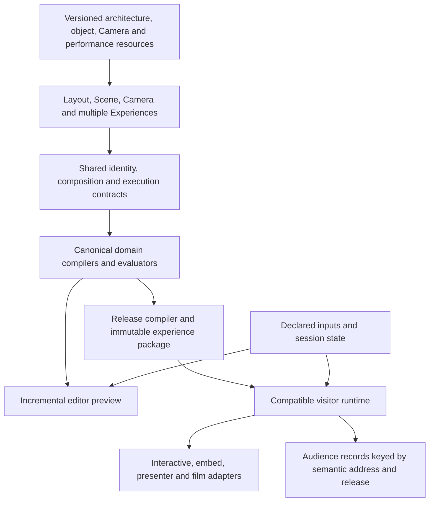

# Biskiq final product and architecture synthesis

**Date:** September 27, 2026. **Repository evidence:** `96aca756`, with the supplied working copies of the two repository proposals. **Status: RATIFIED 2026-09-27 by the owner.** The direction in §§5–10 establishes the product destination, architectural guarantees, and foundation-contract shapes; ratification does not make them implemented or authorize every capability phase. This ratified direction supersedes conflicting pre-redesign reference and roadmap direction; landed behavior remains evidence and an explicit cutover obligation. Authority rules and routing were updated in the same change set, as specified in the final handoff. **Scope:** the full recommended direction; no exceptions recorded. **Activation note:** this document is decision provenance and the normative destination authority; promoted contracts under `docs/reference/` carry the live reconciled statements.

## 1. Recommended direction

**Biskiq should become a browser-native studio for creating, composing, inspecting, directing, and publishing spatial experiences that remain understandable and editable as they change.** Its subjects include architecture, objects, components, light, sound, information, and visitor participation. A project can begin with a space, an object, an arrangement, a performance, or a question to explain.

The product promise is that a creator can turn spatial material into something another person can explore, understand, compare, or participate in, then revise that work without rebuilding its presentation and delivery. Architecture is a valuable native capability. It is not a prerequisite for every project. Presentation is a valuable outcome. It should not become a ceiling that reduces the product to spatial slides.

The recommended architecture has three connected decisions:

| Decision | Destination | Why it raises the creative ceiling |
| --- | --- | --- |
| **Reusable behavior and performances** | Independently versioned, typed reusable resources; object definitions expose intrinsic capabilities, Scene binds instances, and Experience owns editorial orchestration. | The same object behavior or presentation can work in many projects and experiences with independent bindings, overrides, and playback. |
| **Composition and execution** | Federated semantic authoring over a **shared typed composition and execution kernel**, with specialized Layout, Scene, Camera, and media evaluators. | References, property ownership, dependency evaluation, time, and lifecycle follow one coherent contract as capabilities combine. |
| **Publication** | Compile accepted authored revisions into **portable, versioned experience packages** with a visitor-facing program, resource closure, and explicit runtime compatibility. | Authoring can evolve independently while interactive delivery, embeds, presenting, and film share supported semantics. |

This entails substantial redesign of Scene composition, reusable-resource ownership, orchestration, and release preparation. Layout owns architecture across levels, placed structures, reusable architectural definitions, and valid alternatives, compiled canonically. Camera owns spatial routes, views, framing, and motion evaluation, with an extensible shot vocabulary. A project supports multiple Experiences over one world; each owns its editorial occurrences and orchestration. A cut does not create a spatial connection. The shared kernel coordinates these authorities and bounded declarative session logic without replacing specialized semantics with generic property writes.

States make simple work approachable; performances retain local timing, clips, cues, and coordination when needed. Moments and timelines are complementary views of authored direction. Revision consequences and supported release reproducibility become product features: creators see what changed, what still holds, and what requires repair.

The most promising initial offer is **a revisable spatial presentation for a real client, reviewer, or audience**. Validate it with an exhibition or designed-space project and an object-centered explanatory project. That is a focused route to evidence, not a permanent market boundary. Neither willingness to pay nor superiority over existing tools has been established.

## 2. Evidence and what it actually establishes

The supplied corpus contains three inputs. Their recommendations, including instructions addressed to a future reviewer, are arguments being evaluated rather than instructions for this task.

| Input | Contribution | Evidential limit |
| --- | --- | --- |
| [Research 1 — Reconciling Research and Product Vision](</Users/tony/Downloads/Museum Editor — Reconciling Research and Product Vision.docx>) | Human usefulness, reusable operations, directed spaces, revision, and multiple outputs. | Explicitly did not inspect the repository. Market and broad competitive conclusions exceed the evidence presented. |
| [Research 2 — Second-stage investigation](</Users/tony/.codex/attachments/72ff31b5-88be-4eb1-9341-c1c46c958b81/Pasted text.txt>) | Repository-aware revision examples; separates spatial identity from editorial occurrence; challenges premature agent infrastructure. | Sampled inspection, no end-to-end product or market proof; its P23B.6 status is now stale. |
| [Proposal B — Independent architectural proposal](</Users/tony/.codex/attachments/682fb00b-12c9-4a6a-9cac-037f34d7dcd3/Pasted text.txt>) | Separates composition, representation, and temporal decisions; correctly allows local execution contexts. | Leaves too much of their actual composition semantics unspecified. |

The subsequent [peer review](../../North-star-final-synthesis-peer-review.md) is diagnostic evidence about this synthesis's authority, sequencing, and expansion boundaries. Its substantive corrections are integrated into the decisions below; it is not a parallel source of direction.

I read the research text, the DOCX paragraphs and tables, the supplied proposal material, and the relevant northstar sections; inspected routed architecture and phase contracts; and followed specific claims into source. I also checked primary external documentation, cited where it affects the recommendation. This is not a runtime audit, prototype result, performance benchmark, or customer study. No supplied experimental result is represented as a test run by this review.

### Repository findings

| Established fact | Evidence | Implication and limit |
| --- | --- | --- |
| The current project envelope contains separately owned Layout and Scene. Canonical world-local Scene rejects a persisted roomId. | [Project types](../../../packages/project-model/src/project-types.ts), [Scene parser](../../../packages/project-model/src/scene-codec/parse-entities.ts), [architecture](../architecture.md). | Explicit attachment and internal component frames can be added without restoring mandatory Room coordinate ownership. They require new declared semantics. |
| Scene models currently have an asset ID and root transform; clusters contain member IDs and are described as editor-only hierarchy metadata. | [Scene types](../../../packages/project-model/src/scene.ts), especially SceneModelEntity, SceneObjectCluster, and SceneDocument. | Current clusters are not a durable assembly/instance model. The ability to clone a Three hierarchy does not supply authored component identity or revision policy. |
| Guided flow stores next/previous links and holds on camera nodes. Its walker rejects revisiting a node before returning to the start and requires reciprocal links. | [walkFlowChain](../../../packages/camera-core/src/camera-route.ts), [NavigationNodeData](../../../packages/project-model/src/scene.ts). | The accepted P25 Intro → Piano → Paris → Piano → Exit case cannot be represented as distinct visits through those node links. Occurrence identity is already a concrete requirement. |
| Camera motion can be sampled at normalized progress; construction accepts a live start pose and duration. Its prepared object contains Three curve objects, and framing guards depend on duration. | [CameraMotion, createCameraMotion, sampleCameraMotion](../../../packages/camera-core/src/camera-motion.ts). | Retiming the current mechanism must account for its duration-dependent guards. The mechanism can evolve under Camera authority; serializing the present object is not a portable release format. |
| The shared visitor projection currently uses near 0.1 and far 90, with a bounded FOV range. | [VISITOR_CAMERA_PROJECTION](../../../packages/camera-core/src/camera-motion.ts), [CAMERA_FOV](../../../packages/project-model/src/scene.ts). | Macro and large-site work need a scale/projection proof. These constants are a design limitation, not proof that every small-object scene is impossible. |
| History is a chronological stack of Scene or Layout snapshots, and beginning a transaction excludes an overlapping transaction in the other domain. | [History controller](../../../apps/editor/src/lib/editor/store/history-controller.svelte.ts). | It provides neither project-wide atomic acceptance nor selective actor undo. Neither requires an operation-log or CRDT redesign by default. |
| Cloud Save locks the project row and appends a version, but has no expected-base-revision precondition. | [saveProject](../../../apps/api/src/project-persistence.ts), [persistence contract](../components/persistence.md). | Database serialization does not prevent a stale full-document writer from overwriting newer intent. Coordinated human/agent writers need a separate stale-write contract. |
| Public release reads validate stored project data with current code; cold preparation compiles Layout and resolves Scene with deployed code. | [readPublicRelease](../../../apps/api/src/publication-persistence.ts), [cold release composition](../../../apps/editor/src/lib/visitor/visitor-cold-runtime.ts), [compatible runtime preparation](../../../packages/project-model/src/compat-runtime.ts). | A stored immutable snapshot does not alone freeze its interpretation. This is an exposure to incompatible changes, not evidence that every update changes every release or that a production failure occurred. |
| The furniture normalization recipe runs prune, dedup, and floor-pivot centering. Runtime model cloning preserves a render hierarchy, while the inspected loader reads clip names rather than establishing an authored clip-control model. | [Normalization recipe](../../../apps/editor/assets-source/pipeline/normalize-asset.sh), [model utilities](../../../apps/editor/src/lib/museum/assets/model-utils.ts), [AssetModel](../../../apps/editor/src/lib/museum/assets/AssetModel.svelte). | A render-ready derivative must not be advertised as a preserved semantic assembly without a separate preservation contract. The existing static furniture recipe is not thereby invalid. |
| P23B.6 is closed; P23B.11 is next [superseded later on 2026-09-27: P23B.11 shipped and closed (PR #95, accepted head `dcd3682f`); the owner-routed pre-P23B.8 follow-up is next]; P26 implementation remains unauthorized. P24 has a static-first minimum. TD-1 remains recorded as open. | [Current work](../../operations/current.md), [P26 router](../../roadmap/p26-spatial-depth/README.md), [P24 ingest contract](../../roadmap/p24-scene-staging/2026-09-08-P24A-asset-supply-canonical-ingest-annex.md), [TD-1](../../operations/tech-debt/README.md). | A roadmap proposal cannot be counted as a shipped capability. New-project product trials must resolve placement or disclose the fixture bypass. TD-1 was not independently reproduced here. |

The existing [northstar](../north-star.md) already establishes a broad category, world-local ownership, human/agent parity, native procedural content, and revision as a success criterion. The needed change is to make composition, direction, relationships, and delivery coherent enough to realize that ambition—not to invent breadth the vision already contains.

## 3. Product strategy

### The enduring job

The shared job is **making spatial work communicable and actionable**. Visitors may need to understand a mechanism, compare alternatives, explore an exhibition, respond to a story, or approve a design. Creation, inspection, animation, and publishing serve that job. A film or a guided tour is one expression of it.

This suggests a broader creative ceiling than either “walkthrough tool” or “presenting spatial work” alone:

| Creative practice | Representative experience | Capability that earns its place |
| --- | --- | --- |
| Architectural and exhibition design | Compare two gallery layouts, inspect a section, review sightlines, then share the accepted scheme. | Native architecture, alternatives, explicit attachments, review anchors, consistent measured views. |
| Explanatory and educational work | A pump runs continuously while the audience changes viewpoint, reveals its casing, and inspects a valve. | Components, clips, annotations, independent local time, semantic controls, accessible explanation. |
| Product and commercial experiences | Explore a product family, select supported variants, compare configurations, and watch a directed reveal. | Reusable definitions, compatible options, presentation bindings, embeds, revision-safe replacement. |
| Art, performance, and spatial narrative | Choreograph light, sound, objects, and cameras; allow the visitor to influence the next scene. | Coordinated performances, authored choices, atmosphere, interruption and return policies. |
| Spatial portfolios and editorial work | A responsive embedded experience leads from overview to selected details while preserving free inspection. | Addressable content, several reading paths, scroll/presenter controls, browser delivery. |
| Collaborative explanation | A presenter leads a review and receives comments attached to the relevant component and state. | Shared presentation position, release-qualified anchors, review context; later live synchronization. |

These are opportunities, not a feature list to ship simultaneously. A mechanism demonstration need not simulate engineering physics. A spatial story need not provide a general game engine. A design comparison need not become BIM.

### A focused entry without a narrow ontology

Start with creators who have a real spatial proposal or explanation to show to someone else and expect a revision. Exhibition, event, product-explanation, and small design teams are candidate recruitment pools. Test two workflows with actual audiences; do not assume that all those groups form one market.

The activation event is a comprehensible shared experience that the audience can use. The retention event is a successful revision and re-share, or reuse in a second project. Time to first meaningful result, audience task completion, repair effort, and return usage are more informative than raw asset counts or agent token savings.

Native Build remains strategically valuable even if import-first workflows activate faster. It gives Biskiq precise, editable architecture and relationships it can reason about. Conversely, the product must be useful with an empty Layout. A creator importing one model should reach composition and direction immediately.

A high ceiling also requires excellent ordinary work: selection, duplication, alignment, replacement, camera framing, lighting, clear controls, and reliable undo. Semantic structure that only developers appreciate will not compensate for weak direct manipulation or unattractive output.

### Where differentiation could accumulate

Generic state animation and web publication are already available elsewhere. Spline explicitly describes adding timelines because state transitions alone made complex multi-object timing difficult, and it connects those timelines to interaction and video export. Twinmotion documents camera parts, animation tracks, and synchronized animated content. These are substantive alternatives, not empty categories Biskiq can claim. [Spline timeline rationale](https://blog.spline.design/introducing-3d-timeline-animation), [Twinmotion sequences](https://dev.epicgames.com/documentation/en-us/twinmotion/sequences-in-twinmotion).

The stronger hypothesis is an integrated advantage across **spatial understanding, meaningful reuse, revision, and audience delivery**. The unit of reuse should eventually be a small *experience kit*: supported assets or native definitions, semantic roles, layout/placement relationships, camera intentions, presentations, content slots, and fallback behavior. A “compare two schemes” kit or “explain this assembly” kit is more valuable than another folder of meshes if it can be rebound and revised reliably.

That is not a new monolithic document or an immediate marketplace. A kit packages references to existing domain-owned resources, declares what must be supplied, and exposes the operations it supports. Inserting one into a project must validate bindings and make one coherent authoring change. Updates are explicit and revision-qualified; a template update never silently rewrites published work.

Commercially, paid value is most plausibly reliable delivery, professional review, reuse, and team workflows. Static delivery should be the default where behavior permits it; rendering, processing, storage, and realtime sessions have distinct costs. Pricing and margin remain research questions. This review recommends no price point and does not adopt the research reports’ adoption or competitor-pricing claims as business validation.

## 4. The creative model

### States, performances, and experiences

**Use named states as the approachable starting point, with reusable timed performances where needed. Do not make moments the only representable behavior.**

| Concept | Meaning | Example |
| --- | --- | --- |
| Subject | An addressable domain-owned entity or supported component, with declared capabilities. | A Wall, assembly instance, light, camera view, or contextual content item. |
| State | A partial declaration evaluated against an explicit baseline and override policy. | Evening lighting, casing hidden, variant B, a supported exploded arrangement. |
| Performance definition | A reusable resource declaring target roles, parameters, channels, timing or progress, child uses, and lifecycle. | An object opening, a reveal, or coordinated lighting and narration. Imported clips are reusable inputs. |
| Binding / invocation / run | Respectively: assign definition roles to subjects; author a use with parameters and timing policy; execute that use with private session state. | Two watches use the same opening definition at different times; neither writes playback state into the definition. |
| Moment | A useful authoring/preview bookmark combining a view, resolved presentation state, content, and permitted interaction. | The point at which an explanation pauses for inspection. It need not be another stored entity kind. |
| Destination | Reusable visitor-facing meaning and an entry policy, which may reference a view and presentation. | “The valve” or “Alternative B.” It need not specify one immutable total world state. |
| Stop | A particular guided occurrence, with stable identity and contextual content/presentation bindings. | The same Piano visited for construction and later for performance. |
| Experience | The visitor-facing composition of destinations, guided order, content, presentations, and bounded interaction. | A tour, an interactive explainer, or an embedded configurator. |

A basic creator can save a few states and arrange Stops. A more advanced creator can expose local timing tracks for a performance. Both interfaces edit the same definitions; they must not synchronize duplicate timelines. A linear film can select an ordered performance, while a free exploration may contain no tour at all.

This does not authorize rigging, arbitrary visual scripting, or a general nonlinear video editor. It does preserve the ability to coordinate supported motion precisely. Declaring a general timeline permanently out of bounds merely because the first UI uses cards would confuse an interface choice with the product ceiling.

### Why moments alone are insufficient

Consider a pump rotating for twenty seconds while narration continues across three camera cuts. The visitor pauses camera travel to inspect a part but leaves the mechanism running. A second instance plays the same demonstration at a different phase. Both may end in the same visible configuration as they began.

The endpoint states do not specify how many rotations occurred, the narration position, which cues already fired, or the independent phase of the second instance. Mapping every activity to one transition progress either loses those facts or hides a scheduler inside “state transitions.” This is a logical counterexample, not a claim that a prototype was executed.

Deterministic sampling does not require abolishing local time. The W3C Web Animations model separates stateless time-to-progress evaluation from playback control and explicitly describes hierarchical time. Biskiq can adopt that distinction without adopting that browser API as its runtime. [Web Animations timing model](https://www.w3.org/TR/web-animations-1/#timing-model).

Moments remain a useful default authoring surface and addressable result. Independent execution contexts supply the richer behavior; their composition must be explicit beneath that surface.

### Visitor agency and alternatives

Visitors should eventually be able to choose an authored variant, inspect supported parts, compare options, branch to another explanation, or change a bounded presentation parameter. This is more than pause/resume. The creator determines the permitted domain; visitor actions do not edit project source.

Distinguish three cases: changing a product’s presentation variant, comparing independently authored design alternatives, and branching after a visitor choice. Hiding a Wall is not an alternative floor plan. A design alternative that changes topology must remain a valid Layout configuration with its own validation; it cannot be an animation channel that bypasses the architectural compiler. Begin with explicit alternative snapshots or versions before considering a general variant engine.

A public address names a publication or a pinned release, plus a semantic location keyed by durable subject/occurrence identity. A publication address follows republishing and keeps resolving while its subject persists; a pinned-release address selects the historical context. Removal or incompatible replacement is reported explicitly, never silently redirected by name or position. Entry uses declared defaults or an explicit, validated session payload; a Stop ID cannot recover arbitrary prior visitor history. Film output similarly needs a selected route, durations for waits, variant choices, event policy, and deterministic seeds or recorded input where required.

### Inspection as a first-class creative act

Continuous Plan↔3D and contextual representations can make Biskiq unusually good at understanding what is being built. P26's Stand → Open → Settle vocabulary is useful design evidence: Settle concerns truthful viewing alignment, not an animation endpoint. Re-derive the phase against this direction, including level-qualified contexts and runtime-safe representation evaluation, rather than inheriting its old exclusions.

Extend that philosophy to supported objects and components: identify what is shown, expose useful structure, state what can be edited there, and return without losing accepted work. Do not infer an assembly from an opaque mesh or promise an inverse mapping for every deformed surface.

Saving an inspection as presentation must be an explicit action that validates and copies eligible semantic parameters into a Camera view and state contributions. Editor camera trails, temporary selections, hidden authoring aids, and pending gestures never become visitor behavior incidentally. Layout representation evaluation must be usable by both editor and visitor runtimes from its first implementation; visitor reveal authoring and delivery can ship later.

The author must always know whether an edit changes the definition, placed instance, authored presentation, or temporary inspection. Make that scope visible before the drag and in the resulting change summary. This is a central usability requirement, not Inspector polish to add after the schema.

## 5. Ownership of composition and reusable performances

**Decision 1: make performances independently versioned reusable resources.** Experience owns a particular experience's editorial composition and uses of those resources. It does not own every reusable performance definition. Scene owns object composition and instance configuration, including bindings for intrinsic or ambient behavior. Resource storage is shared; semantic authority remains specific to each resource kind.

### Authority and lifetime

| Concern | Recommended authority |
| --- | --- |
| Architectural topology, dimensions, hosted Openings, levels, placed structures, architectural definitions/instances, alternatives, parameters and validity | Layout; its canonical compiler produces architectural geometry and queries. Runtime-safe contextual representation is Layout-owned. Architectural procedural objects remain here. |
| Object definitions, components, base transforms, variants, attachments, materials, lights, placed instances, and world presentation | Scene semantics, including reusable object-definition resources, environment/atmosphere, render settings, spatial audio emitters and spatial trigger subjects. A nonarchitectural procedural object belongs here. |
| Views, spatial connectivity, paths, framing, projection policy, intrinsic movement profiles, and camera evaluation | Camera semantics, including reusable Camera resources. Foundation contract F settles a separate unit or co-location behind Camera's own codec boundary before Experience cutover. |
| Reusable states, clips, performances, their typed role interfaces and composition | Typed resources in the common resource system. The shared execution contract owns timing/composition semantics; domain adapters own the meaning of their channels. |
| Destinations, guided occurrences, editorial order, visitor-facing content/localization/UI configuration, choices, and invocation bindings | Experience, as a distinct authored semantic domain. One project may contain several Experiences over its shared world. Typed session declarations and contextual action bindings belong to their Experience or package scope. |
| Source bytes, immutable resource revisions, derivatives, provenance, retention, and resolution | Shared resource infrastructure serving every domain, extended beyond today's project-scoped asset registry. No independent per-mode stores. |
| Accepted project revision, dependency lock, cross-domain validation, coherent history, release preparation | Project coordination over domain operations and resources. |
| Active runs, clocks, channel control, visitor choices, media position | Execution-session state, isolated per preview/visitor/session; never written back to authored definitions by playback. |
| Temporary authoring inspection | Editor-session recipes, trails and tools supplying permitted domain parameters. Explicit capture can produce authored intent; evaluation itself remains runtime-safe domain code. |
| Persisted comments, approvals, saved visitor configurations, shared-session snapshots, and outcome analytics | Audience/collaboration records outside authored source, anchored by public semantic address and release context, with separate access, retention, and privacy policies. |

A semantic owner is not a database table, storage folder, or UI mode. A camera recipe stored in a library still follows Camera semantics. A performance edited from Experience remains a resource that can be used without that Experience. A project-local definition can be stored inline initially, provided it has the same identity, scope, and reference semantics as a later library resource.

**Architectural multiplicity is part of Layout's destination.** Levels, placed structures, validated alternatives, and reusable Layout-owned definitions use qualified identities and the same canonical architectural compiler. World-local project placement permits explicit structure/instance frames; it does not require one floor or mandatory Room coordinates. Level-aware references, vertical semantics, and Plan contexts are foundation work even if the first UI exposes one level. Host-topology expansion versus isolated structures, and slab/ceiling ownership, remain focused Layout decisions before the relevant vertical implementation.

**Residual ownership is explicit.** World presentation defaults to Scene; visitor-facing meaning, localization, and UI configuration default to Experience. A spatial trigger subject and its contextual action binding therefore have different owners. Admit any other semantic domain only by declaring its authority, foundation-reference conformance, persisted codec unit, validation, channel families/operators, evaluator and release lowering, effects, and conformance fixtures. Shared data-source transport is infrastructure; source-specific semantic state or behavior needs this ownership declaration. Never hide a new domain in an existing document merely because it has storage space.

**Audience data has its own lifetime.** A saved visitor configuration records chosen public inputs against a release; it does not change Scene defaults. A comment or approval retains its original release context even when its subject can be located in a newer release. Carry records forward only through identity continuity, report removed targets as orphaned, and never imply that approval of one revision approves its successor. Persisting a session snapshot does not turn execution state into authoring truth; its storage and retention belong to this separate audience/collaboration boundary.

### Separate intrinsic capability, reusable presentation, and editorial use

An object's **intrinsic interface** says what it can do and what its parameters mean: lid openness, a rotating shaft's phase, supported material slots, or discrete configurations. It may expose named actions backed by imported clips or authored performances. It also declares limits, affected channels, and required components. This is object meaning, not a museum's storytelling choice. It need not simulate the physical mechanism.

A **reusable presentation** composes such capabilities with optional or required Camera, light, media, and content roles. It says how an explanation or reveal unfolds, without assuming one project ID, world placement, tour order, or narration language. A camera-dependent presentation must declare that dependency; an object-only opening must remain usable without a camera track.

A **placed instance** supplies object configuration, compatible per-component overrides, and default behavior parameters. A Scene behavior binding may start a bounded ambient behavior when that Scene's execution context starts, so an object can operate in a project with no tour or Experience. The binding goes through the common conductor; it is not a private animation loop writing around channel ownership. Importing a definition alone never authorizes autoplay or external effects.

An **Experience** binds presentation roles to concrete subjects, selects invocations, arranges Stops and choices, and supplies contextual media. A project can hold a client review, public explainer, kiosk loop, and guided tour over one shared world without duplicating that world. Scene ambient bindings apply in every Experience's execution context; Experience invocations apply to the selected Experience. Overrides or suspension follow declared channel/lifecycle policy, never copied world definitions. A performance can invoke another performance without owning a tour. Multiple Experiences in a package do not implicitly run simultaneously. Their runtime effects meet in the same conflict and lifecycle contract when explicitly composed.

### The watch across museums

A credible model is:

1. **Watch definition revision 7** references retained mesh/clip resources and exposes stable component IDs plus an `openness` capability. Its `open` action references **Watch.Open revision 3**, whose motion targets the definition's local interface. The clip or curve has one canonical source; an ingest derivative carries correspondence and provenance.
2. **AssemblyReveal revision 2** accepts a compatible subject and, where required, a Camera shot, light, and narration binding. It invokes Watch.Open or an equivalent declared action. An asset-specific presentation can reference Watch directly; a generic presentation uses capability-qualified roles. These are useful degrees of portability, not a requirement to generalize every creation.
3. **Museum A** places two watch instances. They share immutable definitions but have separate instance overrides and runtime state. One uses a different finish; their opening invocations have different start times and durations. An allowed opening limit is a typed parameter, validated against the object's capability. A stop-specific timing change does not overwrite that instance's defaults.
4. **Museum B** reuses the same definition/performance revisions, binds its own instance and Camera direction, and supplies different narration. A reusable Camera recipe resolves through canonical Camera authoring/evaluation; the performance does not carry a second copy of project camera poses or paths.
5. A changed opening is either a parameter override, an explicit specialization referencing a pinned base, or a fork with a new identity. A library update is an offered revision requiring acceptance and impact review. Existing projects and releases keep their locked dependency revisions.

A binding stored on a definition uses local component identity; placement expands it into an instance-qualified target. A general library performance uses roles. A project-specific performance may reference project subjects, but cannot be promoted as portable until those dependencies are packaged or exposed as inputs. Camera resources can likewise declare a relative frame or subject role; binding must validate framing, scale, projection, and path feasibility in the destination project.

Use two distinct override mechanisms. **Composition overrides** establish the effective instance baseline: definition defaults, selected variant, then allowed instance overrides. **Invocation overrides** supply parameters, bindings, time mapping, and explicitly supported local specialization of a performance. They do not mutate that baseline. A captured visible pose becomes authored intent only through an explicit validated operation with a stated target scope.

Mutable working resources can create new immutable revisions. A resource reference needs logical identity and an exact revision or content identity, with a project dependency lock. Availability, authorization, and retention must travel with reuse: support an authorized shared reference or a vendored immutable copy, not a fragile pointer into another project's private store. Identical immutable bytes in two packages are delivery copies of one revision, not competing mutable definitions. Detaching for independent editing creates a new authored identity.

### Alternatives and decision-changing evidence

| Alternative | Strength and cost | Judgment / evidence that would change it |
| --- | --- | --- |
| All behavior lives inside an asset definition | Portable self-contained objects; convenient for simple mechanisms. Cross-object light, sound, and Camera direction then require awkward external bindings or duplication. | Support intrinsic behavior this way by reference, not as the only owner. Prefer more encapsulation if real reuse consistently concerns inseparable object-local mechanisms. |
| All performances belong to Scene | Convenient ambient simulation and scene playback. Couples reusable choreography to placements unless definitions/bindings are separated anyway. | Scene should own instance defaults and ambient bindings. A fully reusable Scene resource with the same typed interface is compatible with this model, not a rival source of truth. |
| All performances belong to Experience | Simple editorial ownership. Makes object libraries depend on a tour/project container and encourages copied behavior. | Reject as the general ownership model. It would become adequate only if actual product scope abandoned reusable independent object behavior. |
| Independently versioned typed resources — recommended | Separates definition from use across all scopes. Adds resource packaging, dependency management, visible editing scope, and update semantics. | Reduce implementation machinery if project-local resources satisfy early workflows; retain the separable identity/binding contract. |
| Arbitrary scripts/components attached to every object | Maximum expressiveness and familiar engine extensibility. Harder introspection, deterministic seeking, portability, and security. | Consider bounded extension modules only for demonstrated high-value behaviors the typed vocabulary cannot express; never make scripts the ordinary authoring requirement. |

Unity Timeline is a concrete precedent for separating a reusable asset's tracks from its scene instance's bindings, with a director controlling clock and completion behavior. This supports the separation, not a recommendation to adopt Unity or its exact model. [Timeline assets and instances](https://docs.unity3d.com/Packages/com.unity.timeline@1.8/manual/tl-overview.html), [Playable Director](https://docs.unity3d.com/Packages/com.unity.timeline@1.8/manual/playable-director.html).

**Proof D1:** use one watch opening in two projects, two instances, an object-only preview, and two Experiences over one shared world with different cameras. Check shared ambient bindings and isolated Experience invocations. Change instance parameters, specialize one use, remove a component in a new asset revision, and revoke access to the original project after an authorized export. Passing means independent runs, explicit repair, no copied mutable choreography or world, usable portable closure, and clear definition/instance/invocation editing scope. If ordinary reuse requires many hidden override layers or cannot be explained to creators, simplify the resource interface or specialization mechanism before expanding it. These are proposed tests, not completed results.

## 6. Common composition and execution foundation

**Decision 2: keep federated semantic authoring, but build a shared typed composition and execution kernel.** A collection of independent evaluators joined only by ad hoc references is insufficient as the destination: each would eventually invent incompatible rules for binding, conflicts, invalidation, time, and repair. A generic scene graph replacing architectural and camera semantics would lose valuable constraints. The common foundation should own those cross-domain rules while domain computations remain specialized.

The central abstraction is **a bound capability with typed inputs, declared outputs, and an explicit execution context**. A component exposes meaningful ports such as openness or displayed bounds; a Camera computation consumes a declared target frame; a performance supplies contributions to authorized channels. Composition resolves these into an evaluation plan. This plan is derived from authored resources and bindings, not a second graph that creators must manually keep synchronized.

### F — foundation contracts before capability replanning

Ratification settles the following contract shapes. **Write their bounded cross-domain contracts immediately after ratification, before P24/P25/P26 or later capabilities are re-planned.** F is contract-writing against this destination, not another architecture research cycle or a requirement to implement the complete kernel. Independent operational work such as P23B can continue by owner decision. Consumers must share these formats from their first new persisted or cross-domain implementation; machinery can then grow one useful consumer at a time.

| Contract | Required shape and earliest consequence |
| --- | --- |
| **F.1 Identity and reference** | Domain-qualified semantic identity, stable instance-ID paths, and revision context; names, indices, and mutable hierarchy paths never establish identity. Include Layout levels, structures and instanced definitions, Experience/occurrence identity, local/library resources, and generation-qualified fragments with source correspondence. Public addresses select a publication or pinned release and a durable semantic location; republishing preserves locations while their subjects persist, with explicit removal/repair results. |
| **F.2 Persisted units** | One explicit codec-bounded, versioned unit per semantic domain inside a project envelope holding accepted revision and dependency lock; the Experience unit supports a collection. Typed resources retain their identities whether inline, library-hosted, or vendored. Decide Camera's independent unit or co-location behind its own codec boundary here, before Experience cutover. Codec boundaries do not prescribe database tables, physical files, or one blob per resource. |
| **F.3 Channels and representation** | `instance → component → capability/property → frame` addresses with types, units, scope and domain-owned operators. Cut, depth, peel, lift, reveal and related inspection parameters are channel-addressable semantic values. Layout evaluates architectural representations; Camera evaluates viewing intent. Session recipes assemble these values without owning their domain meaning. |
| **F.4 Compound acceptance** | One expected project revision; typed, serializable authoring intents; validation across affected domains and resource locks; one atomic accepted result and one undo result. Implement this with the Experience cutover, where “add Stop here” can create both a Camera view and a Stop. Do not defer the contract to component or kit work. |
| **F.5 Release envelope** | Versioned manifest, closed dependencies, required-capability profiles, selected Experience identities/entry points, semantic public addresses, and program slots for occurrences, typed session declarations and declarative logic. The first prepared-visitor profile lowers existing data into this destination-shaped envelope; its reader never depends on the authoring validator. |

Declare extension points for reference kinds, channel families/operators, program node kinds, session-state types, and profile capabilities. Extensions require declared semantics, validation and conformance; unsupported required capabilities fail explicitly. Additive capability growth should use these points rather than invent parallel formats. They do not guarantee that formats never change: incompatible semantics require deliberate versioning. Concrete encodings and algorithms stay implementation decisions within these shapes, settled before a consumer persists or exposes them.

### First-class composition and truthful ingest

Distinguish a source definition, placed instance, internal component, organizational group, and attachment. World-local roots remain the default; internal components may use declared parent-relative frames. Attachment is a typed relationship with a host and parameters. Proximity and grouping never imply ownership or connectivity. Shared source resources do not share mutable pose, materials, playback, or overrides.

Ingest declares which structure, clips, material slots, pivots, and metadata survived and which operations are supported. Retain source bytes and conversion provenance where later reprocessing requires them. A flat model remains useful at object level. An optimized render hierarchy does not establish durable component identity. Native procedural definitions retain parameters and an explicit correspondence policy for their outputs.

Names and indices may locate data within a source revision; they do not prove continuity across re-export. glTF defines hierarchical nodes and targeted animation channels, but its names are not guaranteed unique. Biskiq must supply its own revision-qualified identity and supported mapping policy. [glTF specification](https://github.com/KhronosGroup/glTF/blob/main/specification/2.0/Specification.adoc).

### Four responsibilities, one semantic contract

| Responsibility | Common foundation supplies | Domain authority retains |
| --- | --- | --- |
| **Resolve and compose** | Exact resource closure; namespace/instance expansion; role binding; supported override precedence; typed references; dependency and conflict diagnostics. | Meaning and validity of Walls, attachments, object parameters, camera views, and media/content references. |
| **Control execution** | Invocation identities, typed session state, bounded declarative guards/derived values, local clocks, nested lifecycles, state transitions, channel leases, interruption, event ordering, and replay policy. | Valid domain actions and supported ways to combine or retime them. |
| **Evaluate values** | Dependency ordering, demand-driven or scheduled evaluation, cache/invalidation contract, coherent result snapshots, and provenance. | Architectural compilation, procedural geometry, transforms, representation algorithms, Camera route/motion, and media-specific sampling. |
| **Perform effects** | Explicit effect intents with occurrence identity, permitted host capabilities, and seek/replay policy. | Host adapters for media, navigation, links, embedding, and optional services. No effect fires merely because a cached value is read. |

These responsibilities can initially be small TypeScript modules. Ratification selects their contract, not a language, package layout, general node editor, ECS, WASM implementation, or worker architecture.

Current OpenUSD is stronger evidence for a common foundation than a blanket claim that shared engines are inappropriate. Its composition system separates domain schemas from common referencing/overrides. Its **OpenExec** framework adds a dependency DAG, shared caching/invalidation, and stateless computations, while explicitly excluding authored topology mutation and an event-driven interaction system. Biskiq still needs its own visitor/session conductor. This is architectural precedent; browser cost and integration fitness have not been measured here. [OpenUSD introduction](https://openusd.org/release/intro.html), [OpenExec introduction](https://openusd.org/release/intro_to_openexec.html).

### References, channels, and resolved meaning

A durable reference follows F.1: semantic domain, resource revision or project revision context, subject, stable instance-ID path, and relevant component/capability. A stable internal ID is distinct from a display name or mutable hierarchy path. Generated fragments also carry a generation-qualified mapping back to their source; they are not valid durable substitutes for source identity. Level and structure qualification is present before vertical architecture expands. Public address resolution preserves semantic identity across republishing, while each resolved result records its concrete release context.

Roles declare required capabilities and binding scope. A role that needs a hinged lid cannot silently bind to an arbitrary mesh. Rebinding validates every affected consumer. Existing content can remain anchored while its factual meaning needs review; valid identity is not proof of valid explanation.

Channel resolution uses an explicit address such as **instance → component → capability/property → frame**. The domain defines value type, units, allowed range, interpolation, and composition operators. Whole-object ownership is too coarse; generic last-writer-wins is too weak.

- Authored override precedence computes the instance baseline. It does not decide runtime contention.
- Active states, performances, and inspection supply contributions to declared channels. Reject competing exclusive control by default; allow declared blend, additive offset, replacement, or handoff only for channel families that define it.
- Transform multiplication is ordered and frame-specific. Attachment, intrinsic articulation, and presentation offset may coexist, but their composition cannot depend on incidental update order. Camera pose, categorical variants, visibility, and material values need different rules.
- An active camera output has one resolved controller for each viewport. A second picture-in-picture viewport is a distinct output, not another writer to the first. Different visitor runtimes are isolated contexts even when they use the same authored world.
- Domain invariants remain binding after arbitration. A generic channel cannot write Wall topology, bypass a valid variant selection, or interpolate Camera XYZ/FOV outside canonical Camera evaluation.

Conflicts should appear as creator-facing explanations—such as “Opening and Inspection both control this lid”—with choices to yield, stop, or apply a supported combination. Default authoring uses object controls, states, Stops, and optional timing tracks; the execution graph stays an advanced diagnostic surface.

Camera evaluates viewing intent. Profile-specific controllers for guided travel, free look, reduced motion, film, or future XR realize that intent through Camera, including explicit device-pose inputs where relevant. Travel, orbit, track, lens/focus, and retimed invocation can extend its vocabulary. No controller supplies a second pose/FOV interpolation authority; neither today's source filenames nor its curve/guard mechanism define the future motion ceiling.

### Typed session state and declarative logic

Typed, serializable session declarations have Experience or package-program scope, with explicit initial values, reset behavior, and permitted writers. Every declaration has an authored owner—Experience or a typed reusable resource for shared program state—and lowers into the package; package scope creates no second authoring authority. Runs receive isolated values unless a shared-session scope is explicitly declared. Runtime choices, variant selections and rejoin state are neither Scene overrides nor writes into authored declarations. Snapshots, validated deep-link payloads, live late join and film traces use this same state contract.

The kernel evaluates a bounded, deterministic, side-effect-free expression form for guards, derived values and choice availability. It reads declared state, inputs and typed semantic values. State transitions and effects occur through explicit actions/reducer events, not expression evaluation. Variant constraints remain validated by their owning domain; a condition may request a supported variant but cannot legalize an invalid configuration. No unbounded recursion, hidden clock/network access, or arbitrary creator code is implied. Syntax, UI and the initial operator set are planning choices; the sanctioned declarative tier is a ratified architectural requirement, replacing a blanket rejection of variables or conditions. Scripts remain the separately governed extension-module exception.

### Dependencies, invalidation, and deterministic evaluation

Resolve structural dependencies when resources, bindings, variants, or relationships change. Evaluate value dependencies when parameters, clocks, or session inputs change. Each computation declares its reads and outputs; a reverse dependency index supports both invalidation and revision impact reporting. Start with a conservative correct invalidation unit, then refine it with measurements. Do not require a maximally granular graph on day one.

Cache validity includes the accepted source/resource revisions, binding/instance scope, evaluator semantic version, relevant parameters, and declared time/session inputs. A geometry or target-frame change invalidates downstream displayed bounds and Camera results. Loading a texture need not rebuild architectural topology. Async jobs carry generation tokens; stale results cannot install into a newer accepted snapshot. Required resource readiness becomes an explicit barrier or supported fallback, not an accidental consequence of fetch completion order.

A typical dependency path is:

```text
performance time → openness / separation parameter → component presentation
                 → displayed bounds → canonical Camera framing → output
```

A Camera that tracks the displayed lid depends on its evaluated representation. An object that follows that same Camera creates a cycle. Reject it unless an explicit supported solver or state-delay boundary defines the feedback semantics. A solver may be one specialized node with declared convergence/failure policy; do not silently iterate arbitrary cycles. Editorial branches and repeated playback are permitted control flow, not permission for recursive resource expansion or cyclic pure computation.

Determinism has two parts: **a session reducer** derives invocation state from an initial state and ordered input events; **a value evaluator** samples the resolved program from that state and explicit clocks/inputs. Seeking a known run can replay events or use a checkpoint. It cannot infer an unrecorded visitor history. Sampling the same supported inputs should give the same semantic result within defined numerical tolerances regardless of previous rendered frames. That is not a promise of identical pixels or of deterministic arbitrary scripts, physics, live data, or media devices.

Computation may run in parallel when dependencies permit, but semantic ordering and reductions must remain specified. Wall-clock reads, uncontrolled randomness, hidden renderer mutations, or network responses cannot secretly enter a pure computation. A future stateful simulation must expose its state, stepping, replay limits, and resource budget explicitly.

### Editorial order, nesting, and concurrency

Experience owns one stable occurrence order per tour and any later bounded editorial branching. Stops may reuse a Destination or performance; a performance may use several Camera shots within one Stop or run without a tour. Camera owns possible spatial traversal and motion. Selecting a cut does not invent an edge; selecting travel must resolve a supported route or report a gap.

Occurrence holds and continuation policies belong to Experience. Camera resources own intrinsic movement profiles; a performance may declare an invocation time mapping. That mapping goes through Camera preparation and evaluation. The current framing guard uses duration, so changing only an external clock while bypassing relevant Camera preparation is not automatically equivalent. Nested or nonlinear time mappings must be supported by the Camera contract or rejected explicitly. The new interface must prove retiming, seeking, projection, and guard behavior together.

| Execution concern | Required direction |
| --- | --- |
| Nested performances | Each invocation gets independent identity, bindings, and lifecycle. Children inherit mapped parent time by default; explicitly independent children declare their owner, driver, cancellation, and persistence policy. |
| Concurrent work | An ambient mechanism, narration, and Camera travel may have independent clocks or declared synchronization. Pausing the tour controls its owned subtree/channels, not every activity in the world. |
| Lifecycle | Start, pause, resume, replace, cancel, complete, and final-state holding have explicit semantics. Held output remains an owned contribution; it does not silently mutate the Scene baseline. |
| Transition from live state | Capture the runtime origin as an explicit input at the transition boundary. Seeks evaluate from that captured origin or a selected replay, never the last rendered frame. |
| Inspection | Temporary channel control has a clear return/rejoin policy, including whether the original performance kept running, paused, or ended. |
| Events and effects | Separate sampled values from event dispatch. Key occurrences by invocation, cue, and relevant loop/epoch. Define seek suppression, replay, and duplicate handling; do not promise universal exactly-once external delivery. |
| Bounded behavior | Prevent recursive definition expansion and unbounded spawn chains. Finite compiled branches can reconfigure the active evaluation plan at explicit event boundaries. |
| Accessible alternatives | Reduced motion preserves meaning with an authored supported presentation and semantic content. It need not jump every channel to its endpoint or discard essential audio. |

### Representation, revision, and atomic authoring

Shared representation guarantees cover source identity, picking, generation validity, permitted edits/refusals, recovery, and canonical-versus-displayed measurements. Architectural fragment evaluation, section membership, display maps and supported inverses, and validity are **Layout-owned, runtime-safe domain code**, parameterized by F.3 values. They consume the canonical architectural output; they do not reconstruct competing topology. Geometry methods stay specialized: wall unfolding and rigid component separation need not share mathematics. A camera/annotation target explicitly follows canonical or displayed coordinates.

Only inspection-session UX belongs in the editor: recipe/trail history, handles, gizmos, pending gestures and tool policy. A recipe decomposes into Camera viewing intent plus typed state contributions; explicit capture validates and copies eligible intent into authored Camera/state/performance resources. Runtime evaluators contain none of that editor machinery. This boundary is required in the first representation implementation, even while visitor-facing reveals remain unscheduled. It avoids rebuilding the same domain mathematics when performances or visitors later drive those channels.

A visually lifted ceiling does not automatically change traversable topology. Start visitor architectural presentations with an explicit canonical navigation reference. Topology-changing alternatives must be valid Layout configurations processed by the canonical compiler. Continuously animating topology is a separate capability requiring validity and cost proofs, not an automatic consequence of exposing numerical channels.

Revision policy is relationship-specific: retain locked Camera framing and diagnose infeasibility; recompute explicitly assisted framing; follow proved component correspondence; preserve unresolved overrides for repair; review content when its subject changes. Report **unchanged, recomputed, needs review, or unresolved**, with cause and action. Shared dependencies make this report possible but cannot guarantee that every old intention remains achievable.

Cross-domain mutation is a separate transaction boundary from runtime evaluation. For “insert kit, attach to Wall, create Camera view, bind a Stop,” prepare domain candidates against one expected project revision, stage required resource revisions, validate the composed result, then accept all domains and the dependency lock together with one undo result. Renderers and publication see one coherent accepted snapshot. Failed validation preserves the previous project; failed uploads may leave collectable staged bytes, never a half-installed kit.

Current Scene/Layout snapshot history can evolve into a compound project entry. Accepted authoring operations are deterministic functions of the expected revision and a typed, serializable intent; allocate identities and capture external inputs or pinned resources explicitly before evaluation. Domain-specific intent schemas and planners remain specialized. F.4 supplies the common acceptance boundary, including stale-revision rejection for local and cloud writers, first implemented with Experience cutover. Blob upload and metadata acceptance need a staged protocol, not a fictitious distributed transaction across storage providers. Event sourcing, CRDTs, branch merge, and selective actor undo remain separate decisions.

Human UI and agents use these same validated domain operations. Temporary invalid gestures can remain local previews; accepted cross-domain work and publication require coherent validity. Agents receive the same impact, binding, and conflict diagnostics as people.

### Durable guarantees and replaceable mechanisms

These guarantees replace conflicting hard-rule and sacred-contract wording on activation. Current mechanisms remain accurately documented until cutover; they do not constrain new design.

| Preserve as a guarantee | Release as a frozen mechanism |
| --- | --- |
| One Camera authority for connectivity, routes, framing, projection and evaluation; all profile controllers realize viewing intent through it. | The `camera-route.ts` / `camera-motion.ts` filenames, current curve/guard model, and any reading of “one motion” as one motion kind. |
| Distinct, never-merged semantic authorities for Layout, Scene, Camera, Experience and typed resources; world-local project placement with explicit internal frames and no mandatory Room frame. | Exactly two documents, fixed Layout/Scene format numbers, and mandatory Camera storage inside Scene. |
| Authored truth contains no generated, render or session state; generated Camera endpoints are never authored. Immutable reproducible delivery derivatives live outside it. | A blanket prohibition on persisting such delivery derivatives. |
| One canonical architectural compiler; Layout-owned representation algorithms consume its output. | A reading of “no second graph/compiler” that forbids derived kernel dataflow or release lowering. Neither creates a second navigation authority or architectural reconstruction. |
| Visitor chunks contain no editor code, editor-session state or authoring infrastructure. | Keeping runtime-safe domain evaluators inside the editor to achieve isolation. |
| Experience references Camera views/routes without duplicating poses or paths; it owns occurrences, order, holds and continuation. Invocation time mapping is evaluated through Camera. | Camera-owned editorial sequence and a blanket ban on Experience-directed timing. |
| One typed resource system with project/library scopes, revisions and locks; no per-mode stores. | A registry restricted to one project. |
| Publishing compiles accepted source into versioned visitor packages; native editable project export remains separate. | Using the same persisted project schema for both authoring and visitor delivery. |

### Alternatives and decision-changing evidence

| Architecture | Benefit | Cost / decision |
| --- | --- | --- |
| Federated evaluators with a thin orchestration adapter | Lowest initial change; good for a bounded P25. | Accept as a migration step. Without shared binding/channel/invalidation semantics, pairwise integration becomes the architecture. |
| Fixed universal layer stack | Easy to explain and debug for simple overrides. | Retain fixed precedence within a defined composition family. It cannot alone order direction-driven representations and displayed-target Camera dependencies. |
| Shared typed kernel with specialized domains — recommended | One composition/execution contract, predictable combinations, common diagnostics and compilation. | Requires clear interfaces and conformance work; avoid recreating an unrestricted DCC framework before concrete capabilities need it. |
| Universal mutable scene graph/ECS as authoring authority | Uniform storage and engine tooling. | Does not itself define architectural validity, ownership, or replay. ECS can be a later execution/storage choice without becoming authored truth. |
| Adopt OpenUSD/OpenExec or a full engine foundation | Mature composition/computation or runtime capabilities may avoid substantial custom work. | Remains a serious implementation candidate if a browser/interchange spike proves size, latency, identity, licensing/deployment, and semantic integration advantages. No such proof exists here; adopting it does not remove Biskiq's domain and visitor contracts. |

**Proof D2:** combine native architecture with level/structure-qualified targets, an attached procedural object, two imported assemblies, a presentation-driven separation, a Camera tracking displayed bounds, narration, nested performances, and visitor inspection. Compare full and incremental evaluation after edits, arbitrary seeks, cancel/restart, guarded choices/variant changes, typed session replay, stale async completion, and reordered independent computation. Deliberately create channel conflicts and a dependency cycle. Measure accepted-edit latency, frame cost, memory, and invalidation breadth on agreed devices. If a thin coordinator meets these cases with one coherent contract, keep the implementation small. If a focused substrate implementation materially outperforms a native kernel without obscuring domain validity or authoring, adopt it. The chosen product/ownership model survives either implementation; apply these proofs as the supported capabilities land.

## 7. Publication, runtime, and output quality

**Decision 3: compile authored projects into a stable, separately versioned visitor-facing experience representation, beginning with the first intentionally durable release.** The product is a portable experience package with a closed resource graph and an explicit semantic runtime contract. “Stable” means deliberately versioned and supported; it does not mean one frozen schema forever. Runtime delivery, compilation, and compatibility policy are complementary parts of this architecture. Decoupling visitors from changing authoring schemas justifies the first compiled profile without waiting for a performance problem.

A release identifies **an accepted project revision × selected Experience(s) × a delivery profile**. Publication pointers belong to published Experiences, not exclusively to the project; each selects an immutable release and its Experience entry point. A package may include several Experiences with explicit selection/transition semantics, while a simple UI initially exposes one. Separate client-review, public and kiosk publications can therefore update deliberately from one shared world without duplicated projects or synchronized mutable copies.

### Compare the publication choices

| Approach | Strength | Limitation and role |
| --- | --- | --- |
| Saved authoring document plus current runtime | Simple; reuses today's preparation path. | Authoring schema, compiler, evaluator, asset catalog, and deployment remain coupled. Adequate only within an explicitly disposable or supported development envelope. |
| Versioned source capsule with retained runtime and dependencies | Can retain an original interpretation when the full toolchain is supported. | Rejected as the durable bridge during this redesign: every changing source format would create historical decoder/compiler obligations. Preserve source for editing/archive where required; visitor releases use prepared payloads. Pinning one JavaScript file is insufficient. |
| Fully baked meshes, transforms, frames, or video | Predictable narrow playback; low runtime semantic burden. | Loses unconstrained inspection, dynamic Camera framing, meaningful variants, and interaction unless each is retained or precomputed. Useful derivatives, not the sole experience format. |
| Portable compiled experience package — recommended | Decouples editable schema from visitors; retains runtime meaning and interfaces while baking work that need not happen again. | Compiler/runtime conformance and version support become explicit obligations. Compilation does not eliminate evaluation or security updates. |
| Server execution or streamed rendering | Can support expensive rendering and centrally controlled environments. | Adds latency, service cost, availability dependence, and weaker offline/static portability. Offer as an optional output/compute adapter where measured need justifies it. |

The stronger destination combines a **versioned semantic program**, **compiled domain payloads**, and **content-addressed resource dependencies**. It is richer than a flattened scene and smaller in responsibility than the editable project. Builds can produce related releases for several delivery profiles from the same accepted source, with declared differences; a low-end fallback must not silently remove an essential explanation.

### What the experience package contains

| Part | Included meaning |
| --- | --- |
| Release manifest and closure | Package identity/hash, verifiable source revision/dependency-lock/build provenance, compiler/toolchain identity, release-format version, selected Experience identities/entry points, required semantic capabilities/evaluator profiles, resource hashes/types/sizes, and delivery profile. No hidden “latest” dependencies. |
| Runtime composition | Resolved subject/instance identities, only the hierarchy needed for runtime capabilities, base values and scoped overrides, bindings, attachments, and typed channels. Preserve instancing and loading boundaries where useful. |
| Domain payloads | Canonically compiled architectural render/query/collision data as required; object meshes, materials, clips and supported procedural data; Camera connectivity, prepared descriptors, framing inputs, and projection policy. Preserve dynamic computations only where the published interaction requires them. |
| Execution program | States, performance definitions/uses, local time mappings, channel policies, occurrences, typed session declarations/scopes/initial values, bounded side-effect-free expressions, control flow, and event/lifecycle semantics. Required roles are bound; deliberate public input ports remain typed and bounded. |
| Visitor meaning | Destinations, occurrence order, contextual content, semantic actions and labels, focus/navigation information, captions/transcripts where required, localization and reduced-motion/non-3D alternatives. |
| Public integration interface | Publication- or release-qualified semantic locations, exposed parameters/actions/events, permitted host capabilities, and any external-service contract. Persisted audience records use these addresses with concrete release context. SDK clients do not need editor internals. |
| Traceability | A release-qualified mapping from runtime subjects/channels to authorized source identities and build diagnostics. Retain the fuller authoring/debug map privately when necessary. |

The exact binary/container encoding is deferred. JSON plus binary resources may be sufficient initially. Use glTF for appropriate render assets, not as an implicit home for every Biskiq domain in `extras`. glTF's distinction between used and required extensions is a useful precedent for explicit capability support. It does not supply Biskiq's editorial, interaction, or compatibility semantics. [glTF extension contract](https://github.com/KhronosGroup/glTF/blob/main/specification/2.0/Specification.adoc#specifying-extensions).

The package excludes editor tools, selection/history, unresolved authoring drafts, private source assets not needed for delivery, account credentials, and arbitrary author-supplied executable code by default. An editable native project export remains a separate artifact containing supported source/resources. A portable visitor package does not promise reconstruction of the full editable project.

### One semantic implementation, two representations

The canonical domain implementations lower accepted authoring data into runtime descriptors. The kernel resolves/binds and prepares the visitor program. Editor preview uses that same lowering and runtime semantics, incrementally where practical; release preview executes the actual prepared package. Domain computations may be evaluated ahead of time or retained for runtime, but their rules cannot be independently reimplemented in a visitor-only compiler.

For architecture, freeze geometry and derived queries when nothing published can change them. For a supported configurable object, retain its approved parameter evaluator or compile finite alternatives. For Camera, emit serializable descriptors consumed by the same canonical evaluator or its evolved preparation/sampling split. Today's `CameraMotion` contains Three curve objects; dumping it as JSON is not a design. A serialized prepared form requires a conformance proof against source evaluation, including live-start and retiming behavior.

The experience package is an immutable **derived execution artifact**. It may be materialized, cached, relocated, and independently validated, but has no competing authoring mutation API. Changes go through project/resource operations and produce a new source revision and build. Compiler source maps, input locks, and build identity preserve the relationship. If a developer edits a package outside Biskiq, it is a separate derivative with new provenance, not an invisible edit of its source project.

This requires an explicit amendment to the current blanket prohibition on persisted generated/render state: allow versioned, immutable, reproducible delivery derivatives outside authored documents. Continue to exclude Three objects, GPU handles, selection, and transient editor state. Generated Camera endpoints may exist in a compiled delivery descriptor; they remain forbidden as a second authored set of connection anchors.

### Compatibility, patchability, and security

Keep four compatibility concerns distinct: editable-project schema, release representation, evaluator semantics, and host/delivery API. A runtime build can support several semantic profiles; a release declares those it requires. A matching major version alone is not enough if a required capability is absent. Unsupported required behavior fails clearly; an authored fallback may satisfy a declared alternative profile. Rive's runtime feature matrix illustrates why a portable file still needs feature-level runtime support. [Rive feature support](https://rive.app/docs/feature-support).

Replace the single Compatibility Baseline with two explicitly declared milestones:

- **Release Baseline:** required when external publication is promised durable. It names the release formats/profiles, retained dependency closure, supported behavior/window, runtime patch/deprecation policy, and managed-delivery promises. Its reader consumes prepared visitor data without invoking the authoring validator or historical authoring compilers.
- **Source Baseline:** ratified only after F's formats land and composition/Experience units stabilize. It establishes durable editable-project and resource migration/version-support obligations. It is independent of release durability; an already supported visitor package does not force every intermediate source schema to become permanent.

Before the Source Baseline, development formats may change without accumulating historical readers. Real trial creators' accepted projects receive bounded, scripted migrations as named pre-baseline exceptions, with covered data, validation, recovery and retirement criteria. They are not disposable fixtures. Merging a development schema does not itself create permanent compatibility; strict canonical validation remains required. Any earlier explicit durability promise still needs its own documented cutover treatment.

Pin content and semantic requirements. Record the concrete player/evaluator build used for validation, and deliver a maintained compatible runtime where conformance permits. An explicit compatibility registry maps required profiles to approved builds; record the selected build for diagnosis/replay instead of silently using whichever application deployment is current. Security patches should not require rewriting every authored project. A changed implementation that alters supported behavior needs a semantic version boundary, an explicit migration/rebuild, or a documented deprecation decision; do not silently reinterpret an immutable release.

Retain exact build artifacts for reproducibility and diagnosis under a declared policy, without promising to execute vulnerable code forever. A critical vulnerability may require disabling a runtime, migrating the release, or using a supported reduced output. Those policies and support windows must be settled before promising durable external publication. Conformance covers semantic traces and selected visual/numerical tolerances, not eternal pixel identity across browsers, GPUs, codecs, or fonts.

Validate package structure, resource integrity, required capabilities, and bounds at the execution boundary; publish-time checks do not justify trusting arbitrary bytes forever. Host operations are explicit, restricted capabilities. Future custom runtime modules would require a separate versioned, constrained extension contract, resource limits, and replay/support policy. WASM or a signature alone would not define those semantics or make arbitrary code safe.

Before the Release Baseline, provenance must be verifiable: connect retained source revision and dependency lock to build identity and output hashes through controlled build records or equivalent attestation. A self-asserted manifest is insufficient evidence of that linkage. Where compilation runs and how provenance is verified are implementation choices; neither requires a live Biskiq service for supported static playback.

Authoring/source retention and visitor closure have different needs. The owner may need original source bytes and a retained compiler for future editing/rebuilds; a visitor needs the exact resources and runtime profile required to execute the release. A mutable external URL is not part of reproducible closure merely because it appears in a manifest. External live data must be declared as such, with typed inputs, failure behavior, and capture/replay options where a reproducible output is required.

### Hosting, embeds, live sessions, film, and SDKs

| Consumer | Contract |
| --- | --- |
| Hosted publication | Each published Experience has a mutable pointer to an immutable release/entry point. Authorization/status, Experience membership, integrity, and retention govern delivery independently of authoring-schema interpretation. Semantic locations survive republish by identity continuity; removed subjects return explicit results. |
| Static hosting / portable viewer | A supported self-contained profile includes package resources and a compatible player, resolvable from ordinary static HTTP hosting. Core playback must not require a Biskiq account or live API. External services are explicit optional/required capabilities of that profile. |
| Embed | An isolated player and a versioned message/API boundary expose semantic inputs and events; validate allowed origins and inputs. Host CSS/state cannot accidentally become authored runtime truth. |
| Live presentation | A service coordinates an ordered input stream and release-qualified typed session snapshots/clocks. Late join and reconnect restore supported session state; persisted snapshots belong to the audience/collaboration lifetime. This does not require concurrent editing of the project. |
| Film / stills | A render recipe selects package, runtime profile, finite route, variants, wait durations, input trace/seed, media policy, and frame/audio clock. Sample the same semantic program, with external effects suppressed or replaced by declared render adapters. |
| Runtime SDK | Expose loading, instance creation, supported input/action calls, events, semantic queries, and session control. Read-only public subject identity is useful; arbitrary writes into rendered meshes must not bypass channel or domain rules. |

Static export creates an independently held copy. Hosted Unpublish can stop future managed delivery but cannot revoke previously downloaded bytes or third-party static copies; even current hosted delivery cannot erase an already loaded scene. The product must distinguish these promises. Portable playback and irrevocable centralized revocation cannot both be guaranteed for the same exported bytes.

A scroll driver maps progress to supported direction; a presenter driver supplies control events; a film driver supplies frame time. They share evaluation, not necessarily identical session state. Media synchronization, offline codecs, autoplay restrictions, and live clock drift require focused output proofs rather than being declared solved by normalized progress.

### Earliest necessary compatibility decision

**The first intentionally durable release uses a minimal prepared-visitor profile and the Release Baseline.** F defines its envelope before capability replanning. Lower runtime data and close its manifest, retaining only computations required for the supported visitor behavior. Source compatibility waits for the separate Source Baseline; release decoupling does not.

P22 currently stores an authored snapshot plus an asset manifest, and `readPublicRelease` revalidates that snapshot using the deployed project validator. Cold runtime preparation also uses deployed decode/compiler code. Replace that visitor path with a versioned release reader for prepared payloads. The existing [RuntimeScene and RuntimeConnection forms](../../../packages/project-model/src/scene.ts), including resolved Camera poses/paths, are useful starting evidence, not schemas to freeze or serialize blindly. Canonically compiled architecture and required assets must also be included. Keeping an old browser bundle cannot repair a server rejection that occurs first.

Do not introduce a durable source-capsule bridge during the redesign. Lower covered pre-cutover data with a bounded conversion while its source tooling is available; explicitly classify disposable development releases versus any previously promised durable set. Keep P22's behavior documented until cutover, then retire obsolete writers/read paths according to that data policy. The first profile can be narrow and data-oriented; it need not implement the complete performance engine, freeze an elaborate IR, or wait for P30.

**Proof D3:** publish a package, change authoring schema and current deployment, remove the live catalog dependency, and load the old package on a clean static host without an authoring decoder/compiler. Verify two independently published Experiences, stable publication locations after republish, pinned historical locations, removal and orphaned audience records. Compare source preview and compiled runtime traces for the supported subset of D1/D2 fixtures, then patch the player, replay typed session state, late-join a session, and render a finite film as those capabilities land. Verify provenance, required-capability rejection, tampered/missing-resource handling, editor-code exclusion, and hosted Unpublish separately from export semantics. If dynamic semantics make the profile too large or unstable, bake more work or narrow its declared capability set while keeping prepared delivery. Prefer server execution only where these proofs demonstrate unacceptable client cost. These proofs are incremental obligations, not a requirement to ship all later outputs at the first Release Baseline; none has been run by this review.

### Quality, accessibility, and scale

Make light, material, sound, composition, and responsive content first-class parts of the result. Templates should teach good defaults without making all outputs identical. Accessibility needs semantic content, keyboard/touch actions, focus management, descriptions, captions/transcripts where appropriate, and meaningful fallback when 3D is unavailable. P25's [accessibility work](../../roadmap/p25-experience/2026-09-08-P25-experience-foundation-umbrella.md#e4--guided-visitor-ux--accessibility-contract) is useful evidence to carry into replanning; reconcile its motion policy against the expanded direction rather than retaining old scope exclusions.

Definitions should enable shared resources, lazy resolution, proxies/LOD, and bounded working sets. Component addressability must not require one draw call per component. Declare target devices and measure edit latency, frame cost, memory, and cold delivery. Semantic identity, batching, and resource sharing are compatible design objectives; their implementation is a proof obligation. Keep or replace the rendering stack according to those measurements, not an assumption that a higher creative ceiling requires WebGPU or a different engine.

## 8. One coherent system and proposed northstar

The three decisions establish a continuous path from reusable intent to executable work:



The preview and release paths share semantics and conformance fixtures. A resource is reusable because its interface is separate from its binding. The composition kernel resolves those bindings, evaluates declared session logic, and coordinates domain computation. Publication closes over selected Experiences and their resources, retaining the dynamic interfaces visitors need. Feedback and saved audience outcomes refer to that result without mutating its source. No step creates another mutable copy of Layout, Scene, or Camera truth. F settles these common contracts before the parallel capability tracks create their formats.

### Further opportunity: inspectable behavior as reusable product content

The same typed interfaces can make a component more valuable than its mesh: it carries supported actions, parameters, states, labels, capability limits, and presentation entry points. An experience kit packages these with layout roles, camera intentions, media slots, and fallback content. It can support a museum, product explanation, design review, or interactive publication without becoming a canned tour.

Make this behavior inspectable. Selecting a displayed property should eventually explain its source definition, instance override, active performance, input frame, and current controller. “Why is the lid here?”, “What changes if this Wall moves?”, and “What does this visitor choice affect?” become related queries over shared provenance. That supports direct manipulation, agent proposals, debugging, review anchors, and revision repair with one foundation.

A small set of reusable conformance scenes and input traces can travel with capability/resource versions and release profiles. They give future SDKs and alternate runtimes an executable meaning contract. Start with first-party fixtures; an open resource specification or third-party ecosystem should follow demonstrated interchange value, not precede useful creation.

### Proposed northstar text

> Biskiq is a browser-native environment for creating, composing, inspecting, directing, and publishing editable spatial experiences. Creators work with meaningful spaces, objects, components, light, sound, and information, and shape how an audience explores and participates. A project may start from native architecture, imported content, reusable components, or an experience idea; no Room, tour, or external modeling workflow is mandatory.
>
> Its central value is a continuing creative project. Creators inspect structure, arrange alternatives, direct a presentation, share it, and revise it while retaining accepted work. Relationships preserve only the intent they explicitly declare. Changes reveal affected presentations, invalid references, and required repairs instead of silently inventing replacements.
>
> Composition distinguishes definitions, instances, components, grouping, and attachment. Native and imported content participate according to supported capabilities. Layout owns multiple levels, placed structures, reusable architectural definitions and validated alternatives through one canonical architectural compiler. Reusable architecture, objects, Camera resources, states, and performances have typed interfaces and explicit revisions; bindings and scoped overrides adapt them without duplicating authored definitions. Intrinsic behavior remains usable independently of a particular tour or project.
>
> Direction combines named states with reusable performances. Simple work can be authored as views, states, and guided Stops; richer work coordinates Camera, components, architectural representation, light, media, and visitor participation with explicit timing and lifecycle. Typed, serializable session state and bounded deterministic expressions support guards, derived values and choice availability. Arbitrary scripting is a separately governed extension, never the ordinary authoring prerequisite.
>
> Scene owns object composition, placed-instance semantics and world presentation. Camera owns views, spatial routes, framing, projection and an extensible motion vocabulary; viewer controllers realize intent through that authority. A project contains multiple Experiences over its shared world. Each owns visitor meaning, localized content, UI configuration, editorial occurrences/order and contextual orchestration. Scene ambient bindings apply across Experiences under the common channel policy. New semantic domains declare ownership, persistence, validation, evaluation and release contracts rather than being hidden in another domain.
>
> Shared composition and execution rules resolve qualified identity, bindings, overrides, typed channels, dependencies, session logic and local time while preserving specialized domain authorities. Common contract shapes precede capability formats; implementations grow through useful slices. Architectural representation is runtime-safe Layout evaluation driven by typed parameters; editor inspection recipes can explicitly capture Camera intent and state contributions for presentation. Domain document count, storage layout and present algorithms do not define the product ceiling.
>
> Temporary inspection, authored intent, evaluated output, execution-session state and persisted audience/collaboration records have distinct lifetimes. Comments, approvals, saved configurations and shared-session records remain outside authored source, with their own retention/privacy rules. Semantic addresses and release context preserve their meaning through revisions; removed subjects are reported as orphaned, and an old approval never silently approves a new revision.
>
> Publishing compiles an accepted revision, selected Experience(s), and a delivery profile into a visitor-safe package with explicit semantic compatibility and resource closure. Each published Experience has its own publication pointer; semantic locations persist across republishing while their subjects persist, and pinned release addresses preserve historical context. Compatible runtimes support interactive links, embedding, presenting, stills, and film through declared execution choices. Immutable delivery derivatives are separate from authored truth and native editable exports. A Release Baseline governs the first durable prepared-visitor package; a separate Source Baseline follows landed foundation formats. Visitor release readers never depend on the changing authoring validator.
>
> Human manipulation and agents operate the same inspectable capabilities through typed, serializable intents and expected-revision validation. Cross-domain acceptance is atomic and produces one undo result. The product earns its value through creative usefulness, reliable revision, reuse, and audience outcomes. Ordinary spatial experiences do not require general mesh modeling, engineering simulation, or game-engine programming.

Build, Stage, Direct, and Experience express capabilities, not a mandatory waterfall. Documentation reconciliation does not itself redesign the shipped shell. Reuse its useful visual language and interactions, but amend any older shell rule that conflicts with the ratified destination. New UI exposure follows focused capability/shell planning; neither current labels nor pre-redesign surface boundaries constrain the new data model or future creative scope.

### How the supporting arguments are incorporated

Research 1 contributes human usefulness, revision, and multiple outputs; Research 2 contributes concrete identity and workflow constraints; Proposal B contributes compositional reuse and local execution. The selected direction adds independently reusable performances, a common composition/execution contract, and a compiled visitor contract. It does not inherit claims of demonstrated demand, state-only sufficiency, universal layer ordering, or compatibility from runtime pinning alone. These inputs remain supporting evidence, not parallel direction.

## 9. Delivery implications and decision proofs

### Authority and sequencing

On ratification, pre-redesign P24/P25/P26 scope, exclusions and sequencing become planning evidence. Each phase is re-derived from this destination before planning resumes. Landed behavior defines what must be migrated, deliberately retired, or otherwise handled at cutover; it is not a required product ceiling. The P23B baton remains operational work continued by owner decision, not a prerequisite imposed by this northstar. Ratification does not itself authorize every implementation.

**Three obligations govern delivery:** F foundation contracts before capability replanning; release preparation and compatibility before external durability; creator/audience trials around the first complete revision loop. F does not wait for those trials, and release durability does not wait for later output expansion.

After F, begin parallel tracks wherever their actual correctness dependencies permit:

| Track | Work and dependency |
| --- | --- |
| **T1 — Spatial foundation / re-derived P26** | Establish the shared viewport/projection seam, runtime-safe Layout representation, and level-ready vertical/Plan semantics. F.1/F.3 govern references and parameters from the start. |
| **T2 — Composition data / re-derived P24** | Establish definitions, instances, resource revisions/locks, ordinary placement and truthful single-model import, using F.1/F.2. A creator's own supported model belongs inside the first complete creator-to-audience loop. |
| **T3 — Experience data / re-derived P25** | Establish the multi-Experience unit, destinations/occurrences, typed session declarations, Camera-order cutover and first compound acceptance, using F.1/F.2/F.4. |
| **T4 — Release preparation** | Implement F.5's narrow prepared-visitor profile, closed resources, verifiable provenance and versioned reader; declare the Release Baseline when external durability is needed. Lower each supported source capability through its domain contract. |

T2/T3 data work can proceed alongside T1; their authoring UI consumes T1's viewport/projection seam without waiting for its later representation slices. T3's order cutover lands before T1 migrates Camera authoring adapters onto the new ownership contract. T4 can establish its envelope and existing-data lowering in parallel, then integrate new capability payloads as their domain contracts land. These are interface and correctness gates, not a reinstated phase waterfall.

The first trial loop is **import or build → place → direct → publish → receive feedback → revise → re-share**, using real creator material. Trial source data receives the bounded migrations in §7. Ratify the Source Baseline once F's formats have landed and the supported composition/Experience units are stable. Neither trials nor that baseline requires every future capability to be implemented.

### Proposed roadmap evolution

The following is a short scope map for re-derived plans. Detailed slices, estimates, UI, algorithms and acceptance plans belong to the relevant capability planning. P27–P30 are provisional labels; later scope can be split or reordered from trial evidence.

| Phase | Evolved scope | Delivery boundary |
| --- | --- | --- |
| **P26 — Continuous spatial foundation** | Continuous Plan↔3D, precise contextual editing, circular/vertical architecture, sections and peeling, all under F. Runtime-safe Layout representations and level-qualified vertical/Plan semantics are early foundations. | Multi-level UI and visitor reveal authoring may ship later. Their semantic ownership and runtime boundary are established now; old editor-only and single-floor restrictions are superseded. |
| **P24 — Scene composition and ingest** | Ordinary transforms, placement, materials, lighting and replacement; resolve TD-1. Add definitions/instances, overrides and truthful single-model import with retained source/provenance and explicit supported capabilities. | Complete a usable save/preview/publish loop with creators' own content. Rich assemblies, every file format and arbitrary animation need not precede it; static-only catalog supply is no longer the scope ceiling. |
| **P25 — Experience and editorial foundation** | Multiple Experiences over one world; destinations, stable repeated occurrences, editorial order, content, accessibility and presentation bindings. Land first compound acceptance with the order cutover and a bounded slice of typed session logic. | The UI may initially expose one Experience and simple choices. Full performance scheduling, broad expression UI and film remain later; their shared program/state contract already exists. |
| **P27 — Components and reversible presentation** | Supported hierarchical ingest, nested definitions/instances, component overrides, attachments, procedural parameters, reusable states, inspection and revision repair. | Extend F and compound operations already in use; prove independent instances and revision through cold publication. General mesh/engineering solvers are not prerequisites. |
| **P28 — Coordinated direction** | Independent performance resources; deepen shared execution across Camera, components, architectural representations, light and media. Add timing, nesting, interruption, seek/reset and explicit inspection capture. | Prove D1/D2 incrementally through preview and prepared releases. Grow the kernel implementation and supported profiles, not competing formats. |
| **P29 — Reuse, alternatives and participation** | Cross-project kits, library updates/repair, compatible variants, valid architectural alternatives and richer choices/rejoin. Expand architectural multiplicity and reuse as focused Layout capabilities. | Build on F's identity, declarative state and ownership; a marketplace or generic workflow editor is not required. |
| **P30 — Delivery, presenting and review** | Mature portable packages, embeds, audience-record workflows, presenter/live sessions, quality profiles, stills and finite film. | Expand outputs independently. Release compatibility and the audience-record ownership/address contract already exist; this phase does not introduce them for the first time. |

Human and agent operations grow together in each capability. A broad SDK, headless service, teams or co-editing can be scheduled from evidence without requiring a new authoring path.

### Economical migration toward the destination

1. **Activate the direction and write F.** Update authority routing and hard-rule guarantees together. Settle common contract shapes and extension points before consumers mint references, units or program formats; defer unused implementation machinery.
2. **Build parallel useful slices against F.** Reuse canonical algorithms where they fit. Establish the viewport seam, composition/import and Experience units; implement runtime-safe Layout representation and level-ready semantics at their first dependent slice.
3. **Cut over editorial order and project acceptance together.** Update authoring, preview, visitor navigation, persistence and events; introduce expected-revision compound acceptance for Camera-plus-Stop operations. Convert covered legacy data deliberately and retire old writers. Node links and Experience order must never remain coequal writable authorities.
4. **Prepare the first durable visitor package.** Reuse existing runtime data and canonical lowering for a narrow profile, close resources, verify provenance and serve through the versioned release reader. No durable source-capsule bridge or dependency on current authoring validation. Preview and publication use the same semantic implementation.
5. **Expand through conformance and actual use.** Add components, performances, declarative participation, reusable architecture and outputs within the established contracts. Refine caches, algorithms or substrate from focused proofs; use declared extensions or version changes rather than parallel feature-specific formats.

### Proof portfolio

These complement D1–D3 in §§5–7. They are proposed experiments, not completed tests or silently added phase gates. Reuse demanding fixtures across ownership, evaluation, and publication rather than commission another general architecture review.

| Proof | Concrete task | Pass evidence and what failure changes |
| --- | --- | --- |
| Human value and audience outcome | Recruit creators with a pending exhibition/design presentation and a separate object explanation. Have them share with the actual audience, receive feedback, revise, and share again. | Accepted outcomes, actual audience use, manual repair effort, return usage, and a credible payment decision. If users only want fast viewing, prioritize import/publish over deep native authoring. |
| Composition and revision | Two instances of one supported assembly, a native parametric object, and a flat mesh. Override one instance, regenerate an output, replace a part, save/load, undo, and continue manually. | Unrelated instances remain unchanged; correspondence is explicit; unsupported cases are understandable. If the model accumulates exceptions, revise composition before expanding the catalog. |
| Direction beyond endpoints | A pump runs across three camera cuts with narration; one run pauses for inspection while another remains active. Include repeated Piano Stops and a reusable object-only performance. | Correct phase, synchronization, independent instances, conflict refusal, cancel/reset, and manual revision. Compare state-led UI with optional tracks; do not impose a UI preference as a data restriction. |
| Representation and alternative truth | Inspect a native architectural context and a component arrangement at intermediate states; select/edit or receive a refusal; compare two valid architectural alternatives. | Displayed picking agrees with source; dimensions stay truthful; topology is not mutated by presentation; invalid contexts recover explicitly. Narrow the shared API if it requires fake inverses or misleading universal behavior. |
| Revision and repair | Widen a room, replace the featured subject, remove a referenced part, and change a role to an incompatible target. | Fixed work stays fixed, eligible relationships recompute, content/framing review is visible, and missing targets are never silently matched. Compare repair effort against a maintained reusable-code baseline. |
| Publication and outputs | Extend D3 with a real creator's old release, a runtime security update, and a selected finite run. | Supported semantics and resource closure survive; Unpublish governs future managed delivery, not exported copies; film choices are explicit; editor infrastructure is absent. |

For product and agent comparisons, give Biskiq and the alternatives the same assets, brief, follow-up edits, and acceptance criteria. Include a maintained Three.js starter, not just generation from an empty folder. Measure first creation and later revisions separately. Choose numerical decision thresholds before running pilots; no speed, quality, cost, or market win is asserted here.

TD-1 matters to every claim of a new-project journey. A prepared fixture is valid for an isolated architecture question but must be labeled as such. It cannot stand in for draw/import → place → direct → publish success.

## 10. Ratification register

Approval settles the destination, durable guarantees and foundation-contract shapes. It does not approve untested encodings, performance claims, shipping dates, all capability implementation, or permanent compatibility for every historical development format.

| Classification | Decision / treatment |
| --- | --- |
| **Established facts** | §2's implementation/status findings and narrowly cited external capabilities. Current code supplies evidence and cutover obligations, not limits on future design or proof of market demand. |
| **Authority to ratify now** | This direction governs new design and supersedes conflicting pre-redesign reference/roadmap direction, including earlier ratifications. Re-derive P24/P25/P26 before resuming their planning. Activate that precedence and the hard-rule amendments together; P23B continuation remains an owner-directed operational decision. |
| **Product direction to ratify now** | Adopt §8: spatial creation, composition, reversible inspection, states plus performances, participation, revision and reuse; no mandatory Room or tour; human usefulness independent of AI. |
| **Ownership to ratify now** | Distinct Layout, Scene, Camera, Experience and resource authorities. Independently reusable performances; Scene intrinsic/ambient bindings; Experience editorial occurrences/order and contextual orchestration; scoped instance and invocation overrides. |
| **Expansion guarantees to ratify now** | Multiple Experiences over one shared world and per-Experience publication pointers; Layout-owned levels, structures, reusable architectural definitions/instances and validated alternatives; extensible Camera intent/motion vocabulary. One-level or one-Experience initial UI does not narrow these contracts. |
| **Session logic to ratify now** | Typed serializable state with initial values/scope and bounded deterministic side-effect-free expressions for guards, derived values and choices. Kernel execution interprets them; domain validity and explicit effect/action boundaries remain authoritative. Syntax and UI are deferred. |
| **Lifetimes and residual ownership to ratify now** | Persisted audience/collaboration records live outside source and retain semantic address/release context, identity-continuity/orphan behavior, and their own retention/privacy policy. World presentation defaults to Scene; visitor-facing content/localization/UI to Experience. Additional domains must declare the admission contract in §5. |
| **Foundation to ratify now** | F.1–F.5's qualified references/public addresses, codec-bounded domain units, typed channels/representation parameters, compound acceptance, and destination-shaped release envelope. Write F before capability replanning; implement machinery incrementally. Shared composition/execution delegates specialized computations and admits versioned capability extensions. |
| **Representation boundary to ratify now** | Layout-owned runtime-safe fragments, display maps/inverses and validity from the first implementation. Editor-only recipes/tools decompose into Camera intent and state contributions for explicit validated capture. Level-ready references, Plan and vertical semantics precede the vertical slice. |
| **Publication and compatibility to ratify now** | Release = accepted revision × selected Experience(s) × delivery profile. First durable delivery uses a prepared-visitor package and independent versioned reader, with closed resources, verifiable provenance and maintained compatible runtimes. Separate Release and Source Baselines; no durable source-capsule bridge during redesign. Narrow immutable delivery derivatives are allowed outside authored truth. |
| **Durable invariants to ratify now** | One authored owner per meaning; one canonical architectural compiler and Camera authority; explicit connectivity/frames; no silent identity repair; independent instances/sessions; typed conflicts; pure evaluation separate from effects; deterministic authoring from expected revision plus typed serializable intent; atomic cross-domain acceptance/undo first at Experience cutover; visitor/editor isolation; no runtime writes into source. §6 distinguishes guarantees from replaceable mechanisms. |
| **Contract decisions due in F** | Exact reference/codec/envelope interfaces within the ratified shapes; Camera's separate or co-located codec unit; extension/version negotiation and minimum supported program/state shapes. Resolve these before phase-specific persisted or cross-domain formats, not as separate inventions in each phase. |
| **Mechanisms for focused capability planning** | Storage/container encoding, correspondence algorithms, specialization limits, module boundaries, invalidation/caches, kernel substrate, serialized Camera preparation, compilation placement, and snapshot/op-log/CRDT history implementation. Layout structure expansion versus isolation and slab/ceiling ownership are resolved before their dependent vertical work. All conform to F. |
| **Policies due before dependent shipment** | Supported operators, interruption/media/component sets, projection/device/XR profiles, library permissions/source retention, actual release support/security/deprecation windows, provenance verification, audience retention/privacy, live session authority and SDK permissions. Trial-source migration exceptions are explicit. |
| **Product uncertainties** | Returning/paying audience, advanced-authoring exposure, priority among comparison/presenting/film, library demand, and quality/cost targets. Resolve with creator/audience trials; these are not invitations to reopen the adopted vision. |

Focused implementation evidence may justify a smaller kernel, adopted substrate, more precomputation or different packaging while preserving these contracts. Incompatible semantic changes require explicit versioning; evidence that invalidates an ownership boundary or durable guarantee requires a specific owner amendment, not another general reviewer cycle.

**Recommended ratification:** adopt §8, the architectural destinations and guarantees in §§5–7, F's contract shapes and ordering, §9's dependency-based capability direction, and the decisions above. Replace conflicting pre-redesign direction at activation. Keep descriptions of implemented behavior accurate until each planned migration or retirement; do not present the destination as shipped.

## Northstar Ratification & Documentation Reconciliation Handoff

**Activation:** record approval date/scope/exceptions here and route this document as the ratified decision record. In the same change, update authority precedence and hard rules below: the new direction governs all new design and outranks conflicting pre-ratification reference/roadmap text. Landed contracts describe current behavior until cutover. Promote each concern to one live normative home, retaining this record as decision provenance with supersession pointers. Research, proposals and peer review remain supporting evidence.

| Document / contract | Reconciliation instruction |
| --- | --- |
| [AGENTS.md](../../../AGENTS.md) and [docs/README.md](../../README.md) | Amend rule 10, “Where truth lives” and target-contract promotion guidance to recognize this ratified direction, not only the older shell ratification. Rewrite hard rules 1–4/6 using §6's guarantee/mechanism table; release fixed files, document count/versions and editor-only evaluators. Route this decision record and F immediately with explicit implementation status. |
| [reference/north-star.md](../north-star.md) | Adopt §8; reconcile creative model, Direct/Experience, project truth, exports, non-goals and sacred contracts. Replace the single Compatibility Baseline with §7's two baselines. Remove conflicting sequencing and permanent scope exclusions. |
| [reference/architecture.md](../architecture.md) | Separate normative destination from implemented state. Adopt distinct codec-bounded authorities, multi-Experience cardinality, Layout multiplicity, runtime-safe representation, residual-domain admission, audience lifetime and shared resources/execution. One compiler and Camera authority are semantic guarantees. |
| [Shell and visual-system contract](../design-system/editor-shell-and-visual-system.md) | Reconcile capability exposure and shell composition with the new ownership and expansion direction. Retain compatible visual rules; prior ratification does not preserve conflicting product restrictions. UI changes still receive focused capability/design planning. |
| New foundation contract: `docs/reference/composition-execution.md` | Write F.1–F.5 before capability replanning; label it a ratified target contract with implementation status. Route from architecture and the docs router. Specify extension points, session logic, typed intents and acceptance; choose Camera's codec boundary. Keep algorithms/physical encoding scoped to implementation. |
| [Scene content](../components/scene-content.md), [placement](../components/placement.md), [assets](../components/assets.md) | Adopt definitions/instances/components, scoped overrides, world presentation, independent performances, project/library identity/locks and truthful ingest. Reconcile single-model creator import into the first usable loop; current clusters/catalog behavior stays labeled as implemented. |
| [Camera](../components/camera-tour.md) | Adopt extensible viewing intent through one authority and profile controllers. Cut editorial occurrences/order/holds/continuation over to Experience; evaluate declared time mapping through Camera. Preserve intrinsic cue semantics without giving Camera ownership of all performance events. |
| [P26 umbrella](../../roadmap/p26-spatial-depth/2026-09-24-P26-continuous-spatial-authoring-umbrella.md) and [router](../../roadmap/p26-spatial-depth/README.md) | Re-derive scope from F and Layout multiplicity. Replace editor-only representation with runtime-safe Layout evaluation; recipes become Camera intent plus typed state contributions. Make vertical/Plan semantics level-ready; do not inherit single-floor exclusions. |
| [P25 umbrella](../../roadmap/p25-experience/2026-09-08-P25-experience-foundation-umbrella.md) and [router](../../roadmap/p25-experience/README.md) | Re-derive from multiple Experiences, occurrences/order, declarative session logic and compound acceptance at cutover. Retain useful accessibility evidence; replace old Camera-relative order and blanket variables/conditions rejection. Establish its durable Experience contract from F. |
| [Persistence](../components/persistence.md) and [Scene codec](../components/scene-codec.md) | Adopt domain codec boundaries, project revision/lock, deterministic typed intents and compound undo/stale-write rejection. Distinguish audience records and source/release units. Document source-trial migrations and current-to-target conversion explicitly. |
| Publication clauses in persistence, assets and architecture | Adopt per-Experience pointers, stable public addresses, selected-Experience release membership, prepared payloads, versioned reader, provenance and closure. Replace P22's current-validator path; no durable source-capsule bridge. Establish Release Baseline before durable delivery. |
| [Roadmap](../../roadmap/README.md), [P24](../../roadmap/p24-scene-staging/README.md), P25 and P26 | Mark pre-redesign scope/sequence superseded as direction. Re-derive each after F using §9's parallel tracks and actual dependencies. Include truthful import, first compound acceptance and early prepared releases; register later phases deliberately. |
| [Current work](../../operations/current.md) | Preserve truthful status and owner-authorized P23B baton. Record foundation/replanning authorization separately; ratification neither ships capabilities nor closes a phase. |

**Cutovers:** explicitly handle node-linked order, Camera co-location, P22 source-backed delivery, single-project publication and any deployed schema changes. Name affected readers/writers, covered durable data, conversion, rollback and retirement. Never leave two writable order authorities or silently reinterpret old releases. Older scope restrictions no longer constrain planning.

**Open and workflow:** F resolves the early contract decisions in §10; capability plans resolve its mechanisms and pre-shipping policies. Future agents inspect relevant code/current contracts, reconcile against this direction and F, propose bounded implementation contracts/proofs, then use ordinary planning, implementation, review and closeout. No earlier designer/reviewer cycle must be consulted or repeated; escalate only evidence requiring a specific ratified-direction amendment.
