# P26 — critical peer reconciliation

A response to the peer review of the P26 continuous spatial authoring prototype, treated as a competing design argument rather than an instruction set. Every claim below is labelled as one of:

- **Observed**: measured or captured in a running prototype (mine, B's or D's).
- **Judgement**: a design decision I'm arguing for.
- **Not demonstrated**: something the prototype still doesn't show.

How the evidence was gathered: all three prototypes were run side by side at 1440 × 900. The review hypotheses were measured with scripts (`review/audit.sh` before the revision, `review/test-flows.sh` and `review/test-plan.sh` after). Every journey step (48 in total) was then played in one session with no errors. The "before" captures are in `review/p-*.png`, B and D in `review/b-*` and `review/d-*`, and the "after" captures in `screens/`.

**Headline.** The synthesis kept its biggest gains but had quietly lost five things the originals did better:

- D's direct physical gestures
- D's Find with reasons
- D's Inside/Outside
- B's exploratory and recovery moves around a section
- B's exact return

It also had four defects of its own:

- a six-beat opening choreography
- a scale bar drawn over a foreshortened curve
- an Esc that skipped the state you came from
- a selection colour that meant two things

All of these are now fixed in the prototype. The review's most important hypothesis, that Settle adds ceremony, was pointed at the wrong culprit. But following it through changed the model more than any other point, as explained in section 1.

---

## 1. The review arguments

### Settle and ceremony — rejected as diagnosed; the real cause fixed; Settle redefined

**Observed.** Settle cost the user nothing. It is automatic on arrival and needs no key, click or wait. The ceremony was elsewhere:

- Pressing **O** on the Rotunda wall took **5.5 s** to reach an editable sheet, and **still 5.5 s the second time**. It played six sequential camera beats: walk, turn, rise, unroll, descend, step closer.
- The adaptive-motion policy shortened the beats but not the sequence.
- D's equivalent is one press, or a drag on the wall's corner.

**Changed.**

- Every opening and closing is now **one continuous beat**. The camera travels while the wall unrolls, lifting slightly mid-flight so the floor footprint is seen as the wall leaves it.
- The same **O** now takes **2.1 s the first time, with the teaching caption, and 0.8 s once learned**.
- D's direct gestures are back: a **dog-ear** on a selected curved wall and a **lift tab** on a selected ceiling.

**Judgement.** Following the question through showed that Settle was doing two jobs, and one of them was wrong:

- **Job 1: telling you the picture is to scale.** This is right. It is what the paper mat, tape corners and scale bar are for.
- **Job 2: gating when you may edit.** This was wrong, and it had already been silently abandoned. After the curvature revision, handles on a faced wall were live at any angle, while section handles were still hidden until settled. The model and the prototype disagreed.

Settle now does only Job 1, and per screen axis (see "true measure" below). Editing is gated by a new rule, the **legibility gate**:

- A handle exists wherever its own axis reads on screen: at least `cos 70°` of foreshortening, and at least 14 px per metre.
- It is withheld where that axis runs close to the line of sight.
- The number stays typeable on its tape either way.

In Plan, sill and head handles drop out because they are edge-on. In 3D they return as the walls stand up. On a round wall, the jambs of a window near the silhouette drop out. No view has a hand-written handle list.

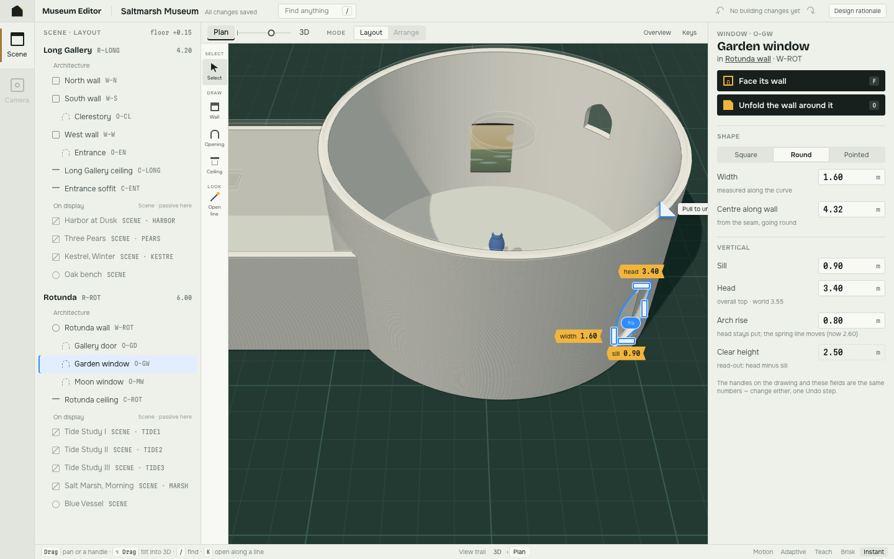

So the model is now **two verbs and a promise**: you *stand* (move the one camera), you *open* (displace architecture as view state), and the picture *settles* when it is to scale. Editing is not a mode you reach. It is a property of legibility.

### Curved-wall unfolding and editable curvature — agreed; strengthened

**Observed.** This was the synthesis's clearest gain over both originals:

- B could only project or panel a curve.
- D could only snap it flat.

**Changed.** D's peel had been dropped from the synthesis, on the grounds (D's own critique) that it duplicated the O verb. With curvature as a view that's no longer true: **peel is the only gesture that sets an arbitrary curvature from where you stand**.

- Drag the corner and the wall unrolls under your hand, in place.
- Let go and it stays there, with magnetic stops at 180°, 90° and flat.
- A click is still D's one-press open.

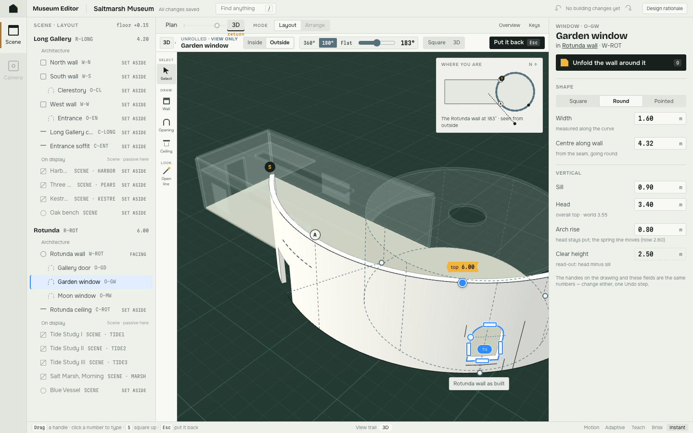

### "True measure" while the picture is foreshortened — accepted; it was worse than suspected

**Observed.** Facing the round wall at 360°, the prototype drew:

- a **"2 m" horizontal scale bar**
- a **"34.56 m around" dimension line spanning about 11 m of picture**
- a frame labelled "heights true"

A user could have measured a width off the screen and got it wrong.

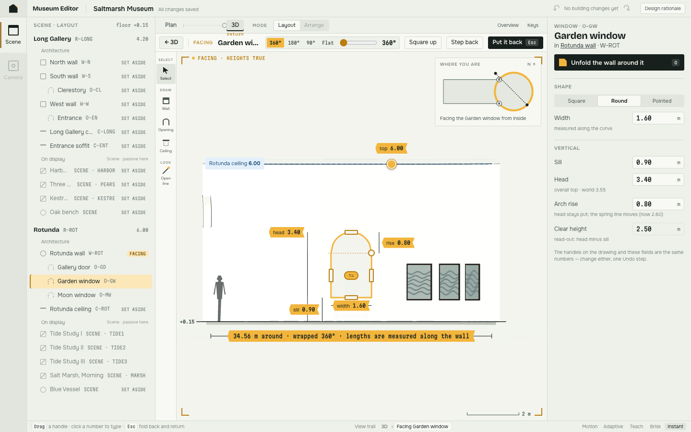

**Changed.** The language now separates the two claims:

- **Measured** is a property of numbers. Every tape and field is a model value, exact at any curvature, because the unroll is isometric. No UI string says "true measure" any more.
- **To scale** is a property of the picture, and it is per screen axis:
  - A round or part-unrolled wall seen square gets a **vertical** scale bar only, and the label "Heights to scale · the curve foreshortens widths".
  - A flat sheet, a straight wall, Plan, a section and Look up get both bars.
- The overall-length dimension is drawn only where the picture can carry it: straight walls and flat sheets. On a curve, the length lives in the Inspector.

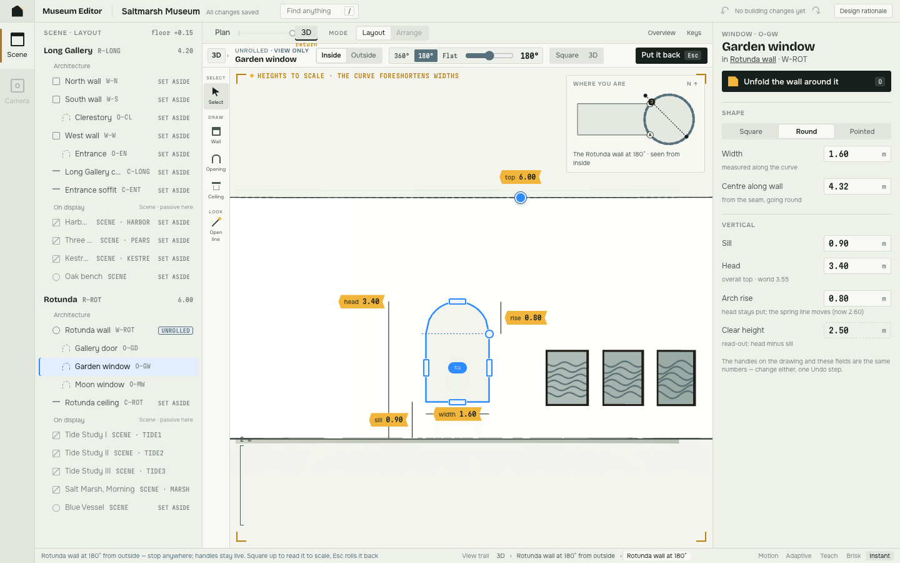

### A settled section may crowd — accepted, reinterpreted

**Observed.** Before the revision, the section showed **13 labels** with only the door selected. Two of the loudest ("1.40 of wall above", "3.20 of wall above") described things that *weren't* selected. And they were the same yellow as the selection itself, so selection and measurement could not be told apart.

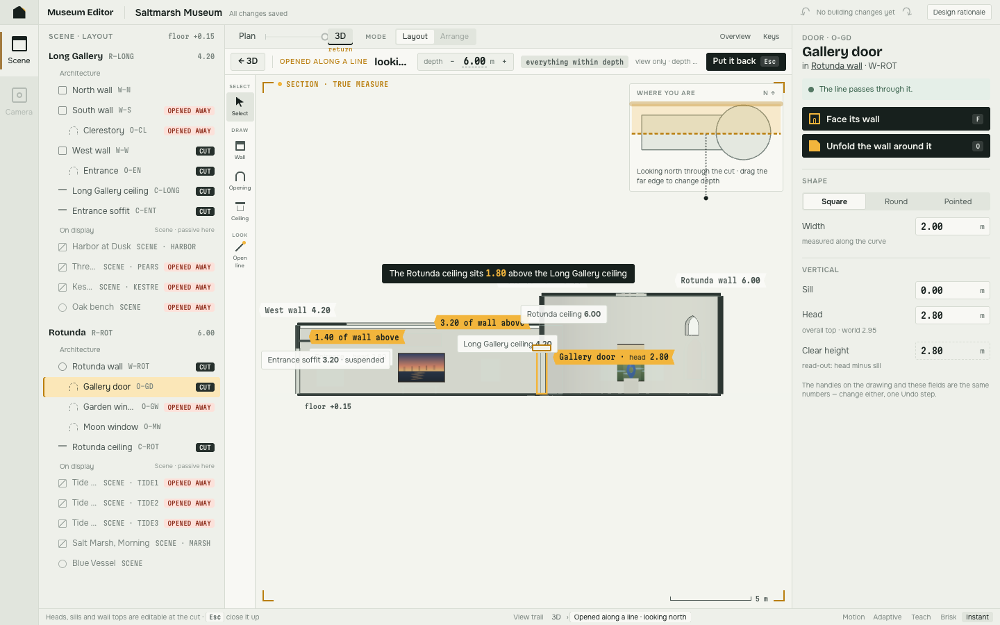

**Judgement.** The crowding wasn't a property of a settled section. It was label policy. Adding layer filters would have treated the symptom.

**Changed.**

- **Label budget:**
  - Every cut source carries its identity quietly (`W-ROT 6.00`, `O-GD`).
  - Only the selection speaks at full strength.
  - Only the selection's derived facts are drawn (wall above, reason for absence).
- **Priority declutter:** a lower-priority label yields to a higher one instead of overlapping it. Handles always claim their space first. This also fixed the junction-note collisions on the flat sheet at 1280.

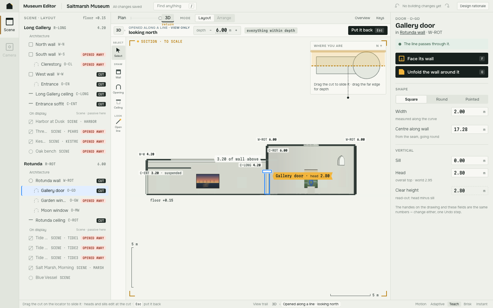

**Not demonstrated.** The Saltmarsh museum has five walls. The brief's twelve-room case, and whether decluttering hides something a user needs at that density, remain untested.

### Ceiling lift and look-up — agreed; one directness gain

**Changed.** D's **lift tab**:

- Drag the lid up from where you stand. Past a third it finishes lifting; less and it drops back.
- A dashed outline marks where the ceiling really is.
- Look up now *nests* inside the lift (breadcrumb `3D › Lifted › Looking up`).

### Ordinary cross-view authoring — accepted; now demonstrated (Journey E)

**Observed before.** Plan showed a read-only summary tape for a selected opening, and nothing was editable there. "Plan is a standpoint of the one camera" was asserted, never used for authoring.

**Changed.** One opening kit serves Plan, free 3D and Face, filtered by the legibility gate. Journey E is the review's suggested journey and also the brief's §6.7 storyboard. Measured with real pointer drags (`review/test-plan.sh`):

1. In Plan, slide the Garden window along the curve (4.32 → 7.47 m). One Undo entry.
2. Widen it (1.60 → 0.80). One entry.
3. Tilt to 46°: head and sill handles appear.
4. Drag the head in 3D (3.40 → 5.20). One entry.
5. Press **F** and drag the arch rise. One entry.
6. **Esc** returns to the exact 46° standpoint, not a default. The exit summary names the one change made while facing.
7. **1** for Plan, then Undo twice. The view doesn't move.

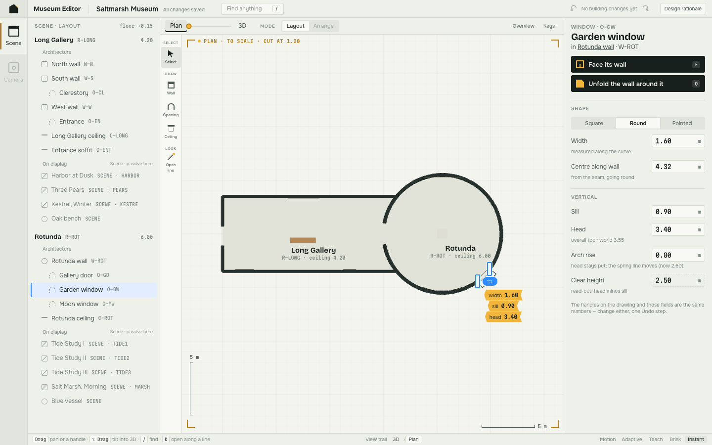

**Pushback.** The brief places wall drawing and topology in Plan. The prototype still doesn't draw *new* walls, openings or ceiling footprints; its Draw tools say so. The claim proven is narrower: **existing** architecture edits in the one renderer from Plan, 3D and a face, with one selection and one history.

### Chained open states, the trail, Esc and Put it back — accepted; the hierarchy was wrong

**Observed.** I opened a section, set its depth to 3 m, selected a door and faced its wall. **Esc landed in 3D. The section was gone.** The strip also had two buttons that did the same thing ("← 3D" and "Put it back").

**Judgement.** "Esc restores everything" was defensible for two-level chains. It is wrong once you drill through a section into a wall, because the section *is* the context you came from.

**Changed.** There are now three axes, each with its own key:

| Axis | Key | What it walks |
|---|---|---|
| Nesting (structure) | **Esc** one level · **⇧Esc** or the first crumb for all | the breadcrumb `3D › Section › Facing` |
| Time | **[ ]** | the view trail |
| Building | **⌘Z** | Undo |

- Opening a *different* kind of open state nests. The same kind replaces, so hopping wall to wall doesn't pile up a stack.
- Returning, by crumb or by trail, is **exact**. The trail used to lose the camera angle, the zoom and the Reveal. The same test before and after:

| | Angle | Zoom (frame) | Depth | Reveal |
|---|---|---|---|---|
| before revision | 0.050 → **0.000** | 26.22 → **34.40** | 3 → 3 | harbor → **none** |
| after revision | 0.050 → 0.050 | 26.22 → 26.22 | 3 → 3 | harbor → harbor |

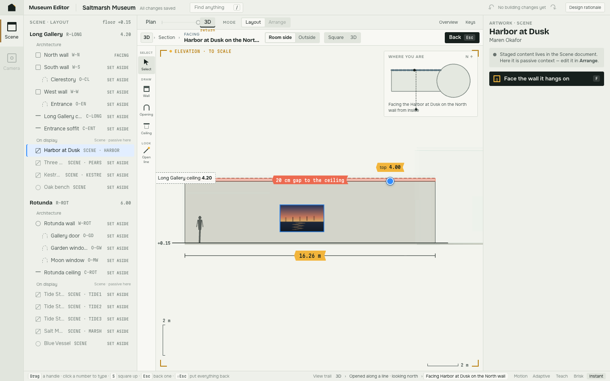

### The contextual strip truncates — accepted; fixed by structure, not by moving controls to Paper

**Observed.** Facing the Rotunda truncated the title to "Gar…" at 1440, and the strip overflowed at 1280.

**Changed.**

- The kind sits above the title in one compact identity block, which also carries **"view only"**.
- The breadcrumb collapses at narrow widths.
- The redundant length readout and the 90° preset are gone.
- The strip now fits at 1440 and 1280: its scroll width equals its visible width.

**Rejected:** floating controls on Paper. PLATE is explicit that Paper does not accumulate application controls.

### Yellow tape and PLATE selection — accepted, as a semantic decision rather than a stylistic one

**Judgement.** The brief says it outright ("Selection color is the product's existing selection color"). The stronger reason is functional: in D's language, yellow already meant *a number you can type*. It couldn't also mean *the thing you have selected*, and the section showed the confusion. The palette now has one meaning per colour:

| Colour | Meaning |
|---|---|
| PLATE blue `#2F8CFF` | selection only: outlines, handles, Navigator row, Reveal |
| Tape yellow | measurement: typeable numbers, scale, the armed knife (matching PLATE's own amber "armed" token) |
| Dashed slate | view-only displacement |
| Coral | problems |
| Green | open on purpose (this replaced a sky blue that would have overloaded selection blue) |

### Temporary deformation must look like view state — accepted; four reinforcing cues

**Changed.**

1. A displaced wall wears **paper-sheet material** for as long as it is off its footprint.
2. The **wall as built** stays drawn in dashed slate on its real footprint: "Rotunda wall as built", and "as built · 4.20" under a lifted lid.
3. The strip says **view only**.
4. On returning to where the chain began, a summary says **"View restored. The 2 building changes you made while it was open stay"**, with *Undo these* and *Keep*.

This is D's session summary. I had rejected it as "one Undo for the whole session". Reinterpreted, it keeps one gesture = one Undo entry and offers the batch as an explicit choice. It retires as soon as Undo or a new edit supersedes it.

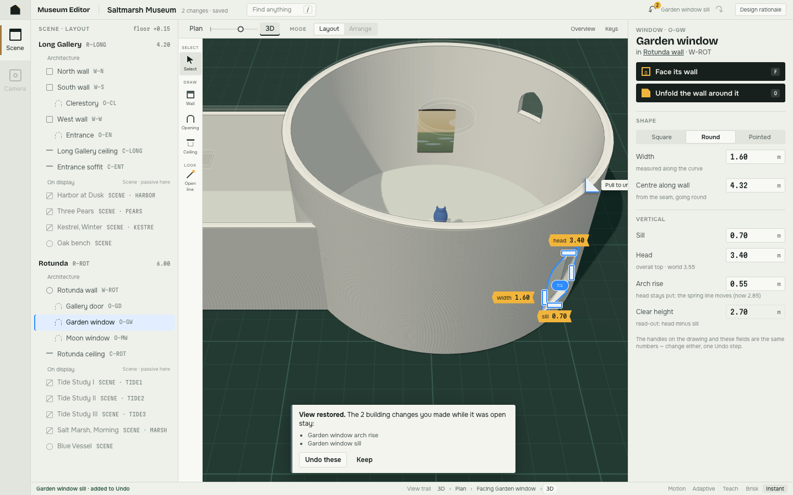

---

## 2. What the synthesis gained and lost against B and D

### Losses investigated

**From D:**

- **Space for the museum: a real loss, partly recovered, trade-off accepted.** Observed: D's Paper is 1204 px wide at 1440; mine is 816, because PLATE's Navigator (268) and Inspector (300) are fixed shell. My locator card also covered another 222 × 143 px at rest.
  - Recovered: the locator now appears only while something is open or being drawn.
  - Not recovered: the shell itself. I rejected D's floating card as a replacement for the Inspector, because the Inspector is the brief's single writer for exact values. D's card was a second one.
  - Open question: whether PLATE should sanction a Navigator collapse for large drawings.
- **Immediacy of physical opening: a real loss, restored and evolved.** The peel now stops anywhere; the lid tab works as in D.
- **Inside / Outside: a real loss, restored and evolved.** It is now a walk rather than a toggle: the camera swings round the wall and the strip shows `Inside | Outside`.
  - **F** faces from the room side, where authors work.
  - A **peel** faces from wherever you stand, so pulling the Rotunda's corner from the garden gives you the outside face.
- **Find Anything with reasons: a real loss, restored and evolved.** **/** or ⌘K searches names and references. Every result shows where it is *from here*: hidden behind, out of frame, beyond depth, set aside, and so on.
  - Picking a result places a beacon.
  - The Inspector offers the recovery: Look at it, Face it, Include it, Show it through, Go to its wall, Face it instead.
  - The finder, Inspector, beacon and section locator all read one resolver (`whereIs`, built on `memberOf`). This extends the brief's "membership evaluated once" to visibility as well.

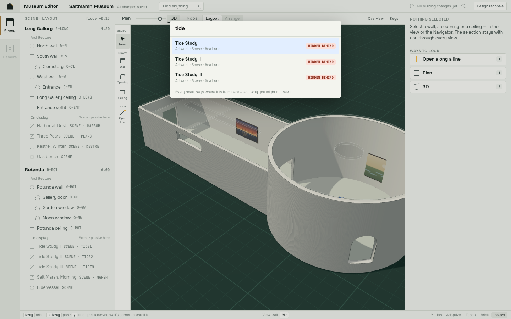

**From B:**

- **Live exploratory preview of candidate sections: a real loss, restored in evolved form.** Once a line is drawn, a slide grip moves it parallel and end grips turn it; the peek re-derives the cut as you go. Once a section is open, the cut can be slid by dragging it on the locator. That is the one place its axis reads, since it runs along the line of sight in the section itself.
  - **Rejected:** B's hover-before-drawing. B's blade was axis-aligned, so hovering defined it. A free-angle line needs one gesture to define its direction; sliding it afterwards is B's scrub.
- **Contextual recovery for an excluded subject: a real loss, restored.**
  - *Include it* reaches exactly far enough (3.00 → 4.00 m, computed from membership, recorded as a view change).
  - *Go to its wall* nests, and Esc returns to the same cut and depth.
  - *Show it through* keeps D's Reveal.
  - The excluded selection also keeps a labelled place on the drawing ("Harbor at Dusk · 0.75 m beyond the 3.00 m depth"), which is B's ghost idea.
- **Exact restoration of the prior standpoint: a real defect, fixed.** See the before/after measurement in section 1.

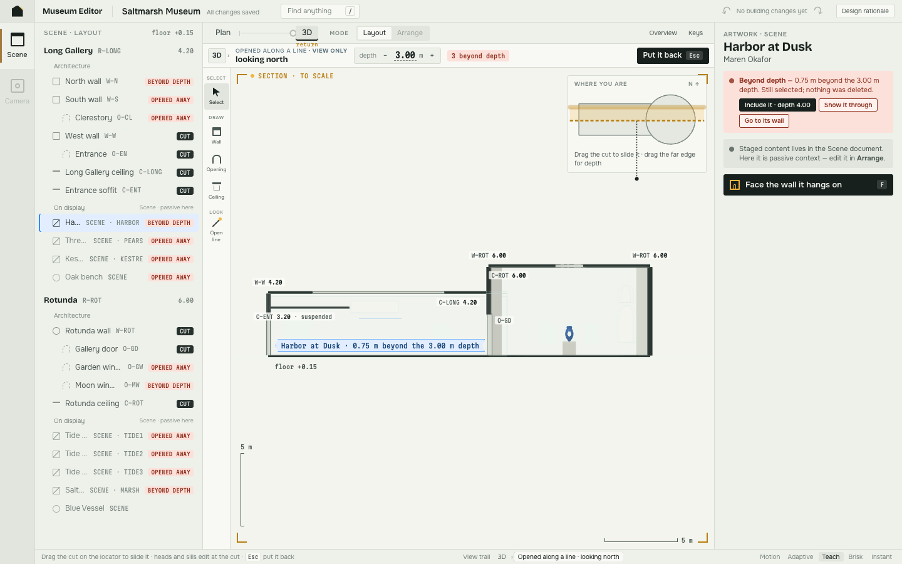

### Other losses found independently

- D's session summary: restored as above.
- The six-beat choreography: a regression against *both* originals, which each opened in one move.
- The scale bar over a curve: my own defect, with no precedent in B or D.

### Kept as trade-offs

- D's Visit mode: P25's territory.
- D's see-through lens: a third x-ray mechanism next to Reveal and Find.
- D's "follow or stay" card when a wall rises under a ceiling: still an open product question.
- B's segmented-panel curve: superseded by the curvature dial.
- B's vertical crop: deferred. See "Not demonstrated" below; the brief requires it.

### What the synthesis still does better than either original

Each of these is demonstrated in the prototype:

- One camera from Plan to 3D, with the plan cut descending through the building.
- Curvature as an editable, stoppable view.
- Handles that stay exact in perspective, because drags resolve on the wall's own plane or along its own surface.
- Two separate histories (view and building), now three axes with nesting.
- Adaptive motion.

## 3. Rejected or reinterpreted

| Review point or lead | Verdict | Why |
|---|---|---|
| Settle adds ceremony | rejected as diagnosed | Settle is free; the choreography and the lost direct gestures were the cost. Both fixed. |
| A crowded settled section | reinterpreted | Label policy, not the section itself. Budget + declutter rather than layer filters. |
| Strip density | accepted, bounded | Fixed in the strip. Controls were not moved onto Paper. |
| D's full-bleed composition | trade-off accepted | PLATE's Navigator and Inspector are the shell; the Inspector is the one writer. |
| B's hover-before-drawing | reinterpreted | Draw once, then slide. A free-angle line needs its direction first. |
| D's "one Undo per session" | reinterpreted | Kept one entry per gesture; the summary offers the batch explicitly. |
| Esc = put everything back | reversed | One level out; ⇧Esc or the first crumb for all. Same-kind hops still replace. |

## 4. New product conclusions

1. **Editing is a property of legibility, not a mode.** One rule decides which handles exist in every view, and it answers the brief's "3D handle subset" question without a list. The only exception I kept by hand: profile details (arch rise, ridge) appear only while facing. That reflects where they are worth editing, not whether they can be seen.
2. **Measured and to scale are different promises.** Numbers are always measured on the model. The picture is to scale only on a settled plane, and per axis.
3. **Nesting and history are different axes.** The breadcrumb records where you came from; the trail records where you have been. They deserve different keys.
4. **A gesture and its verb are the same act at different grain.** Drag the corner for any amount; click it, or press O, for all of it. Intermediate states are legitimate places to stop.
5. **View state has to look like view state, and leaving has to say what stayed.** The paper sheet, the as-built ghost, "view only", and the exit summary.
6. **One colour, one meaning.** Adopting PLATE blue for selection is what freed yellow to mean "a number you can type".

## 5. Not demonstrated

- Drawing new walls, openings or ceiling footprints in the one renderer.
- Vertical crop and cut-only (both brief requirements).
- A twelve-room museum; the declutter policy at scale.
- Wall deletion while it is open, and refusal of an oblique wall (brief §6.5).
- Keyboard nudging of handles, screen-reader naming of open states, reduced-motion correspondence.
- Performance of re-tessellation during peel on real cubic walls.
- **No user testing has been done.** The first things to test:
  - whether "heights to scale" is understood without the caption
  - whether people find the dog-ear unprompted
  - whether Esc-one-level feels right, or surprising, after a long chain

## 6. Code map of the revision

| Concern | Where |
|---|---|
| Legibility gate | `app/draw.js` `legible`, `handleIf`; one opening kit `drawOpening` with `dims: plan / compact / full` |
| Nesting, exact recipes | `app/actions.js` `recipeOf`, `enterRecipe`, `openSession` (nest vs replace), `backInner`, `closeAll`, `crumbs` |
| One-beat motion | `camAt(…, arc)`; `unfold`, `unfoldInner`, `exitSessionInner` |
| Peel, lid tab | `beginPeel`, `peelTo`, `endPeel`, `beginLid`, `lidTo`, `endLid`; pointer handling in `app/main.js` |
| Inside / Outside | `sideOfCamera`, `setSide`, `faceClip`; signed surface offset in `draw.js kit` |
| Section recovery | `includeIt`, `goToHost`, `slideCut`; the locator in `drawSection`; knife grips `dragKnifeGrip` |
| Where is it | `whereIs`, `worldOf`, `stage.occluder`; finder in `main.js`; Inspector `where()` in `app/ui.js` |
| Per-axis scale | `main.js truthBar` |
| Declutter | `app/overlay.js declutter` |
