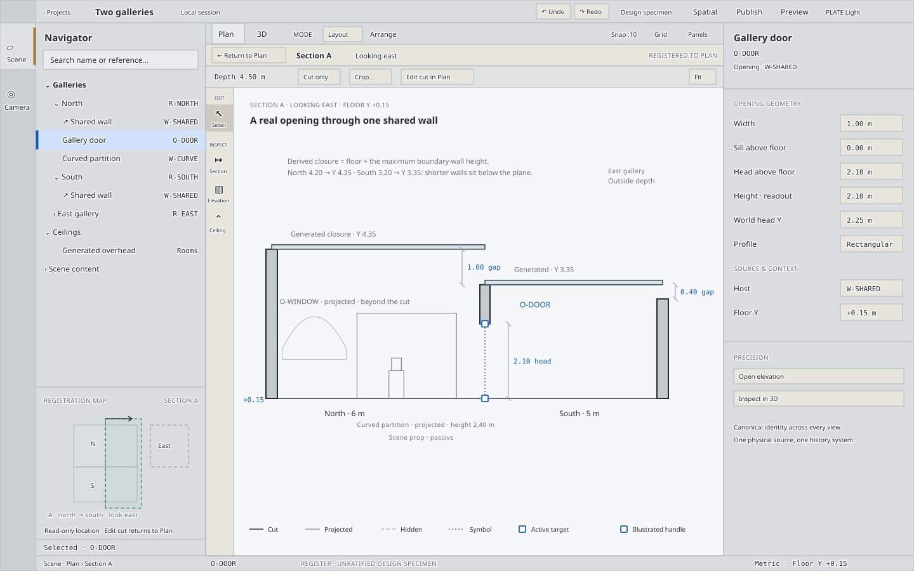

# REGISTER — spatial editing without losing your place

**Independent P26 design exploration · 2026-09-22 · UNRATIFIED**

One primary direction, created from the brief, synthesis, durable contracts and inspected implementation. No other P26 submissions were consulted. This is a product/interaction design, not an implementation plan. Production code is unchanged.

**Start with [the interactive visual atlas](./atlas.html).** It contains a full 1440 × 900 PLATE instrument frame, scenario boards, a working numeric-edit/Undo demonstration, and separate Reveal/restore-view controls. [Interaction and ceiling specification](./direction.md) supplies the full behavior; [implementation evidence](./evidence.md) distinguishes inspected capabilities from proposed seams.

Standalone vectors: [Section frame](./section-1440x900.svg) · [Ceiling Focus frame](./ceiling-focus-1440x900.svg) · [Twelve-room frame](./twelve-room-1440x900.svg). Each is exactly 1440 × 900; the atlas has 29 annotated states. These are design drawings, not captures of implemented P26 features. Regenerate the vectors with `node docs/roadmap/p26-spatial-depth/design/proposals/register/export-frames.mjs`, then verify the package with `node docs/roadmap/p26-spatial-depth/design/proposals/register/check-atlas.mjs`. That checker renders every board, asserts the scenario consistency matrix (durable view, Navigator selection, status reference and Inspector identity agree), probes every displayed control for a real handler, checks that each board's drawing discloses the geometry its narration claims, and fails if the exported vectors have drifted from the atlas.

REGISTER makes every vertical edit a visit from Plan: place a cut, work on the real object, return to the same place. Its signature is the small **registration map** in the Navigator: the current cut and visible range stay intelligible while the central Paper becomes Section, Wall Elevation or Ceiling Focus. The map is a view locator, never another geometry editor or selection store.

The ceiling model is deliberately ambitious: independent regions can span rooms, stop short of walls, coexist at different heights, or form explicitly trimmed joints. Creators distinguish **closure** from **suspended** ceilings; generated room closure remains legible wherever it still supplies overhead. No room-boundary restriction or blanket overlap prohibition.

## Review route

1. Atlas S1/S2/S10: place a cut through the shared door, edit its head, commit, then return. “Edit the cut you placed” shows the committed range and its own span, depth and look-direction controls.
2. S3/S7: one opening through elevation, numeric input, Undo and 3D; gable, arch, curve-follow and deleted host recovery through the Project Head's global Undo.
3. S5: authored versus generated overhead, spanning shed, partial/multiple regions, overlap joint, reflected focus.
4. S4/S6: twelve-room density, reason-coded exclusions, selective Reveal of one source, and independent view restoration.
5. S8/S9: architectural column/platform, passive prop, empty/invalid/unsupported states.
6. Ratification table at the end of the specification.

**Delivery boundary:** design-only package committed for review on branch `codex/p26-register-design`, based on `8d583172c6edc8814c416a3ba5786cf7652ab4c0`. Review-ready is not ratified: no implementation approval, direction ratification, phase-status advancement or P23B/cycle gate change is implied.

Verification and prototype limits are recorded in [review-notes.md](./review-notes.md).
