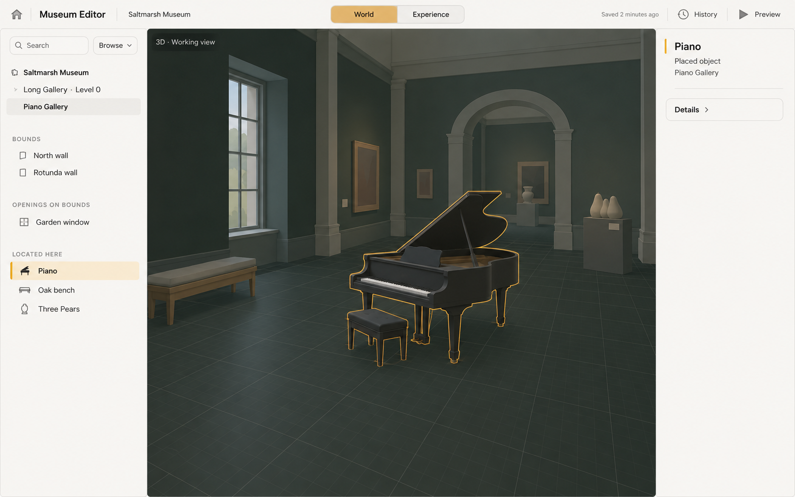
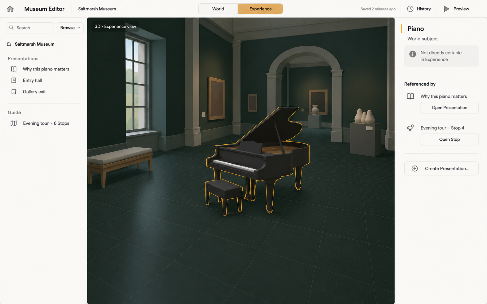
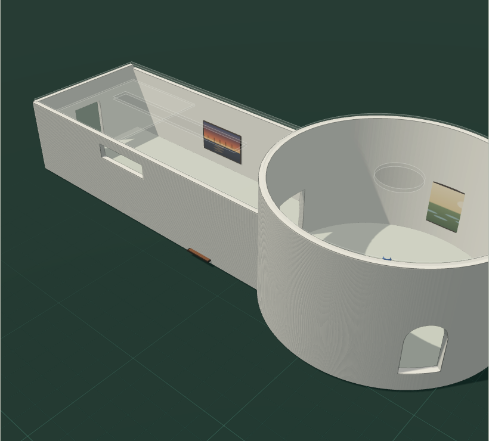
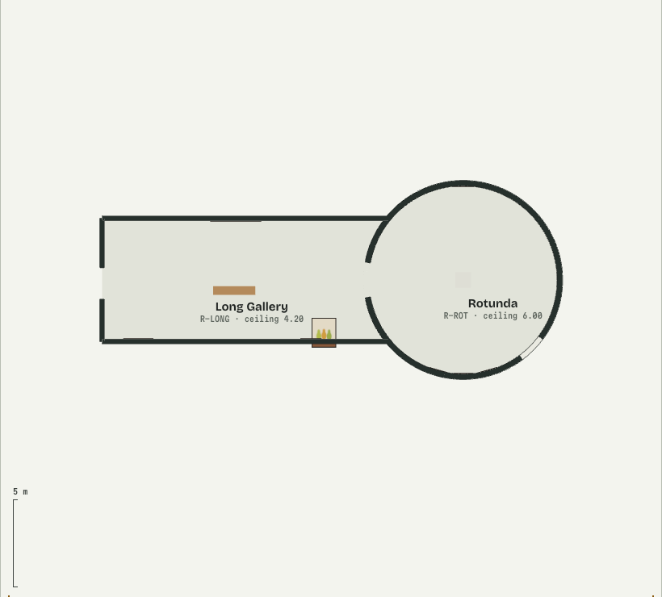
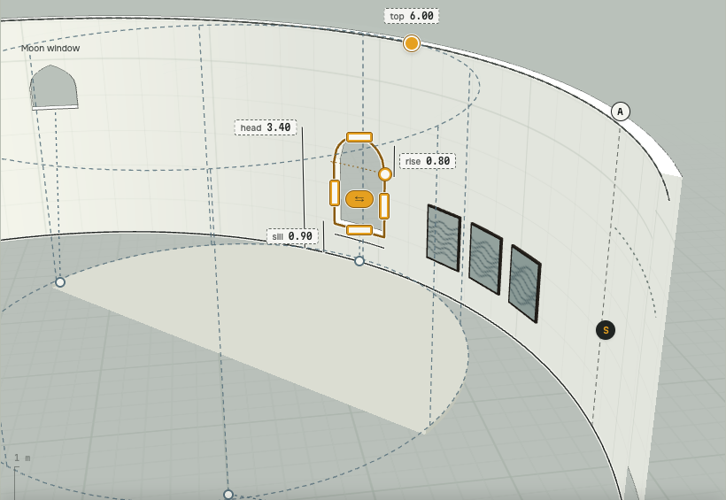
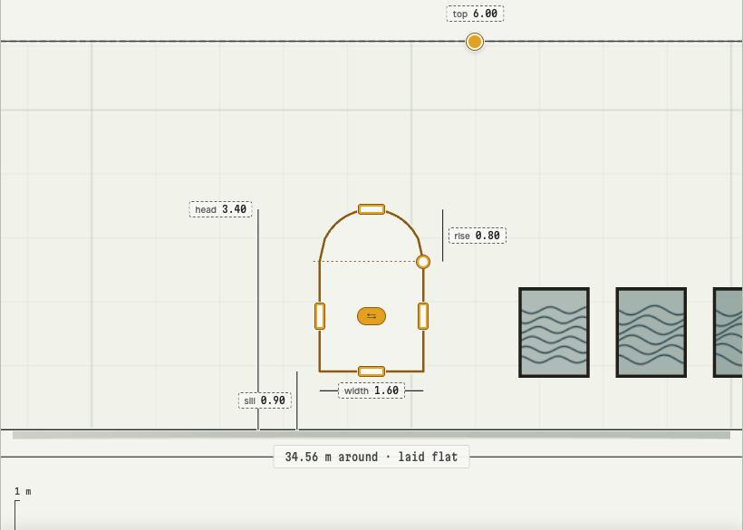

# Museum Editor · 2D Paper authoring

Independent design commission · 2 October 2026

**Given this product, its accepted shell, visual language and interaction
philosophy, what should a mature 2D spatial-authoring surface be?**

Propose the destination Paper experience inside the established Museum Editor
shell. Bring your own full-editor model: choose the authoring vocabulary,
information architecture and interaction forms. This packet supplies product
context, not a tool inventory or preferred arrangement. It stands alone;
all six visual references are in the adjacent `references/` folder.

## Product and assignment

Museum Editor is a browser-based creative environment for composing spatial
experiences and shaping how an audience encounters them. Creators develop spaces
and the things within them, give subjects meaning, and direct visitor encounters.
The continuing project should remain understandable and revisable. A project
need not begin with a room or a tour.

**World** is the lens for authoring the spatial world itself. It should feel like
working with a tangible place: see the work, remain oriented, select a subject,
and bring richer instruments to the current question. Technical depth is available
without making ordinary work feel technical.

**Experience** is the complementary lens for visitor-facing meaning and encounter.
Both share one project, the same spatial Stage and the same selected identity.
Experience supplies surrounding product context; its workspace is outside this round.

**2D Paper** is World’s measured drafting condition: a place to create and revise
spatial work with clear references, precision and direct feedback. It belongs to
the same world as the spatial view. Changing the reading preserves identity and
orientation; it feels like another working condition of the same product.

Design the complete Paper experience. Territories include primary action access,
deeper discovery, contextual editing, drafting/reference treatment, temporary
instruments, active-procedure communication, entry and dismissal, and growth.
These are prompts for judgment, not a feature checklist. Include other elements
where your model needs them. Depicted subjects and task examples neither prescribe
tools nor set a ceiling on capability. Implementation reconciliation follows the
independent proposals.

## Settled principles and design boundary

**Calm by default.** Keep ordinary Paper visually quiet, with frequently useful
actions easy to reach and the work dominant. Permanently exposing every operation
is not the expression of a powerful editor.

**Complexity through procedural disclosure.** Deeper capability appears through
an intentional trigger, relevant context or procedure. Distinguish ordinary rest,
deliberate entry, active work and clean return. Advanced capability can disappear
again. You choose the mechanism.

**Growth without toolbar sprawl.** Demonstrate a substantially larger vocabulary
of your own choosing while preserving the same coherent, quiet resting workspace.

**Preserve the accepted shell and one coherent product.** Paper and its attached
instruments inherit the product’s character. This round refines its 2D working
condition within the established surrounding architecture.

| Fixed context | Open design territory |
| --- | --- |
| **Head:** recognizable project identity, World / Experience switch and application actions. | Paper-local access, discovery and task communication. |
| **Index:** local orientation and access to other subjects. **Card:** canonical selected identity at its stable shell landmark. | Contextual editing controls and their relationship to selection, while preserving those responsibilities. |
| **Stage:** dominant, continuous spatial work; Paper is its measured 2D reading. | Drafting composition, grid/reference controls, direct feedback and attached instruments. |
| Useful breadth persists; specialist depth is invoked. No specialist Instrument at ordinary rest. | Triggers, control forms, information architecture and authoring vocabulary. |
| One coherent active task surface. Task focus can concern a related subject or part without replacing selection or turning Card into a tool panel. | How a procedure expands, communicates state, completes, collapses or cancels; its 2D layout. |
| Chassis / Paper / Instrument materials, restrained type, technical ink, ochre selection and distinct states. | Their detailed application to Paper while preserving the supplied visual language. |

Keep orientation and accepted work when a procedure ends. Make unfinished proposals
legible and cancellable. Temporary inspection and its task surface enter and leave
together. Leaving for the other lens cancels unfinished proposals
and makes invoked work inactive. Returning to World starts calmly with the current
selection and standpoint; resuming requires an explicit action appropriate to the
original subject. A lens switch must not silently move the viewpoint, restore an
old selection or create content.

No control pattern, menu family, tool grouping or exact operation is preselected.
The surrounding shell and Experience authoring model are outside the commission.

## Required proposal

Deliver a small, decision-grade proposal with high-fidelity boards/screens and
a short explanation of the interaction model. Choose how many boards you need.
Use one coherent authoring story to show:

1. Ordinary 2D rest.
2. Discovery and access to the core actions you choose.
3. Deliberate entry into deeper or specialized capability.
4. An active advanced procedure, with subject, task, state and consequences legible.
5. Completion, cancellation or collapse back to calm Paper, distinguishing accepted
   work from unfinished work.
6. Growth to a much larger vocabulary: what stays quiet and how added depth is
   found and used.

Explain triggers and exits, keyboard access/focus, and how the Stage remains usable
in a narrow desktop window. Shell compression keeps the Stage dominant and does
not itself move or refit the viewpoint. Brief annotations or a compact flow are sufficient.
Supply readable exports and editable design source in your preferred tool.
An exhaustive design system or coded prototype is unnecessary.

We will assess coherence, discoverability, active-state clarity, clean return,
scalability and fidelity to this product. Assume no knowledge of an existing
editor’s capabilities.

## Visual language · Paper within PLATE

PLATE is the accepted direction: a quiet manufactured frame around tangible
spatial work, with an editorial sensibility and measured authoring.

| Material role | Character |
| --- | --- |
| **Chassis** | Pale, cool, stable, square and quiet; thin rules and modest headings. |
| **Paper** | Light vellum for measured drafting; dark cutting mat for spatial work. Two expressions of one working-surface role, separated from the chassis by a fine inset perimeter. |
| **Instrument** | Light manufactured controls acting on the work, with restrained edges and small radii. Integrated with the chassis; richer specialist surfaces belong to invoked work. |

The mat is not a fourth material. Paper carries drawing, selection, guides and
direct feedback; attached controls preserve the reading of the work.

| Visual role | Reference palette |
| --- | --- |
| Vellum / chassis / instrument | `#F3F4EE` / `#EEEDE8` / `#F8F8F4` |
| Neutral recess / Paper perimeter | `#E2E0D8` / `#B8BEB3` |
| Technical / reference ink on light surfaces | `#202422` / `#3E4440` |
| Spatial mat / deeper ground | `#1D3A33` / `#152C26` |
| Mat grid, minor / major | `#2B5147` / `#3C6A5C` |
| Paper grid, minor / major | `#9FB2A2` at 28% / `#809984` at 45% |
| Selection/manipulation | Ochre `#E5A020`; dark edge on light surfaces `#8A5B10`; quiet tint at 10% |
| View-only displacement | Slate `#56707C`, dashed |
| Caution / refusal | Caution: `#F7EDE8` with terracotta `#C85A48`. Refusal: `#FDF3F0`, dark text `#7E2718` and an explicit reason. |

**State.** One selected identity reads coherently across Stage, Index and Card.
Selection is a persistent contour and quiet tint, with contrasting core/halo where
needed; it does not flood Paper or erase the grid. Manipulation emphasizes the
active handle/affected edge and relevant measurement. Hover is a restrained lift
or edge below selection. An armed control uses a neutral recess and normal ink.
Keyboard focus has an independent visible cue. Active lens, selected subject and
active tool/procedure remain distinct; branding/history accents do not encode
selection. Caution, refusal, temporary inspection, preview and accepted edits need
different readings, with wording/shape as well as color.

**Type and controls.** Warm humanist sans for ordinary UI; narrow mechanical mono
for measurements, coordinates and references. Reference faces: Onest, Martian Mono,
and limited Bricolage Grotesque for identity/display. Use restrained desktop sizes:
9 px tiny mono measures; 10–11 px metadata/readouts; 12–13 px rows, controls and
values; 15 px panel headings; 20 px only where project identity warrants it.
Text scale and control density can vary independently. Keep essential labels,
focus and targets usable. Square chassis edges and approximately 3 px instrument
radii preserve mechanical character; ordinary action/utility heights cluster around
24–30 px, with smaller actions used locally. These roles do not prescribe an
instrument layout. Supplied rasters can be viewed without installing fonts.

**Drafting.** Reference grid: 1 m minor / 5 m major at architectural scale; a
1, 2, 5 progression across scales, with major intervals five times the minor.
Thin or suppress visually crowded lines; retain a stable spatial datum. Grid is
a drawing-surface property, separate from view/tool state. You decide its access
controls. Plan and spatial readings preserve subject and orientation; temporary
inspection reads as temporary. Motion may support continuity, with a clear
reduced-motion path. Transition choreography and focus-ring geometry remain open.

## Curated visual references

The first two images establish the accepted shell. The four surface excerpts
communicate spatial/drafting character without supplying a 2D control solution.
Open the local PNGs at full size for detail. This text resolves incidental raster
differences; scene content, labels, dimensions and exact handles are illustrative.

### 01 · Ordinary World

Head above, Index left, dominant Stage, selected-identity Card right. The same
piano reads as selected across all three surfaces. No specialist task surface at
rest. **Raster correction:** active-lens amber is too strong; use neutral lens
emphasis and reserve strongest ochre for selection/manipulation. Panel dimensions,
rounded raster corners and photoreal detail are not extra requirements; use the
material/control character above.

### 02 · Another lens, the same project

The Index changes context while the shell, piano identity and standpoint remain
recognizable. This is a continuity specimen, not ordinary Experience’s starting
state. Its relationship/action rows illustrate context, not Paper capability.
Lens switching is distinct from explicitly opening work or creating meaning.
The same amber-lens correction applies.

### 03 · Spatial mat

Dark ground, quiet grid, pale architectural mass and content within a place.
Depth and physical character establish the spatial counterpart to Paper.

### 04 · Measured plan

The same prototype place from above: technical edges, quiet surfaces, spatial
labels and scale reference. Read 03 → 04 as two working conditions of one place.
These endpoints imply continuity, not a required animation. This surface excerpt
is context, not a finished Paper workspace; reference 06 supplies the grid detail.

### 05 · Paper in space

Vellum and grid remain attached to a spatial subject. Ochre identifies the selected
opening; slate dashed references mark view-only displacement. This intermediate
reading explains material continuity, not a required geometry operation.

### 06 · Paper, selection and local precision

Paper and grid survive selection. Contour, local handles and mechanical readouts
make measured work legible without flooding the sheet. Translate this hierarchy
into your model; no exact handle arrangement, numeric widget or operation is required.

## Manifest · provenance and purpose

This Markdown file is the complete brief, boundary sheet, visual-language sheet,
deliverable requirements and reference guide. It is newly prepared from the
commission assignment and the accepted destination product/shell direction.
It describes intended design, not feature availability in a shipped editor.

| Included local artifact | Source and reason |
| --- | --- |
| `references/01-world-at-rest.png` | Unaltered ordinary-World piano board from the finalized, accepted World shell visual references. Shell hierarchy, calm rest and selection. |
| `references/02-same-project-other-lens.png` | Unaltered selected-World-subject-in-Experience board from that canonical QA set. Shared shell and identity continuity. |
| `references/03-spatial-mat.png` | Accepted World prototype spatial-overview specimen, surface excerpt. Model/mat character. |
| `references/04-paper-plan.png` | Fresh accepted World prototype capture after settling into ordinary plan, without selection or an invoked instrument. Measured reading paired with 03. |
| `references/05-paper-in-space.png` | Accepted prototype intermediate curved-drafting specimen, surface excerpt. Spatial Paper and view-only state. |
| `references/06-paper-selection-detail.png` | Accepted prototype flat-drafting specimen, surface excerpt. Grid, ink, selection and local precision. |

The accepted World and finalized Experience shell designs inform the fixed shell
boundary; accepted PLATE material/type/state/drafting
direction informs the visual language. The prototype excerpts omit surrounding
demo controls, task panels and status copy and preserve source pixels. No palette,
geometry or control solution was redrawn. Full design records and executable
prototypes are unnecessary for this independent handoff.
