# Experience V2 replacement conformance review

**C8 in-scope behavioral and visual acceptance complete, 2026-10-04; independent external review pending.**
Repository verification remains blocked by the pre-existing missing P23B fixture. This is review-ready
prototype evidence, with no merge-readiness, PR closure or major-phase closure claim.

The [C1–C8 replacement contract](../../../docs/roadmap/p25-experience/design/experience-v2-prototype/conformance-plan.md)
owns this record. [S0–S9 acceptance](./EXPERIENCE-ACCEPTANCE.md), its plan and specimens remain
unchanged historical evidence. This prototype establishes no production format or cutover.

## Revision and reproducibility

Implementation revision: **e02cd25872b3249e9a3a579eaf6406a8d82ead25** on `prototype-v2`, descending from
`a005f649c8f9cb4105753232185bbe713ba85b19` (C1–C7). The final documentation/evidence commit on
[PR #113](https://github.com/Biskiq/spatial-sketch-editor/pull/113) contains this record and the same
frozen executable. No code or assertion changed after the final runs. The owner resumed C8 and
authorized coherent commits and push on 2026-10-04; older checkpoint restrictions are superseded.

Frozen executable SHA256: `91c8fd76fcf50758026beaf7517701326792ba16c97514d5cd23c05f152ceda0`.
[Final provenance manifest](../../../docs/operations/checkpoints/experience-v2-conformance-evidence/c8-provenance.json)
records the exact file digests, harness digests, capture/comparison checksums and verification exits.
The initial checkout reproduced the paused executable hash before any change; the separated history
and omitted captures were reconciled against the preserved backup before relying on them.

Canonical viewport **1440×900, DPR 1**, query `shot=1&motion=instant`; narrow companions
**1024×768, DPR 1**. Retained World responsive coverage includes 1280×800 and DPR 2, reduced
motion and unchanged Camera intent. The [authored fixture](../app/conformance-fixture.js) supplies
World content, six Stops, repeated Machine meaning, three unequal Machine Views, a distinct
Gallery light destination and Open casing. It loads no connection/anchor/beat, selection, task,
reading or standpoint. Ordinary and precise no-Guide cases begin with product Reset.

[Executable product transcript](./conformance-check.sh) is the exact interaction recipe, with
read-only source/selection/Camera sidecars for every canonical capture. Sidecars observe states;
they never establish them. Fixture loading is the sole source-loading exception. All subsequent
selection, disclosure, framing, scope, geometry and Preview steps use actual controls/pointer/keyboard.

```sh
QA_OUT=prototypes/spatial-authoring/screens/experience-conformance QA_SESSION=c8-final-captures bash prototypes/spatial-authoring/qa/conformance-check.sh
QA_OUT=prototypes/spatial-authoring/screens/experience-conformance QA_SESSION=c8-final-narrow bash prototypes/spatial-authoring/qa/reconciliation-check.sh
```

## Implemented slices and material decisions

| Slice | Result |
|---|---|
| C1 | Authored-only stress fixture, six-state manifest, product transcripts, read-only snapshots and successor boundary mutations. Old proof/captures retained. |
| C2 | Camera kernel owns resolved framing, observer routes, stations, timing, interpolation and realization; navigation owns input, projection, detents, neutral invocation and opaque returns. Existing World motion profiles preserved. |
| C3 | Quiet Meaning/Focus/Show Card, spatial unordered Set, derived Auto/Hints and explicit atomic Capture, PLATE semantic roles, shared Meaning/Set-role confirmation. |
| C4 | Peek awareness, L0/L1 overview, distinct repeated pins, L2 schematic/spatial Set, explicit local entry and canonical occurrence selection. |
| C5 | Real scoped Plan observer graph, multiple origins, destination, 2/3 coverage/gap, generated endpoints versus authored anchors, normal pace, pointer/keyboard authoring and aggregate Undo. |
| C6 | Same route plus stable spatial/temporal stations, local beat/hold lanes, explicit multi-route resolution, saved disclosure, timing/ref preservation and shared route confirmation. |
| C7 | No-Guide Stage framing instrument, real Through gate/horizon/target, Outside observer/frustum, truthful Plan/Outside/Through, one active grip/tape, scope and neutral returns. |
| C8 | All six canonical compositions and companion states reviewed; current frozen-source behavioral, mutation and repository evidence below. External review pending. |

- Anchors mean **observer positions in project space**. Camera converts them with the interpolated
  observer-to-target offset. Stage paths, direct manipulation, samples, station estimates and
  visitor evaluation use the same Camera path. Generated endpoints are never authored anchors.
- Coverage includes the actual Stop entry plus independently reachable shared choice/cue Views.
  A specialized entry replaces a shared entry that is no longer independently reachable.
- Auto/Hints are derived intent; Capture authors one Camera View and its Experience use in one
  transaction. Relative framing is resolved against current World facts by Camera, including
  explicit unresolved/fixed-framing review. Neither authoring nor Preview keeps an alternate resolver.
- Navigation freezes the current realization before neutral activation and blocks setup writes.
  Parked work contains accepted identity/parameters, never old poses/return tokens. Explicit
  spatial invocation takes a fresh return from now; Preview has its own suspension/return.
- Travel waits for the actual departure View. It refuses locally during an unfinished move or
  exploration, rather than inventing a route from the current eye to the authored origin.
- Source operations recalculate reach at proposal and acceptance. Supported Stop-entry detach
  is atomic; unsupported Presentation forks are not offered. Cancellation writes no history.
- Source/domain/runtime algorithms stay separate from editor session machinery. The static
  prototype shares its page; production visitor chunks and routes were not changed.

## Material C8 corrections

The resumed full-window review rejected the paused specimens for M1/M7 despite their green
73-check log. Expanded editorial work was trapped in the Stage column; coordination was below
all three bookends; Card omitted active local binding/reach; Index omitted its Guide locator;
L1 thumbnails were generic diamonds; the Hold lane had a number field without a duration bar.

The correction stays at the rendering/QA seam in `experience-ui.js` and Experience CSS:
expanded Deck is a shell-level overlay beneath Index + Stage + Card, retaining Stage geometry;
Peek remains at the Stage edge. Coordination nests inside the central Seam instrument, with
bookends retained. Card keeps canonical Stop identity and adds explicitly labeled task focus,
station binding and transition-local reach. Guide locator and Scene-based schematic thumbnails
supply occurrence context. Hold length and the strip's time positions derive from the existing
`movementTiming`/`coordinateTiming` evaluation, with stable Camera station IDs; they introduce
no authored time positions, geometry writer or evaluator. Normal Seam names its shared Camera route.

Two focused assertions protect breadth/locator/thumbnails and central coordination/Card reach;
the existing station assertion now checks the duration bar. No World baseline or tolerance changed.
Final captures and all mandatory comparison pairs were regenerated and all six states re-reviewed
after the last shared change. No material in-scope visual failure remains.

## Canonical rendered verdicts

Each table directly applies M0–M8 and its C-QA criterion to the actual full-window rendering.
Seven dimensions are independent verdicts; control presence alone is insufficient. The original
board is on the left, current product on the right. Full native captures and read-only JSON
sidecars share each state's basename in the [capture directory](../screens/experience-conformance/).

### QA-1 — ordinary Presentation: PASS

Recipe: Reset → Experience → Machine in Index → Present this → name “Why the drive matters” →
Meaning “A casing, a rotor, and a path for power.” → Auto (derived, no write) → Hints/Left →
Capture → Hints/Right → Capture → Bring into view. Before any View, Preview/Exit also succeeds.
Asserted state: `presentation-1`, ordinary depth, no task/Guide, useful 3D. Two captured uses
show entry/choice relationships to Machine. Forbidden: route edges, Stop pins, precise rig, Deck.

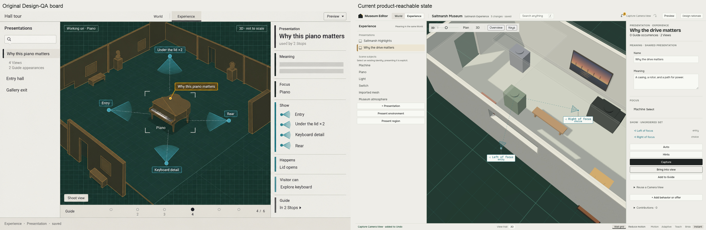

| Dimension | Verdict and reason |
|---|---|
| Shell/Stage dominance | PASS — shared Head and light chassis frame a dominant spatial Stage; M0/M2 hold. |
| Landmarks/disclosure | PASS — vertical Meaning/Focus/Show Card, locator Index; no Guide gives no rail; only explicit add/Camera doors, M3/M8. |
| Spatial reading | PASS — useful explicitly reached 3D, recognizable Machine and two separated observer positions. |
| Spatial instruments | PASS — cyan direction glyphs and dashed focus references, truthful leaders to displaced labels; no ordering or Camera edge. |
| Identity/scope | PASS — Presentation remains canonical; role labels are use facts; Camera framing is independently owned. |
| Semantic controls | PASS — ordinary actions/reference links stay quiet, Capture is explicit primary acceptance, selection uses ochre. |
| Reachability | PASS — both Set labels/glyphs visibly reachable, real Hints/Capture/Preview controls exercised; no hidden pose setup. |

Tolerated: two Views rather than four, Machine rather than Piano, simple Scene geometry and
observer positions partly outside the room; no incidental board room arrangement is required.
The active Set and its focus remain legible. Plan companion has the same identities/roles;
Add to Guide produces quiet Peek, without automatic Overview or precision.

### QA-2 — Guide overview: PASS

Recipe: Load authored conformance content → open How the drive works → Overview → explicit
Plan → Bring into view. Then select all six real Stage pins and Deck cards, returning to
Overview between expansions. Selection alone never forces L2; explicit occurrence opening does.
Primary capture retains `presentation-1`; selected companion ends at repeated `stop-18` (Stop 6).
Asserted state: overview task/depth, Plan, six numbered locations and L0/L1 Deck; no spatial Set,
facing glyphs or Camera topology. The retained Presentation Card honestly reflects selection.

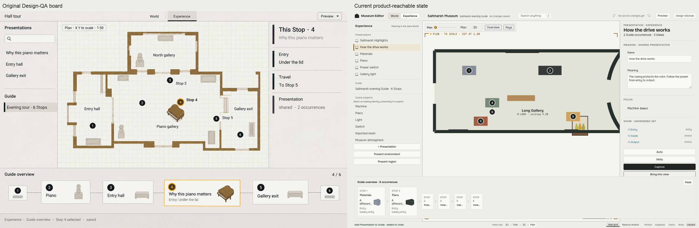

| Dimension | Verdict and reason |
|---|---|
| Shell/Stage dominance | PASS — same shared Head/Index/Card; shallow broad Deck leaves spatial Stage dominant, M0–M2. |
| Landmarks/disclosure | PASS — Deck spans beneath all three landmarks; Guide locator in Index, L0 distant cards and L1 named summaries/entry/thumbnails, M1/M4. |
| Spatial reading | PASS — explicit useful Plan; Stop 4/6 share location but separate numbered access with honest attachment. |
| Spatial instruments | PASS — occurrence pins only; Set/facing/route overlays absent, C-QA2. |
| Identity/scope | PASS — primary Presentation selection is retained honestly; selected variant has This Stop identity/local vs shared scope. |
| Semantic controls | PASS — neutral editorial connectors, selected-occurrence ochre and quiet Peek; order never appears as Camera connectivity. |
| Reachability | PASS — every Stage/Deck occurrence selects its own identity; repeated pins are distinct hits; Overview preserves Camera source and standpoint. |

Tolerated: current primary selection differs from the board's selected Stop; the selected companion
supplies that case. L1 uses schematic thumbnails of the actual simplified Scene subject, not photo
renders. Content-sized groups leave quiet spare breadth rather than stretching sparse summaries.

### QA-3 — expanded occurrence: PASS

Recipe: QA-2 → explicitly open Stop 4 → choose each View from schematic and Stage Set → reopen
Stop 4 → Edit shared Meaning → propose with Enter → capture Ask → Cancel → propose/Update all.
Local entry controls and supported atomic entry specialization are independently exercised.
Asserted state: canonical `stop-16`, occurrence task/depth, Plan, one L2 Stop 4 and compressed
neighbors; shared Presentation `presentation-1` also appears at Stop 6. Forbidden: duplicate
per-View settings forms, route topology, clipped constellation, silent shared acceptance.

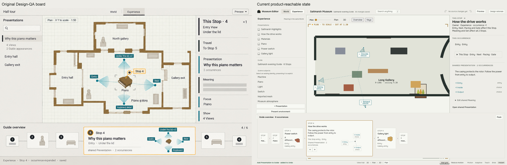

| Dimension | Verdict and reason |
|---|---|
| Shell/Stage dominance | PASS — same chassis and Head; breadth Deck supports one working occurrence while Stage remains dominant, M0/M1/M2. |
| Landmarks/disclosure | PASS — L2 is a deliberate expansion; Deck owns summary/entry/schematic Set, Card owns This Stop/shared strata and Ask, M3/M4/M8. |
| Spatial reading | PASS — three unequal observers form an unordered constellation around Machine; schematic and Plan expose the same uses. |
| Spatial instruments | PASS — direction/focus links describe framing, not order; full constellation in Deck and Stage, C-QA3. |
| Identity/scope | PASS — Stop 4 header remains; Meaning/Set affect both Stops, entry/continuation remain local; Ask names wider reach. |
| Semantic controls | PASS — use references are cyan, canonical emphasis ochre, scope acceptance primary and Cancel ordinary. |
| Reachability | PASS — all six occurrence cards and every schematic/Stage use are real hits; canceled proposal adds no history, accepted shared edit adds one. |

Tolerated: three Views instead of four; names may ellipsize with complete accessible references.
Supported Update all/Cancel replaces the specimen's unsupported general story fork. Atomic Stop-entry
detach remains available only for the supported operation, with independent ownership proof.

### QA-4 — Seam route authoring: PASS

Recipe: QA-3 → explicit 3D → open Seam 4→5 (no movement) → Travel → Connect Entry → Connect
Inside → Edit route (explicit useful Plan/return) → Stage click for Anchor 1 → drag/accept →
Undo → recapture. Capture precedes third-origin repair. Then repair Output, prove 3/3, test Cut
and unresolved Travel refusal. Asserted state: `stop-16`, route depth, Seam into `stop-17`, Plan;
Camera connections 8/9, selected connection 9, anchor 10, 2/3 reach and honest Output gap.
Forbidden: coordination strip, edge across gap/Cut, authored endpoint anchors.

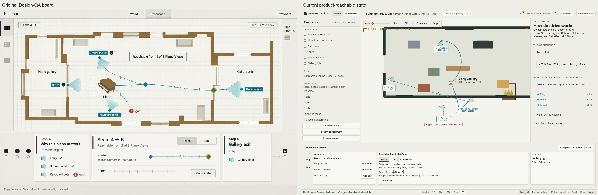

| Dimension | Verdict and reason |
|---|---|
| Shell/Stage dominance | PASS — shared Head and upper identity/locator landmarks; spatial route dominates above broad shallow triptych, M0–M2. |
| Landmarks/disclosure | PASS — source bookend owns three origin reach rows; destination names Stop/entry; center owns Travel/Cut, route/pace/status/Coordinate/return, M5/M6. |
| Spatial reading | PASS — Plan follows explicit Edit route, not Seam opening; useful framing shows both supported paths, all origins and destination. |
| Spatial instruments | PASS — Camera-evaluated observer paths, cyan pace/sample cues, operative filled interior diamond; endpoint glyphs distinct and gap unconnected. |
| Identity/scope | PASS — Stop 4 remains canonical; center says shared Camera route/pace; source coverage includes all legitimate origins. |
| Semantic controls | PASS — Travel is neutral armed state, gap uses refusal role, working anchor ochre and shared route cyan; no fabricated travel. |
| Reachability | PASS — real anchor click/drag and keyboard/cancellation/Undo; endpoint labels above Deck; third gap repaired locally to 3/3. |

Tolerated: simpler floorplan, curved observer route and exact anchor position differ from the board.
The contract requires truthful evaluated geometry and useful framing, not the specimen's incidental
Piano/gallery raster. Upper side panels remain expanded; collapse is optional, breadth is preserved.

### QA-5 — local coordination: PASS

Recipe: Continue QA-4 without moving → Coordinate → Anchor 1 → Hold here → choose Open casing
→ Invoke here → focus Anchor 1 in strip. Reopen saved Seam, edit pace with shared confirmation,
move anchor, verify stable references/derived timing, exercise multi-route choice and neutral Resume.
Asserted state: `stop-16`, coordination depth, same Seam/connection/Camera as QA-4;
`beat-21` hold and `beat-22` invocation attached to `anchor-10`, via contribution `contribution-20`.
Forbidden: strip geometry editing, global timeline, silent first-route choice or new selection.

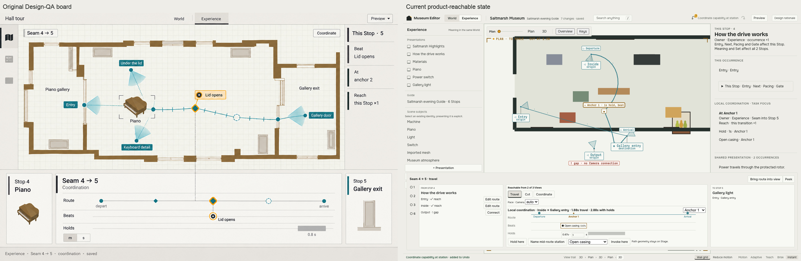

| Dimension | Verdict and reason |
|---|---|
| Shell/Stage dominance | PASS — retained Head/Index/Card and route; coordination occupies the same broad Deck, with Stage still the main spatial work, M0–M2. |
| Landmarks/disclosure | PASS — strip is inside central Seam instrument with both bookends and unrelated context; Card carries binding/reach task detail, M3/M5–M7. |
| Spatial reading | PASS — QA-4/5 sidecars have exactly equal Camera source and complete realization; no extra route/pose system. |
| Spatial instruments | PASS — stable depart/anchor/arrive counterparts, active ochre station/event attachment, distinct Beat and duration Hold lanes; time positions/lengths derive from existing evaluator. |
| Identity/scope | PASS — task focus leaves canonical Stop 4 intact; Card explicitly identifies transition into Stop 5 and local reach ×1; route remains shared Camera. |
| Semantic controls | PASS — quiet cyan route orientation, neutral local event/hold rows, ochre counterpart focus; no legacy Camera Timeline chrome. |
| Reachability | PASS — station/hold/invoke controls, reopening, scope, pace and Stage-only geometry edits exercised; event/station correspondence visible in both projections. |

Tolerated: local time projection uses evaluated seconds without an optional units toggle; Hold length
shows duration and labels its seconds. Task focus describes the incoming transition without selecting
its authored beat or replacing the source Stop Card. No strip control changes path geometry.

### QA-6 — precise Camera: PASS

Recipe: Reset → Present Machine → Auto → Capture → select Auto framing use → Precise Camera →
Look through → Frame height grip drag/accept → typed height 4 → capture. Then Preview/Exit,
Outside, World/Plan → Experience/Resume (neutral current Plan) → explicit Look through/fresh return;
Put it back restores that current Plan. Escape and lost-capture cancel live auditions.
Asserted state: canonical `use-2` referencing `view-1`, precision task/depth, Through,
frameH active, no Guide. Forbidden: Guide Deck, extra numeric tapes, visitor authoring rig/input.

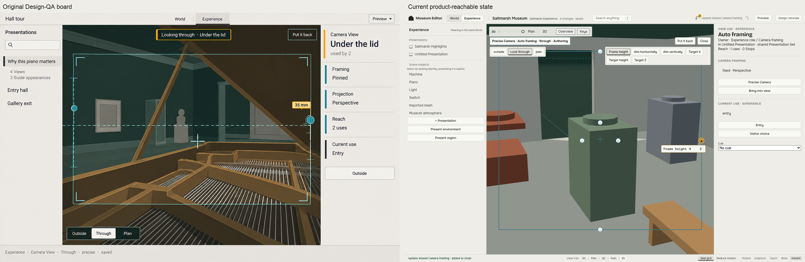

| Dimension | Verdict and reason |
|---|---|
| Shell/Stage dominance | PASS — same Head/Index/vertical Card, dominant through-View image, no precision Deck, M0–M3/M8. |
| Landmarks/disclosure | PASS — precision reached directly from View use; Stage toolbar/postures/return, only one active tape; Preview deliberately removes editor chrome. |
| Spatial reading | PASS — Through is evaluated Perspective image; Outside observer/frustum and neutral Plan Resume are truthful alternative readings of the same View. |
| Spatial instruments | PASS — frame gate/horizon/target and active framing grip operate through Camera; Outside shows evaluated observer/target/framing relationship without an invented orbit. |
| Identity/scope | PASS — Card distinguishes Camera framing from Experience role/current use and declares one-use reach; shared/detached cases tested separately. |
| Semantic controls | PASS — local posture armed state, cyan passive rig, ochre active grip/tape, explicit Put it back; visitor image cannot be confused with authoring. |
| Reachability | PASS — grip drag and numeric edits use same writer; exact Preview return, fresh spatial return, Escape/lost capture and neutral Resume exercised. |

Tolerated: Machine block model rather than Piano interior, frame-height operation rather than a
specimen lens-mm field, simple frustum rather than optional Outside circle/inset. Initial Outside
is an allowed experiment; this canonical capture explicitly invokes Through. No unsupported lens
or orbit control is fabricated merely to resemble the board.
## Companion and transition review

All companion captures were inspected at full-window scale on the frozen executable.
The [World ordinary specimen](../../world-experience-shell-round/QA-package/01-world-ordinary-piano.png)
calibrates shared Head, locator, dominant Stage and quiet canonical Card; its richer Scene
geometry and World task semantics do not redefine Experience. The fresh [World capture](../screens/experience-conformance/world-current.png) is reached by
selecting North wall in the actual Index, preserving standpoint. Retained World shell/continuity
and responsive axes protect the actual shared executable without importing Paper controls.

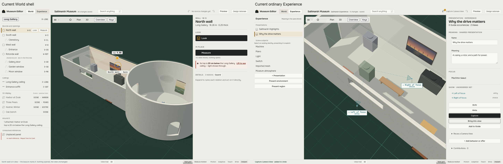

| Companion/stress case | Verdict and evidence |
|---|---|
| Ordinary Plan / Peek | PASS — same unordered Set IDs/roles; real Plan/3D controls, no source edits. First Stop opens only Stage-edge Peek; no precision or overview side effect. |
| Six Stops / repeated Machine / selected overview | PASS — six distinct Stage and Deck hits, Stop 4 and 6 share meaning but retain occurrence IDs. `qa-2-selected` retains Stop 6 without forcing L2. |
| Shared Meaning Ask / supported entry detach | PASS — scope appears in the stable Card before acceptance; Cancel changes neither source nor Undo. Accepted shared edit is one step; Stop-entry specialization is atomic and supported, without a general Presentation fork. |
| Multi-origin route / repair / Cut | PASS — captured 2/3 support, disconnected Output gap; local repair gives 3/3. Cut leaves Camera source but paints no Seam edge/anchor; unresolved Travel refuses. |
| Saved/multiple-route coordination | PASS — reopened strip and spatial station projections agree; explicit choice where two routes have different contexts. Pace and Stage anchor edits update evaluated timing without rebinding beats. |
| No-Guide precision / Outside | PASS — same View use, real observer–target/frustum relationship and manipulation, one tape, no Guide Deck; no unsupported orbit. |
| Plan after neutral Resume | PASS — World Plan persists through Experience Resume; instrument reports Plan. Explicit Look through takes a fresh return; Put it back returns to current Plan, not an obsolete parked pose. |
| Preview from ordinary/precision/accepted World inspection | PASS — frozen source, authoring input/rig/task removed; exact complete Camera/inspection/selection restoration. Both no-View and no-Guide cases work. |
| Foreign identity in both directions / parked work | PASS — canonical identity is retained honestly, inactive procedures inert; deleted/rebound targets revalidate/refuse and never silently retarget. |
| Keyboard and cancellation | PASS — framing numeric/grip and anchor keyboard paths, scope Enter/Escape, live Escape/lost capture/lens cancellation; zero canceled history and deterministic accepted Undo. |
| Reduced motion / viewport / DPR | PASS — retained World axis preserves source/Camera endpoints; 1440×900, 1280×800, 1024×768 and DPR 2. No new device matrix. |
| Narrow Guide/Card/precision/visitor | PASS — 1024×768 L2 remains unclipped, sheet exposes local controls, Stage remains useful, precision/visitor reachable, unchanged Camera intent; fresh `narrow-*` captures. |

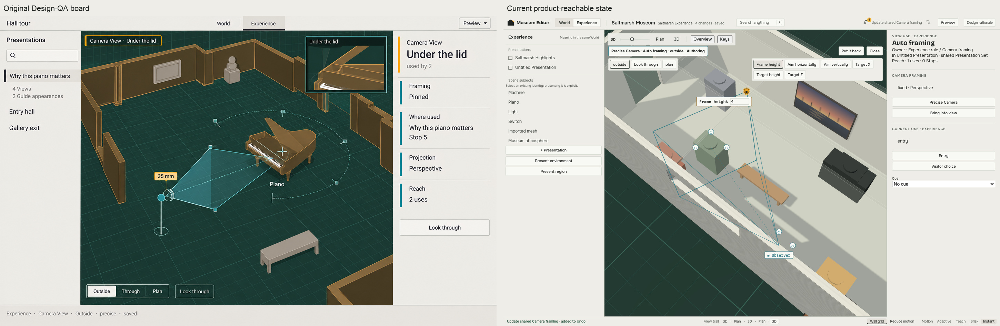

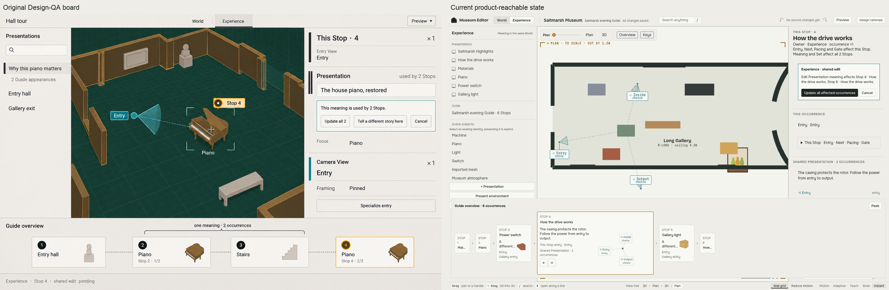

The four mandatory comparison pairs were reviewed after the final shared change. QA-1→QA-2
sheds the Set for numbered occurrence locations; QA-2→QA-3 restores only the expanded working
Set. These are separate product recipes; the QA-1→QA-2 montage itself makes no same-source or
same-standpoint claim. QA-4→QA-5 preserves the actual Camera source and complete realization
exactly, adding only local coordination disclosure/events. QA-6→Preview removes all authoring
chrome/rig/input and returns exactly, with aspect observed after layout settling.

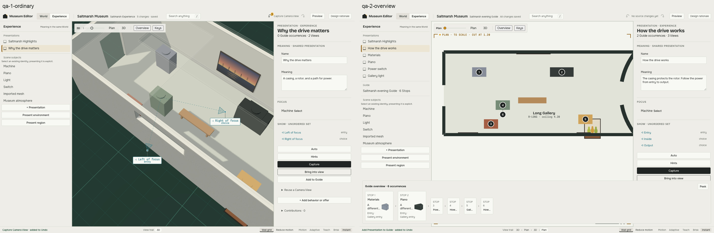

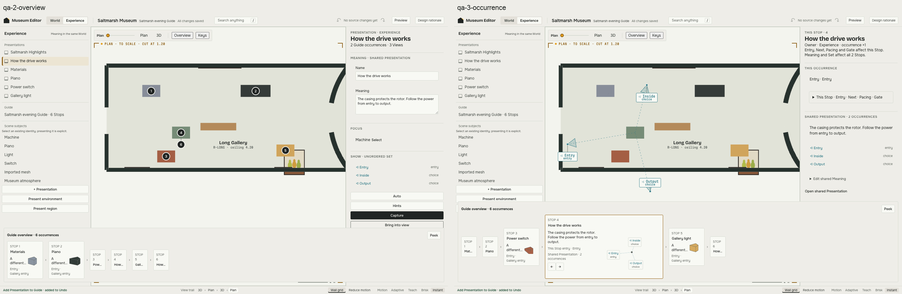

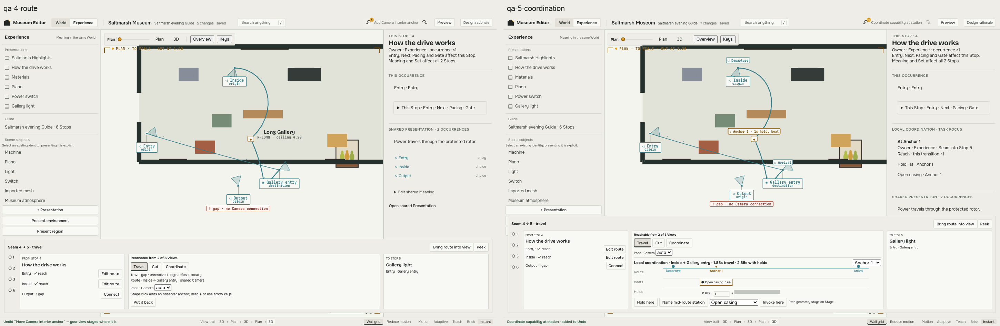

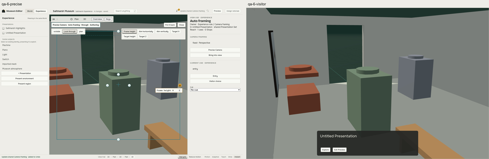

Narrow capture recipe and verification remain in [reconciliation-check.sh](./reconciliation-check.sh);
canonical six-state recipes remain in conformance, with authored content loading only. No historical
capture was overwritten. Overlay rather than Camera refit is the current Deck choice; initial
precision posture, crop-docking/spatial memory and station-bound coordination comprehension remain
usability experiments within the fixed semantics, not waivers of conformance.

## Behavior, ownership and continuity

PASS — one Camera/navigation authority resolves framing, observer route geometry, stations,
pace/interpolation and realization. Experience owns only its meaning, occurrences, use context
and local holds/invocations. Layout architecture and Scene capability source remain distinct;
spatial/temporal projections consume those evaluations. Authored interior anchors are distinct
from generated endpoints/samples; neither snapshots nor thumbnails become authored state.

PASS — one canonical selection and aggregate chronological source history across lenses.
Selection/disclosure do not navigate or write; neutral Resume uses now, explicit invocation
captures a fresh return, Preview suspends/restores the complete accepted context and freezes
source. Pointer/keyboard cancellation, local/shared scope, deleted/rebound target validation
and Cut/Travel coverage remain deterministic. Path geometry edits remain Stage-only.

PASS — visitor session overrides never mutate authored domain source or source history;
editor rig/input are removed during Preview. Production visitor/editor import boundaries were
not changed. Existing World A–F baselines, numerical tolerance `.002`, responsive coverage and
donor A0–A22 behavior remain protected. No production migration, F/T gate, Paper work, broader
3D/lighting/gizmo design or unrelated architecture cleanup occurred.

## Final verification

All final browser axes use the unchanged frozen executable. The integrated run carries
686/0 across 16 axes. The later narrow recipe strengthens its collapsed-control assertion
by deliberately returning Deck to Peek, opening Stop details and checking the actual Entry
rectangle/hit target. Its fresh 13/0 standalone log supersedes the integrated reconciliation
row for that obligation; the other 15 axes and executable remain unchanged. Disposable mutations
use one owned server/session per run and reject the protected defect with unrelated controls
green. Normal and failure paths clean up their own resources; external sessions are left alone.
Final logs live in [C8 evidence](../../../docs/operations/checkpoints/experience-v2-conformance-evidence/).
The older `v2-*-final` and paused manifests retain interruption provenance only and confer no
final acceptance; C8 logs and final manifest below supersede them.

| Gate | Final result | Complete log |
|---|---|---|
| Canonical/companion product capture | PASS 75/75; current PNG/JSON and regenerated comparisons | [capture log](../../../docs/operations/checkpoints/experience-v2-conformance-evidence/c8-captures.txt) |
| Integrated World + Experience | PASS all 16 axes, 686/0 | [integrated log](../../../docs/operations/checkpoints/experience-v2-conformance-evidence/c8-integrated.txt) |
| Successor mutations | PASS 3 World + 7 Experience injected regressions rejected; unrelated controls green | [mutation log](../../../docs/operations/checkpoints/experience-v2-conformance-evidence/c8-mutations.txt) |
| Narrow strengthened successor | PASS 13/13, fresh 1024×768 captures and real Entry hit | [narrow log](../../../docs/operations/checkpoints/experience-v2-conformance-evidence/c8-narrow.txt) |
| Prototype domain/runtime | PASS 40/40 | [domain log](../../../docs/operations/checkpoints/experience-v2-conformance-evidence/c8-domain.txt) |
| Donor preservation | PASS 62/62; typecheck exit 0 | [tests](../../../docs/operations/checkpoints/experience-v2-conformance-evidence/c8-donor.txt), [typecheck](../../../docs/operations/checkpoints/experience-v2-conformance-evidence/c8-donor-typecheck.txt) |
| Repository architecture | BLOCKED exit 1; 23 files/275 tests pass; 1 documentation test fails on missing fixture references | [arch log](../../../docs/operations/checkpoints/experience-v2-conformance-evidence/c8-root-arch.txt) |
| Repository complete tests | BLOCKED exit 1; 338 files pass/34 fail/1 skip; 4950 tests pass/2 fail/1 skip; 32 collection failures | [full log](../../../docs/operations/checkpoints/experience-v2-conformance-evidence/c8-root-test.txt) |
| Repository check | BLOCKED exit 1; 1 missing-module error, 0 warnings; museum check not reached | [check log](../../../docs/operations/checkpoints/experience-v2-conformance-evidence/c8-root-check.txt) |
| Repository build | BLOCKED exit 1; missing fixture import after 2424 modules; museum build not reached | [build log](../../../docs/operations/checkpoints/experience-v2-conformance-evidence/c8-root-build.txt) |
| Final documentation successor | BLOCKED exit 1; 21/22 pass, only two unchanged historical references to the absent fixture | [documentation log](../../../docs/operations/checkpoints/experience-v2-conformance-evidence/c8-docs.txt) |
| Whitespace | PASS `git diff --check` | [diff-check log](../../../docs/operations/checkpoints/experience-v2-conformance-evidence/c8-diff-check.txt) |

External blocker: absent **40-walls.json** in the P23B roadmap fixture location, imported by
[p23b-fixtures.ts](../../../apps/editor/src/lib/bench/p23b-fixtures.ts). The file was already
absent at the C1–C7 head and in the local `origin/main` tree; C8 does not touch its importer or
production source. All 32 collection failures, the dormant-scan behavioral failure, the
missing-module check error and build resolution failure converge on that import. The other
failed test is documentation references to the same missing fixture. The first arch/full runs
also observed the now-retired active checkpoint reference; final focused docs verification
supersedes that row and isolates the two unchanged historical references. No in-scope failure
is being classified as this blocker. Resolution requires restoration of the authoritative
fixture by separately authorized work; generating a substitute would not establish its identity.


## Acceptance and handoff

Self-review PASS: final C8 implementation/QA diff, all eight board comparisons, six native
full-window captures, four mandatory transition pairs and required companions were reviewed
against the current M0–M8/C-QA rules. The identified information-home/instrument failures are
corrected and re-captured. Exact QA-4/5 source/realization equality was independently checked
from the JSON sidecars. Domain separation, one Camera evaluator, Stage-only route editing,
canonical identity, source/history/cancellation and visitor isolation are protected by the
frozen final integrated and mutation proof. No unresolved material C8 defect or unsupported
product decision remains. The narrow hidden-control assertion was strengthened and re-reviewed;
no claim depends on a collapsed field's zero rectangle. Complete evidence is retained, and
source/capture hashes are checked again before push. Independent external review remains owed.

C1–C8 in-scope conformance is complete and ready for independent external review on #113.
The repository blocker below prevents a merge-readiness claim; no PR merge/closure or formal
slice/major-phase closure was performed. The owner resumption cleared the pause; the completed
checkpoint is retired under work-checkpoint after durable evidence promotion here. The
slice-closeout workflow was inspected: its implementation-review/merge-ready boundary is not
crossed while independent review and the repository gate blocker remain.

Paper PA0 consumes this executable, the replacement plan and this record, with shared Stage,
selection, Camera, aggregate history and cancellation seams preserved. Paper remains the next
PR only after #113's external review/landing; it inherits no failed Experience obligation.
Historical S0–S9 acceptance remains untouched. The live P25 router and operations/current point
to this evidence and the external-review baton; F/T and major-phase status remain unchanged.
